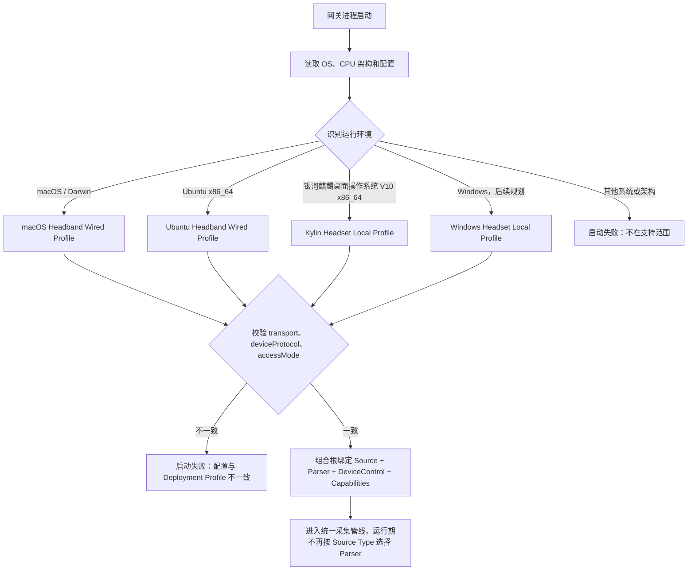
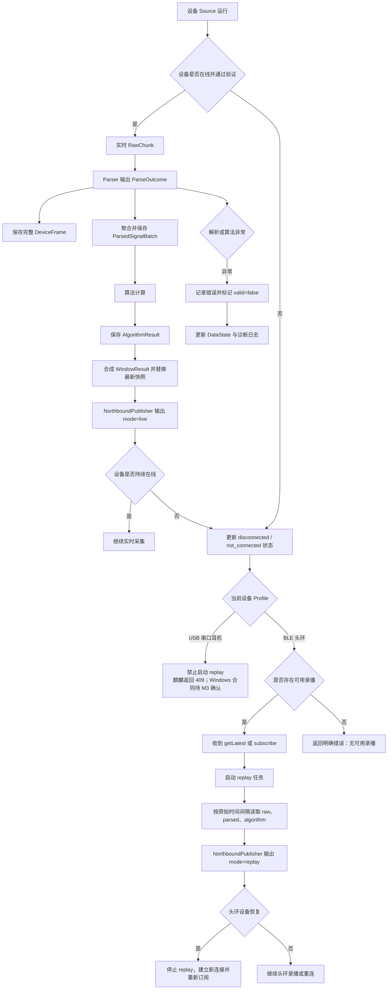
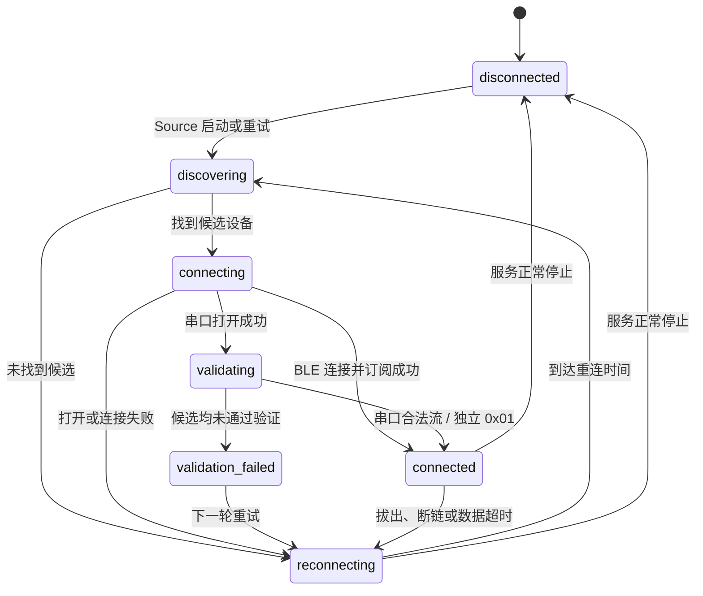
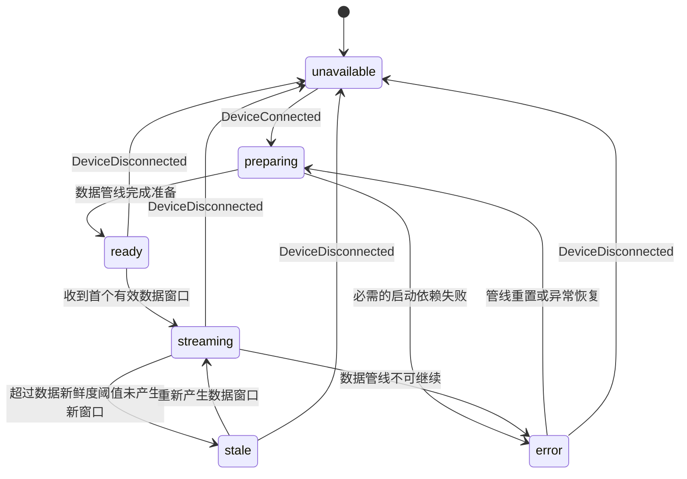
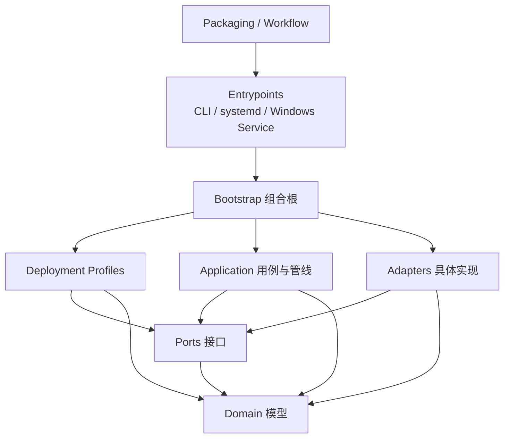
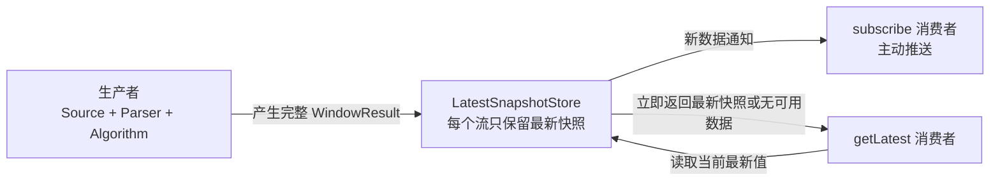
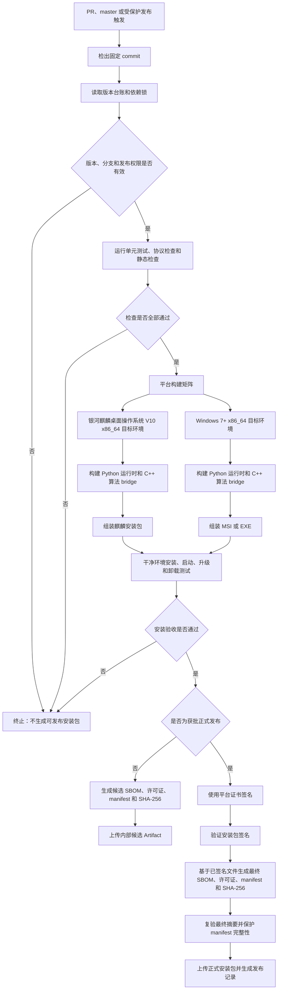

# NeuroBridge 项目结构与多系统接入 PRD

状态：内部架构需求基线（待评审）

日期：2026-09-07

适用范围：NeuroBridge 统一目标架构；当前实现评估截至本文日期

2026-09-08 源码补齐状态、两组需求的实现/额外内容对照及未关闭门禁见[需求补齐与验收清单](需求补齐与验收清单.md)。该清单不降低本文的完成定义。

## 1. 文档目的

本文定义 NeuroBridge 在 macOS、Ubuntu、银河麒麟 V10 及后续 Windows 网关上的统一项目结构、设备接入边界、源数据处理链路和分阶段验收要求。

本文解决以下问题：

1. macOS、Ubuntu、银河麒麟 V10 以及后续 Windows 分别接入哪一种设备；
2. 蓝牙头环和 USB 串口耳机如何统一称为原始数据源；
3. 设备采集、源数据解析、算法输入、持久化和北向分发之间如何隔离；
4. 当前代码已经满足哪些要求，哪些地方仍不能作为目标架构验收依据。

本文是内部项目结构和实现约束，不直接修改已发布的北向协议，也不替代双方最终签字的报文语义。本文识别出的北向变更需求必须进入一致性评审，在所有受影响文档同步后才能实现和发布。

关联文档包括银河麒麟 V10 耳机 USB 串口接入 PRD、头环蓝牙网关对接方案、北向网络协议及版本台账。各文档分别描述项目结构、专项设备、接入合同或版本事实；其中重复出现的系统映射、设备能力、错误语义和验收范围必须按第 13 节保持一致。

本文后续所称“银河麒麟 V10”均指客户已确认的目标产品线“银河麒麟桌面操作系统 V10 x86_64”。2026-09-07 实机诊断已观测到 SP1 2503 和 systemd 245；该镜像是否作为正式验收基线，以及最终 ISO 文件名、SHA-256 和包管理器，仍需在候选包构建前锁定。

NeuroBridge 的运行与交付形态是安装在本机的后台服务端程序：银河麒麟下由 systemd 管理，Windows 下由 Windows Service 管理。“项目软件以服务端形式运行”不等于“目标操作系统必须是银河麒麟高级服务器版”；操作系统产品线仍以最终客户镜像为准。

## 2. 产品范围

### 2.1 支持矩阵

| 网关操作系统 | 设备类型 | 设备链路 | 北向接入方式 | 目标状态 |
|---|---|---|---|---|
| macOS | 蓝牙头环 | BLE | 旧 B 端专网，`access.mode="wired_b_side"` | 兼容链路；支持头环实时采集、录播、算法处理、录制和北向分发 |
| Ubuntu | 蓝牙头环 | BLE | 旧 B 端专网，`access.mode="wired_b_side"` | 兼容链路；支持头环实时采集、录播、算法处理、录制和北向分发 |
| 银河麒麟桌面操作系统 V10 x86_64（实机观测 SP1 2503，正式验收镜像待锁定） | 耳机 | USB 派生 TTY 串口 | 本机页面，`access.mode="local_browser"`，仅回环地址 | 当前最终产品平台；仅支持实时数据，不支持录播；以可安装、升级、卸载的离线安装包交付 |
| Windows 7 x86_64 及以上 | 耳机 | USB 虚拟串口（COM） | 本机页面，`access.mode="local_browser"`，仅回环地址 | 后续最终产品平台；仅支持实时数据，不支持录播；以可安装、升级、卸载的安装包交付 |

系统和设备的对应关系由网关运行环境固定决定，不允许根据设备扫描结果自动切换到另一类设备传输。

macOS 和 Ubuntu 使用既有隔离 B 端专网拓扑，不提供本机浏览器作为其标准接入方式；银河麒麟 V10 和 Windows 使用同机浏览器与 `127.0.0.1` 回环 HTTP/WebSocket。面向最终客户的标准产品交付形态为银河麒麟 V10 安装包或 Windows 安装包。不得要求最终用户获取 Git 仓库、执行源码脚本或自行准备 Python/C++ 构建环境。

### 2.2 统一术语

- **传输原始块（Raw Chunk）**：一次 BLE 通知或一次串口读取边界收到的原始字节。串口 RawChunk 可能是半帧、多帧或包含噪声，不等同于完整设备帧。
- **设备原始帧（Device Frame）**：按设备协议完成边界识别后的完整原始帧。包括 BLE 特征通知帧和耳机完整 28 字节帧；必须保持原始字节序和载荷语义。
- **源数据源（Raw Data Source）**：负责发现设备、建立连接、读取原始字节和报告连接状态的组件。
- **源数据解析器（Raw Data Parser）**：负责把 RawChunk 分帧并解析为 DeviceFrame、设备无关的 ParsedSignal 和诊断结果；解析器不得调用算法或北向服务。
- **解析结果（Parse Outcome）**：Parser 一次处理的结果集合，包含零到多个 DeviceFrame、ParsedSignal、缓存字节数、丢弃字节数和解析诊断。
- **解析信号（Parsed Signal）**：从一个或一组 DeviceFrame 中提取的设备无关 EEG、HR 或状态片段，尚未按算法窗口聚合。
- **统一信号批次（Parsed Signal Batch）**：与设备传输无关的 EEG、HR、状态和时间窗口模型，供算法、录制和北向层共同使用。
- **算法输入**：由统一信号批次经过算法适配器转换得到的 SDK 输入，不等同于设备原始帧。
- **录制（Recording）**：为追溯、诊断或合规目的持久化设备原始数据、解析数据和算法结果。录制不代表数据允许录播。
- **录播（Replay）**：将已保存数据按历史采集时间间隔重新通过北向协议发送。录播仅适用于蓝牙头环；USB 串口耳机数据不支持录播。

### 2.3 不在本 PRD 范围

- 银河麒麟上的 BLE 头环接入；
- macOS 或 Ubuntu 上的耳机串口接入；
- 当前阶段的 Windows 实现与现场验收；Windows Profile 及其串口数据源属于后续扩展目标；
- 未确认设备 VID/PID、端点和传输合同的原生 USB/HID/Bulk/Interrupt 接入；
- 浏览器直接使用 Web Serial 或 WebUSB；
- USB 串口耳机历史数据的北向录播；
- 修改已发布或预发布北向协议版本、字段和错误码；
- 多耳机、多网关和多受试者并发场景。

### 2.4 交付阶段

本 PRD 描述统一目标架构，但各平台不在同一个版本同时验收：

| 阶段 | 交付范围 | 完成判定 |
|---|---|---|
| M1 当前交付 | 银河麒麟桌面操作系统 V10、USB 串口耳机、本机页面、耳机禁用录播、银河麒麟安装包 | 按最终实机锁定的银河麒麟桌面操作系统 V10 x86_64 镜像完成 24 小时长稳和安装包验收 |
| M2 兼容链路重构 | macOS/Ubuntu、BLE 头环、旧 B 端专网、头环实时与录播 | 两个平台分别完成 Source/Parser/Profile 迁移、旧 B 端专网回归和 24 小时长稳 |
| M3 后续产品 | Windows 7 x86_64 及以上、USB COM 耳机、本机页面、Windows 安装包 | 至少在 Windows 7 最低基线目标机完成 COM、服务、24 小时长稳和安装包验收 |

后续阶段的目录和接口可以在 M1 建立扩展点，但不得把“已设计”或“已有兼容代码”写成该平台已经交付。每个阶段只用本阶段目标系统的实机结果完成验收，不能用其他系统替代。

### 2.5 实施优先级

正式安装包发布和 Workflow 门禁在各产品平台的实施排期中优先级最低，但安装目录、服务账户、配置/日志/数据目录和 systemd/Windows Service 骨架必须提前落地，以保证长稳验收使用真实安装布局，而不是开发者源码目录。排期顺序为：

1. 先完成 Source/Parser 接口、系统 Profile 与设备连接；
2. 同步建立服务安装布局与可重复的 systemd/Windows Service 测试骨架；
3. 再完成信号窗口、算法、双状态模块、持久化和北向数据链路；
4. 然后在安装布局或候选包环境中完成异常恢复、日志与 24 小时长稳验证；
5. 最后完成正式安装包、签名、SBOM、构建清单和 Workflow 发布门禁。

“优先级最低”仅表示实施顺序最后，不表示可以用源码目录代替最终安装包，也不表示正式交付可以跳过打包验收。

## 3. 产品目标

### 3.1 主要目标

1. macOS、Ubuntu 和银河麒麟 V10 分阶段通过统一网关核心完成“设备采集 → 原始数据解析 → 算法 → 持久化 → 北向 WebSocket 分发”，并为后续 Windows 串口耳机接入保留相同扩展路径。
2. 按 Domain、Ports、Application、Adapters、Profiles 和 Entrypoints 重新组织项目结构；新增或替换设备传输时，只增加对应 Source、Parser 和 Profile 实现，不修改核心业务、算法和北向协议代码。
3. 保留设备原始字节，并能将其与解析结果、算法结果、录制会话和采集窗口时间戳关联。
4. 通过运行环境配置校验保证系统与设备类型的固定映射，防止错误部署。
5. 蓝牙头环的实时与录播模式复用同一套统一信号模型和北向事件模型；USB 串口耳机只允许实时模式。
6. 银河麒麟 V10 和 Windows 的最终交付物由受控 Workflow 从已审核源码生成可追溯安装包，不以源码目录或 Git bundle 代替产品安装包。

### 3.2 成功标准

- macOS 和 Ubuntu 能使用 BLE 头环完成连续采集；
- 银河麒麟 V10 能使用 USB 串口耳机完成握手、分帧、重连和连续采集；
- 当前三条链路以及后续 Windows 串口链路都使用相同根包络的北向消息；
- 算法层不依赖 BLE、串口或具体设备名称；
- 北向层不依赖 Bleak、pyserial 或设备帧格式；
- 公共领域模型和接口层不反向依赖具体设备、操作系统、WebSocket、文件系统或算法 SDK；
- 设备接入失败、解析失败和算法失败不会导致主进程退出；
- 银河麒麟和 Windows 耳机离线时不自动选择任何录播数据，耳机北向事件不得出现 `mode="replay"`；
- 银河麒麟与 Windows 安装包可在干净目标系统上完成安装、启动、升级、修复和卸载，并能通过版本、摘要和构建清单追溯到唯一源码提交。
- 当前交付在最终锁定的银河麒麟桌面操作系统 V10 x86_64 实机连续运行 24 小时，主进程不退出，且形成可用于后续确定延迟、资源、队列和丢弃阈值的运行日志。

## 4. 目标总体架构

```text
┌──────────────────────────────────────────────────────────────────┐
│ Deployment Profile Resolver                                     │
│ platform + transport + deviceProtocol + accessMode + capability │
└───────────────────────────────┬──────────────────────────────────┘
                                │ Bootstrap 一次性绑定
           ┌────────────────────┼─────────────────────┐
           ▼                    ▼                     ▼
 RawDataSource           RawDataParser          DeviceControl
 connection/RawChunk     ParseOutcome            E1/E0 等出数控制
           └────────────────────┬─────────────────────┘
                                ▼
          DeviceFrame + ParsedSignal + Diagnostics
              ┌─────────────────┼──────────────────┐
              ▼                 ▼                  ▼
   RecordingRepository  SignalWindowAssembler  双状态模块/日志
                                ▼
          ParsedSignalBatch → AlgorithmEngine
                     └──────────┬──────────┘
                                ▼
          WindowResultAggregator → LatestSnapshotStore
                                ▼
       Application Use Cases → NorthboundController/Publisher
```

### 4.1 系统与设备策略选择流程



### 4.2 原始数据处理主流程

```mermaid
flowchart LR
    A[蓝牙头环 BLE 通知] --> S[RawDataSource]
    B[耳机 USB TTY 字节流] --> S

    S --> C[RawChunk<br/>原始字节 + 通道 + 接收时间]
    C -.可配置诊断留存.-> TRACE[TransportTraceStore]
    C --> D[Profile 已绑定的 RawDataParser]
    D --> E[ParseOutcome]

    E --> F[DeviceFrame]
    E --> G[ParsedSignal]
    E --> DIAG[ParseDiagnostics]

    F --> R1[RecordingRepository<br/>完整设备原始帧]
    DIAG --> LOG[日志与 DataState]

    G --> H[SignalWindowAssembler<br/>ParsedSignalBatch + 有效性]
    H --> R2[RecordingRepository<br/>解析批次]
    H --> I[AlgorithmInputMapper]
    I --> J[AlgorithmRunner / SDK Bridge]
    J --> K[AlgorithmResult]
    K --> R3[RecordingRepository<br/>算法结果]

    H --> AGG[WindowResultAggregator]
    K --> AGG
    AGG --> SNAP[LatestSnapshotStore<br/>按流原子替换最新值]
    SNAP --> USECASE[Application Query / Subscription]
    USECASE --> N[NorthboundController / Publisher]
    N --> O[WebSocket<br/>subscribe 推送 / getLatest 响应]
```



### 4.3 实时、断线与头环录播分支流程



### 4.4 设备连接状态机

设备连接模块只负责设备发现、连接、验证、断线与重连，不负责判断业务数据是否新鲜，也不负责持有北向客户端状态。



要求：

- BLE 可以从 `connecting` 在完成订阅后进入 `connected`；串口必须经过 `validating`；
- 串口已有合法流时，连接状态进入 `connected` 且不得发送 ACK/E1；静默设备只有收到 ACK 后独立 `0x01` 才能进入 `connected`；
- `validation_failed` 是内部诊断状态，北向是否以及如何映射必须与已确认北向协议保持一致；
- DeviceConnectionState 的变更通过领域事件发送给数据状态模块，两个模块不得读写彼此的内部状态对象；
- 北向连接状态与内部详细状态分开，未经协议评审不得直接暴露 `discovering`、`validating` 等内部值。

### 4.5 数据状态机

数据状态模块负责算法准备、设备出数、窗口生成、最新值、存储健康和数据新鲜度，不负责发现或连接设备。



数据状态至少包含以下内部字段；未经北向合同评审，不直接把内部枚举作为对外字段：

- `dataState`：`unavailable`、`preparing`、`ready`、`streaming`、`stale` 或 `error`；
- `lastProducedAtMs`：最近一个完整 WindowResult 的采集时间；
- `lastPublishedAtMs`：最近一次北向发布完成时间；
- `algorithmState`：算法准备、可用、不可用或错误状态；
- `storageState`：`ok`、`warning`、`full` 或 `error`；
- `persistenceGuaranteed`：当前产生数据是否具备持久化保障，与解析/算法 `valid` 独立；
- 最近错误原因、累计生产窗口数、覆盖旧快照数和发送失败数。

串口 ACK 路径进入设备 `connected` 后，数据状态先进入 `preparing`；算法 ready 后由应用层调用 DeviceControl `start_stream()` 发送无响应 E1。该路径算法准备失败时进入 `error` 且不得发送 E1。已有合法流路径不发送 E1，即使算法暂不可用也可继续保存和分发允许的原始数据，收到首个窗口后进入 `streaming`。正常停止时 DeviceControl 最多发送一次无响应 E0，并释放串口资源。

`algorithmState` 与 `storageState` 是数据状态模块中的正交状态：算法或存储异常不必然把仍在产生的原始数据改成 `error`。存储写满或写入错误时仍继续处理和分发可用的实时数据，并通过 `persistenceGuaranteed=false` 单独表达未持久化保障。存储阈值和恢复判定按第 8.5.1 节执行；数据新鲜度阈值仍需配置化并根据 24 小时观测调整。

### 4.6 目标项目结构重设计

改造前目录按功能逐步演进，曾出现公共模型位于 `ble/`、串口 Source 与 Parser 混合、平台入口绕过统一组合逻辑等问题。当前分支已按“领域模型 + 接口端口 + 应用编排 + 外部适配器 + 系统 Profile + 组合根”落地以下结构；兼容目录暂时保留，但职责边界和依赖方向仍属于本 PRD 的强制要求。

```text
NeuroBridge/
├── neurobridge/
│   ├── domain/                         # 纯领域模型，不依赖外部框架
│   │   ├── raw.py                      # RawChunk、DeviceFrame、ParseOutcome
│   │   ├── signal.py                   # ParsedSignal、ParsedSignalBatch、有效性
│   │   ├── algorithm.py                # AlgorithmInput、AlgorithmResult
│   │   ├── status.py                   # DeviceConnectionState、DataState、StorageState
│   │   └── capabilities.py             # ProfileCapabilities，如 supportsReplay
│   ├── ports/                          # 面向接口编程的抽象边界
│   │   ├── raw_source.py               # RawDataSource
│   │   ├── device_control.py            # DeviceControl，E1/E0 等设备出数控制
│   │   ├── raw_parser.py               # RawDataParser
│   │   ├── algorithm.py                # AlgorithmEngine
│   │   ├── recording.py                # RecordingRepository
│   │   ├── replay.py                   # ReplayRepository / ReplayReader
│   │   └── northbound.py               # NorthboundSink / 会话输出接口
│   ├── application/                    # 用例与管线编排，只依赖 domain + ports
│   │   ├── acquisition.py              # Source → Parser → Window 主流程
│   │   ├── windowing.py                # ParsedSignal → ParsedSignalBatch
│   │   ├── processing.py               # 算法输入映射与执行编排
│   │   ├── subscriptions.py            # getLatest/subscribe/unsubscribe 用例
│   │   ├── snapshots.py                # WindowResult 聚合与按流最新值
│   │   ├── replay.py                   # 仅在 Profile 允许时启动头环录播
│   │   └── status.py                   # 统一运行状态和错误转换
│   ├── adapters/                       # ports 的具体实现
│   │   ├── sources/
│   │   │   ├── bluetooth_bleak.py      # macOS/Ubuntu BLE 连接与原始通知
│   │   │   ├── serial_posix.py         # 银河麒麟 TTY 发现、打开、读取
│   │   │   └── serial_windows.py       # Windows COM 发现、打开、读取（规划）
│   │   ├── parsers/
│   │   │   ├── headband_ble.py         # 头环 BLE 通知语义解析
│   │   │   └── headset_rev181.py       # 耳机 28 字节帧解析，麒麟/Windows 共用
│   │   ├── algorithms/
│   │   │   └── affective_sdk.py        # C++ SDK bridge 适配
│   │   ├── storage/
│   │   │   └── filesystem.py           # raw/parsed/algorithm 分层持久化
│   │   └── northbound/
│   │       ├── protocol.py              # 根包络、字段映射、错误映射
│   │       ├── controller.py            # 请求解码并调用 Application 用例
│   │       ├── websocket.py             # WS 连接与 UTF-8 JSON 传输
│   │       ├── publisher.py             # 响应和事件序列化发送
│   │       └── local_ui.py              # 麒麟/Windows 本机 HTTP 页面
│   ├── profiles/                        # OS 与设备组合及能力声明
│   │   ├── resolver.py                  # OS/架构/配置校验
│   │   ├── macos_headband_wired.py       # BLE + 头环 Parser + wired_b_side
│   │   ├── ubuntu_headband_wired.py      # BLE + 头环 Parser + wired_b_side
│   │   ├── kylin_headset_local.py        # POSIX Serial + 耳机 Parser + local_browser
│   │   └── windows_headset_local.py      # Windows Serial + 耳机 Parser + local_browser
│   ├── bootstrap/                       # 唯一组合根，实例化并注入具体实现
│   │   ├── container.py
│   │   └── app.py
│   ├── entrypoints/                     # CLI、systemd/Windows Service 进程入口
│   │   ├── cli.py
│   │   └── service.py
│   └── configuration/                   # 配置模型、加载、迁移和校验
├── config/                              # 各 Profile 默认配置模板
├── web/                                 # 本机浏览器静态资源
├── packaging/
│   ├── kylin/                           # 原生包/.run、systemd、权限和升级脚本
│   └── windows/                         # MSI/EXE、Windows Service 和签名配置
├── tests/
│   ├── unit/                            # domain、Parser、应用用例
│   ├── contract/                        # Source/Parser/算法/北向接口合同测试
│   ├── integration/                     # Profile 完整管线与录播策略
│   ├── platform/                        # macOS/Ubuntu/Kylin/Windows 平台测试
│   └── package/                         # 安装、升级、卸载测试
└── .github/workflows/                   # 校验、候选包与受保护发布 Workflow
```

结构设计规则：

1. `domain/` 和 `ports/` 是稳定内核，不得导入 `adapters/`、`profiles/`、系统 API 或第三方 I/O 库；
2. `application/` 通过 ports 调用设备、算法、持久化和北向输出，不实例化 Bleak、pyserial、WebSocket 或文件存储实现；
3. `adapters/sources/` 只处理传输和设备连接生命周期，`adapters/parsers/` 只负责分帧与设备数据语义，两者必须能独立做合同测试；
4. POSIX TTY 与 Windows COM 是两个 Source 实现，但共用 `headset_rev181` Parser，禁止复制耳机帧解析逻辑；
5. `profiles/` 以 Deployment Profile 声明平台、传输、设备协议、接入方式和能力，并由组合根一次性绑定 Source、Parser 与 DeviceControl；运行期不得按 `sourceType` 再选择 Parser；
6. `bootstrap/` 是唯一允许同时认识 ports 和具体 adapters 的组合根，所有 CLI、systemd 与 Windows Service 入口必须经该组合根启动；
7. 录制能力与录播能力分开建模：RecordingRepository 可保存所有设备数据，ReplayReader 只能由 `supportsReplay=true` 的头环 Profile 使用；
8. `packaging/` 与平台安装脚本不得被 `neurobridge/domain`、`ports` 或 `application` 导入；
9. NorthboundController 只负责协议输入适配，订阅、查询、状态和录播决策属于 Application，NorthboundPublisher 只负责输出；
10. 设备连接状态模块与数据状态模块通过领域事件通信，不共享可变状态；
11. 迁移可以分阶段进行，并可短期保留兼容导出层，但不得长期同时维护两套 Gateway、领域模型或耳机 Parser。

### 4.7 目标依赖方向



图中箭头表示“可以依赖”。`Domain` 不依赖其他业务层；具体设备和平台实现通过 `Bootstrap` 注入应用层，禁止从 `Application` 反向导入 `Adapters`。

### 4.8 分层依赖规则

| 层 | 可以依赖 | 禁止依赖 |
|---|---|---|
| Deployment Profile | OS/架构探测、配置校验、传输/设备/接入能力声明 | 具体业务数据、北向消息 |
| Raw Data Source | 系统驱动、Bleak、pyserial、设备连接协议 | 算法、RecordingStore、北向协议 |
| Raw Data Parser | 设备帧格式、统一领域模型 | Bleak、pyserial、算法进程、WebSocket |
| Device Control | 已验证的设备会话、设备启停命令 | 算法实现、录播、北向连接 |
| Domain/Window | 统一信号模型、时间窗口和有效性 | 设备特征 UUID、串口对象、操作系统 |
| Application | Domain、Ports、ProfileCapabilities | 具体 Source/Parser、WebSocket、文件系统 |
| Algorithm | AlgorithmInput、SDK bridge | BLE/串口实现细节、北向连接 |
| Recording | Raw/Parsed/Algorithm 事件及会话 ID | WebSocket 连接对象 |
| Northbound | 统一领域事件、协议序列化 | Bleak、pyserial、设备帧解析 |

## 5. 核心接口需求

以下接口是架构合同，具体命名可以在实现设计阶段调整，但职责不得合并回 Gateway。

### 5.1 原始数据源接口

原始数据源负责设备生命周期和字节读取，不负责解释业务字段。

```text
RawDataSource
  start() -> async
  stop() -> async
  chunks() -> async iterator[RawChunk]
  connection_events() -> async iterator[DeviceConnectionEvent]
  status() -> SourceStatus
```

`start()` 表示启动设备发现、连接和验证循环，不等同于向设备发送“开始出数”命令。Source 验证成功后通过连接事件通知 Application；是否启动出数由 Application 在算法和管线准备完成后调用 DeviceControl 决定。

`RawChunk` 至少包含：

- `sourceType`：`bluetooth` 或 `serial`，只用于追踪来源，不作为运行期 Parser 选择键；
- `channel`：来源通道，如 BLE characteristic 或 `serial.read`；
- `bytes`：未经修改的原始字节；
- `receivedAtMs`：读取边界时间；
- `receivedAtMonotonicNs`：用于进程内排序和耗时计算的单调时钟；
- `connectionSessionId`：可关联的设备连接会话标识；
- 可选的设备元数据，但不得把敏感凭据和完整人体数据写入日志。

### 5.2 设备控制接口

设备控制接口只负责已验证会话的出数控制：

```text
DeviceControl
  start_stream(connectionSessionId) -> async ControlResult
  stop_stream(connectionSessionId) -> async ControlResult
```

- RawDataSource 是传输连接和底层串口/BLE 对象的唯一所有者；DeviceControl 不得重复打开串口或建立第二条设备连接；
- Bootstrap 为每个已验证的 Source 会话创建共享同一受控写通道的 DeviceControl，并与 `connectionSessionId` 绑定；
- Source 断线、停止或重连后，旧 `connectionSessionId` 的所有控制请求必须返回 `staleSession`，不得写入新会话或已释放句柄；
- 底层读取、ACK/E1/E0 写入和关闭操作必须经同一会话内的串行化锁或等价机制协调，避免写命令与释放端口竞态；
- 串口静默设备在算法 ready 后由 `start_stream()` 无响应发送一次 E1；已有合法流时返回 `alreadyStreaming`，不得补发 E1；
- 串口停止时 `stop_stream()` 最多无响应发送一次 E0；写失败仍必须继续释放端口和任务；
- BLE 的具体开始/停止命令由 Bluetooth DeviceControl 实现，不得泄漏到 Application；
- 未处于允许状态、重复调用、写失败和超时必须返回结构化 ControlResult，并转换为连接或数据状态事件；
- DeviceControl 不初始化算法、不操作录制、不发送北向消息。

### 5.3 源数据解析器接口

解析器接收 RawChunk，输出完整设备帧、设备无关信号片段和解析诊断；统一时间窗口由 Application 的 SignalWindowAssembler 形成。

```text
RawDataParser
  feed(chunk: RawChunk) -> ParseOutcome
  flush(reason) -> ParseOutcome
  reset() -> None
```

`ParseOutcome` 至少包含：

- `frames`：零到多个保持原始字节的 DeviceFrame；
- `signals`：零到多个 ParsedSignal；
- `diagnostics`：非法长度、包头/包尾错误、序列间隙、重复、乱序和迟到等结果；
- `bufferedBytes` 与 `discardedBytes`；
- 输入 RawChunk 与输出帧/信号片段的关联标识。

解析器必须：

- 保留原始字节引用或原始记录关联；
- 显式返回无效原因、丢包、拆包、粘包和信号时间信息；
- `flush()` 必须说明服务停止、断线或 Parser 重置时残留半帧如何记为诊断，不能静默丢弃；
- 不在解析失败时抛出导致网关退出的未处理异常；
- 不调用算法，不发送北向消息。

### 5.4 统一信号批次

SignalWindowAssembler 接收 ParsedSignal，并按配置的窗口策略形成 ParsedSignalBatch。统一批次模型至少包含：

- `deviceProtocol` 与内部 `schemaVersion`；
- `sourceType` 与 `connectionSessionId`；
- `recordingSessionId`；
- `batchId` 或等价的窗口关联键；
- `windowStartMs`、`windowEndMs`；
- EEG/HR 通道、样本格式、样本数量、单位及批量数据；
- `valid` 与 `invalidReasons`；
- 原始 DeviceFrame 引用、序号范围和接收时间范围。

统一模型不得使用 `ff31`、`ff51` 等只属于某一设备协议的名称作为公共业务字段。未经真实数据和算法合同确认，不得假设采样率、单位、缩放规则、每 600 ms 样本数或算法触发数量；未确认项必须保留为显式配置或待确认字段。

对于修订号 181 耳机帧，公共解析模型必须将偏移 `4～5` 的无符号大端序列号与偏移 `6～23` 的 18 字节 EEG 原始值分开表达，不得把序列号当作 EEG 采样值。为保持当前算法 SDK 的原始输入合同，AlgorithmInputMapper 可从已关联 DeviceFrame 中取出 `frame[4:24]` 的 20 字节作为算法原始输入（包含 2 字节序列号和 18 字节 EEG）；该 SDK 专用投影不得反向污染 ParsedSignal 的公共语义。

### 5.5 算法适配接口

算法层只接收 `ParsedSignalBatch` 或明确的 `AlgorithmInput`，不得导入 BLE 或串口包模块。算法适配器负责：

- 保持算法要求的原始字节序和分组；
- 将统一 EEG/HR 批次转换为 SDK 输入；
- 返回携带同一 `batchId`、算法版本、计算开始/完成时间、算法指标和错误原因的 AlgorithmResult；
- 算法不可用时保留原始数据和解析结果。

### 5.6 应用用例与北向接口

Application 提供 `getStatus`、`getLatest`、`subscribe` 和 `unsubscribe` 用例。NorthboundController 负责把 WebSocket 请求解析为用例调用并映射协议错误；NorthboundPublisher 只接收完成聚合的 WindowResult、状态快照或用例响应并负责序列化发送。

北向适配层负责：

- 生成既有 `{protocolVersion, code, data, message}` 根包络；
- 按设备 Profile 生成事件：蓝牙头环允许 `live` / `replay`，USB 串口耳机只允许 `live`；
- 过滤订阅流；
- 将请求交给对应 Application 用例，不在适配层决定录播、设备能力或最新值语义。

设备源、解析器和算法适配器不得直接持有 WebSocket 连接对象。

对于 USB 串口耳机，Application 用例和 Profile 能力门禁必须保证：

- 不从历史录制推导 `availableStreams`；
- 不创建 replay task，不输出 `mode="replay"`；
- 耳机离线后的 `getLatest`、`subscribe` 和状态查询不以历史数据伪装为当前可用数据。

WindowResultAggregator 必须以 `batchId` 合并解析窗口与算法结果。完整 WindowResult 表示“解析批次已经确定，并且算法已返回结果，或已经形成明确的算法不可用/超时标记”，不得无限等待算法。算法超时值必须配置化；首轮 24 小时观测前使用实施配置中的明确候选值，不在业务代码中隐藏默认。超时后先发布带明确原因的 `valid=false` WindowResult；同一 `batchId` 的算法结果迟到时，可持久化并记录迟到指标，但不得重新发布、不得回写已更新的 LatestSnapshotStore。必须记录窗口产生时间、算法完成时间、发布完成时间、迟到结果、发送失败和被最新值覆盖的计数。

WebSocket 不使用应用层 Ping/Pong 或 JSON 心跳。连接实际断开后释放该连接的订阅；客户端重新连接后先调用 `getStatus`，再重新 `subscribe`，旧 `subscriptionId` 不可复用。

## 6. 系统固定映射与 Windows 扩展需求

### 6.1 映射规则

```text
Darwin/macOS       → bluetooth + HeadbandBleParser + wired_b_side
Ubuntu             → bluetooth + HeadbandBleParser + wired_b_side
Galaxy Kylin V10   → serial_posix + HeadsetRev181Parser + local_browser
Windows 7+（后续规划） → serial_windows + HeadsetRev181Parser + local_browser
```

### 6.2 校验规则

1. 启动时读取系统标识、架构和配置；
2. 解析 Deployment Profile；
3. 配置中的传输、设备协议和 `access.mode` 必须与 Deployment Profile 一致；
4. 不一致时启动失败并给出明确错误，不自动降级到另一传输；
5. Kylin 必须校验 x86_64 和串口参数；
6. Ubuntu BLE 运行时不得要求或依赖 ttyACM/ttyUSB 权限；
7. macOS 和 Ubuntu 的 BLE 配置必须包含设备匹配条件和 BLE 权限检查；
8. 只有经过显式开发/回归开关授权，才允许在非目标系统运行其他传输策略；
9. macOS/Ubuntu Profile 必须使用经确认的旧 B 端隔离专网地址和 `wired_b_side`，不得默认绑定公网或切换为本机页面；
10. 银河麒麟/Windows Profile 必须使用 `local_browser`，HTTP/WebSocket 仅监听 `127.0.0.1`；
11. Windows Profile 必须识别 USB 虚拟串口 COM 设备，不依赖 Linux 的 `/dev/ttyACM*`、`/dev/ttyUSB*` 或 sysfs；
12. Windows 与银河麒麟复用同一耳机帧语义、Parser、统一信号模型和北向链路，只允许串口发现、端口打开、权限和服务运行方式存在平台差异。
13. Windows 目标平台的最低产品基线为 Windows 7 x86_64；具体 Service Pack、SHA-2 签名支持补丁及可用浏览器版本必须在 M3 实现前由目标机确认。

### 6.3 入口要求

- macOS：统一入口应使用共享网关核心和 BluetoothSource，固定接入旧 B 端隔离专网，不再维护一套绕过策略注册表的 POC 控制器；
- Ubuntu：部署脚本默认生成 BLE 与 `wired_b_side` 配置，安装 BlueZ/Bleak 运行依赖，不以串口或本机页面作为默认策略；
- 银河麒麟：项目入口固定生成 serial 配置，并执行串口权限、算法 bridge 和本机运行环境检查；
- Windows（后续）：提供 Windows 服务或受控进程入口，固定生成 serial 配置，通过 COM 端口发现实现接入，不复制 Gateway、Parser、算法和北向业务代码。

### 6.4 配置合同

配置采用单一类型化 Schema，并至少包含 `configSchemaVersion`、Deployment Profile 标识、传输参数、设备协议参数、接入方式、录制和日志参数。设计要求如下：

1. 产品安装包固化允许的 Deployment Profile；生产配置只能填写该 Profile 允许调整的参数，不能把麒麟安装包切换为 BLE 或把 macOS/Ubuntu 切换为本机页面；
2. 配置加载顺序为“安装包默认值 → 系统级配置文件 → 显式运维配置”；命令行临时覆盖只允许在标记为开发/回归的运行模式中使用；
3. 未知字段、错误类型、Profile 不匹配和缺少强制字段必须在建立设备连接前失败，并输出不含敏感信息的明确错误；
4. 设备源、设备协议和接入方式的变更需要重启，不支持运行时热切换；
5. 升级前备份配置，按 `configSchemaVersion` 执行幂等迁移；迁移失败时保留原配置和原程序，不得以部分迁移状态启动；
6. 存储配置至少包含 `warningThresholdBytes`、`criticalThresholdBytes`、`recoveryHysteresisBytes`、`segmentDurationMinutes`、`segmentMaxBytes`、`fsyncInterval`、`autoCleanupEnabled` 和会话保留标记；`autoCleanupEnabled` 的安装默认值固定为 `false`；
7. 系统配置路径、Windows 7 的具体 Service Pack/补丁基线、可由现场调整的其他字段白名单和配置迁移保留版本数仍待实施设计确认。

## 7. 设备接入要求

### 7.1 蓝牙头环

BluetoothSource 负责：

- 扫描并按已确认的设备名称/服务 UUID 筛选；
- 连接、订阅 EEG/HR/状态通知；
- 断线状态和重连；
- 记录通知到达时间；
- 输出未经修改的 BLE 原始通知。

BluetoothParser 负责：

- 按已确认的 BLE characteristic 解释通道；
- 校验 EEG、HR 数据长度和有效性；
- 按统一时间窗口形成信号批次。

### 7.2 USB 串口耳机

SerialSource 的平台实现负责：

- 银河麒麟遍历 USB 派生 TTY 候选；Windows 遍历 USB 虚拟串口 COM 候选；
- 打开 115200 8-N-1 串口；
- 执行已有流观察、ACK、独立 `0x01` 验证和重连，并通过设备连接状态事件报告阶段；
- 报告连接、验证和超时状态；
- 输出读取边界的原始字节块。

Headset DeviceControl 负责算法 ready 后的 E1 和停止时的 E0；Application 只依赖 DeviceControl 接口，不直接写串口命令。

HeadsetSerialParser 负责：

- 识别固定 28 字节帧；
- 校验包头、长度、包尾；
- 处理拆包、粘包、噪声和缓冲上限；
- 解析序列号、EEG 和 HR 字段；
- 通过 ParseOutcome 输出完整 DeviceFrame、统一 EEG/HR ParsedSignal 及其关联；
- 记录丢包、重复、乱序和迟到信息。

完整串口帧必须原样持久化；对算法的 EEG/HR 投影不得替代完整原始帧。

耳机数据只允许走实时处理和北向分发链路。保存完整帧、解析数据和算法结果仅用于追溯、诊断、导出或后续离线分析，不得由网关重新读取并作为 `mode="replay"` 的北向事件发送。

## 8. 数据、算法与北向链路

### 8.1 实时链路

```text
RawDataSource
  → RawDataParser
  → ParseOutcome（DeviceFrame + ParsedSignal + Diagnostics）
      ├─ DeviceFrame → RecordingRepository（完整原始帧）
      ├─ Diagnostics → DataState + 结构化日志
      └─ ParsedSignal → SignalWindowAssembler → ParsedSignalBatch
                           ├─ RecordingRepository（解析批次）
                           └─ AlgorithmInputMapper / AlgorithmRunner
                                  └─ RecordingRepository（AlgorithmResult）
  → WindowResultAggregator → LatestSnapshotStore
  → Application Query / Subscription
  → NorthboundController / NorthboundPublisher → WebSocket 客户端
```

算法异常只影响算法结果的有效性，不得阻止原始数据和解析批次保存，也不得让采集主循环退出。

### 8.2 生产者与消费者模型

统一数据管线分为生产者和消费者两部分：

- **生产者**：Source、Parser、窗口和算法组成数据生产链路。每当形成完整 WindowResult，就原子写入 LatestSnapshotStore，并把新结果交给已订阅的 NorthboundPublisher；没有新数据时不生产空数据事件。
- **消费者**：`getLatest` 从 LatestSnapshotStore 获取所请求流的最新快照，不扫描历史录制、不等待下一窗口，也不建立连续队列。`subscribe` 只登记持续接收关系，由生产者有新数据时主动推送。



要求：

1. 快照以 `batchId`、`mode`、采集时间、有效性和流类型关联，更新过程必须原子化，消费者不能读取一半旧、一半新的组合结果；
2. 生产者不得因没有消费者而停止采集、算法或持久化；
3. `getLatest` 只返回最新值，不承担历史补传；USB 串口耳机也不得因此触发 replay；
4. 订阅发送失败或消费者过慢不得阻塞设备读取。每个 WebSocket 连接、每个已订阅流使用容量为 1 的待发最新值位；前一值尚未发出时，新值原子覆盖旧值，不累积无界队列、不停止生产者。对每个流记录发送耗时、发送失败、覆盖次数和最后成功时间；
5. 连续波形仍按已确认北向协议的窗口/批量方式发送，不得退化为逐采样点 JSON。

### 8.3 录播链路

录播只适用于蓝牙头环。头环录播直接读取已保存的原始数据、解析数据和算法结果，按原始时间间隔发送，不重新调用算法；录播输出必须显式带 `mode = "replay"`。

USB 串口耳机不支持录播，必须遵守以下规则：

1. 耳机在线时只输出 `mode = "live"`；
2. 耳机离线时，`subscribe` 或 `getLatest` 不得触发历史数据回放；
3. 即使录制目录存在耳机历史数据，也不得将其识别为耳机可用录播源；
4. 银河麒麟耳机离线后的 `subscribe` 或 `getLatest` 返回已确认的 `409 STREAM_NOT_AVAILABLE_REASON`；Windows 是否复用同一错误合同必须在 M3 实现前完成一致性评审；
5. 网关重启、耳机拔出或串口异常后，只执行设备重连，不从历史时间点补播；
6. 耳机数据持久化、导出和离线分析能力不因禁止录播而取消；
7. 已发布北向协议只有 `live` / `replay` 两种 `mode` 时，耳机离线仍保持配置的 `live` 能力语义，并通过连接状态和错误响应表达不可用；不得用 `replay` 代表“离线”。

### 8.4 时间戳要求

- 原始数据使用设备读取/通知到达边界时间；
- Parser 不得使用页面发送时间替代采集时间；
- 同一原始帧派生出的多个信号应共享可关联的时间范围；
- 算法结果同时保存采集窗口时间和计算完成时间。

Unix Epoch 毫秒用于持久化和北向合同；进程内排序、阶段耗时和超时判断使用单调时钟，避免系统时间校准造成负耗时或错误超时。日志应能通过 `connectionSessionId`、`recordingSessionId` 和 `batchId` 关联同一链路，但不得记录完整敏感数据。

### 8.5 存储容量与北向可观察性

存储模块必须持续检测录制目录的可用空间和写入结果。`storageState` 至少包含 `ok`、`warning`、`full` 和 `error`，并归入数据状态模块统一管理。

当空间不足或写入失败时：

1. 不得静默丢失持久化结果，也不得使北向服务或主进程直接退出；
2. 日志记录发生时间、存储状态、剩余空间、失败操作、录制会话和影响的数据时间范围，但不得记录完整原始数据；
3. 只要设备数据、解析和北向连接仍可用，生产者就继续处理并实时分发；存储异常不得停止 Source、Parser、Algorithm 或订阅发送；
4. 允许出现“业务数据有效，但未获得持久化保障”的运行状态。此时数据的 `valid` 仍按解析/算法语义判定，不因存储失败被改为 `false`；必须单独输出 `persistenceGuaranteed=false`；
5. 持久化写入队列必须有界。存储不可用时不得为了等待恢复而在内存中无界积压原始数据；失败记录按序列号/时间范围汇总为可观测缺口，恢复后不默认补写已丢失的持久化记录；
6. `getStatus` 和状态事件必须向客户端暴露存储健康和持久化保障状态；连续数据事件同步携带 `persistenceGuaranteed`，使消费者可以识别受影响时间段；
7. 自动清理为显式配置开关，默认关闭。关闭时绝不自动删除录制的人体数据；开启时也只能按本节规则清理已结束、未锁定的会话；
8. 当前已发布北向协议尚未定义下述字段，因此必须作为一次北向合同变更，由所有受影响文档、模拟服务端和录播兼容测试同步评审后发布。

#### 8.5.1 北向存储状态合同

`getStatus` 成功响应和状态事件中的 `data.storage` 使用同一对象：

```json
{
  "state": "ok",
  "persistenceGuaranteed": true,
  "reason": "none",
  "availableBytes": 21474836480,
  "warningThresholdBytes": 5368709120,
  "criticalThresholdBytes": 1073741824,
  "autoCleanupEnabled": false,
  "lastSuccessfulWriteAtMs": 1788768000000,
  "affectedFromMs": null
}
```

字段语义：

- `state`：`ok` / `warning` / `full` / `error`；
- `persistenceGuaranteed`：当前产生的数据是否具备持久化保障；它与业务数据 `valid` 正交；
- `reason`：`none` / `low_space` / `no_space` / `quota_exceeded` / `read_only` / `permission_denied` / `io_error` / `path_unavailable` / `write_queue_overflow`；
- `availableBytes`：录制文件系统当前可用字节数，无法取得时为 `null`；
- `warningThresholdBytes` 和 `criticalThresholdBytes`：本机生效阈值；
- `autoCleanupEnabled`：是否启用自动清理；
- `lastSuccessfulWriteAtMs`：最后一次完整持久化写入成功的 Unix Epoch 毫秒；
- `affectedFromMs`：当前未获得持久化保障的连续时间段起点，正常时为 `null`。

存储异常不导致 `getStatus`、`getLatest` 或实时 `subscribe` 失败：只要实时数据可用，这些请求仍返回 `code=200`，并携带存储状态。只有一个请求的主要目标本身依赖成功持久化，且当前无法完成时，才返回 `code=507`、`message="STORAGE_UNAVAILABLE: <reason>"`。设备离线仍使用已确认的 `409 STREAM_NOT_AVAILABLE_REASON`，不得与存储错误混用。

默认阈值为 `warningThresholdBytes=5 GiB`、`criticalThresholdBytes=1 GiB`。可用空间低于 warning 阈值进入 `warning`；低于 critical 阈值，或写入返回 `ENOSPC` / `EDQUOT`，进入 `full`；只读文件系统、权限、I/O 或路径不可用进入 `error`。恢复阈值比进入阈值高 1 GiB，并需要连续 3 次健康检查及至少 1 次实际写入成功后才恢复 `ok`，避免状态抖动。阈值必须可配置，可在首轮 24 小时观测后调整。

#### 8.5.2 文件分段与崩溃恢复

每个 `recordingSessionId` 使用独立会话目录，原始帧、解析批次和算法结果按 `raw/`、`parsed/`、`algorithm/` 分类保存。记录使用带 `schemaVersion`、会话标识、帧/批次关联键和采集时间的追加式 JSONL；完整原始帧只能进入受保护的 raw 分段，不得进入普通运行日志。

默认每 10 分钟或单分段达到 256 MiB 时轮转，以先到条件为准。正在写入的文件使用 `.partial` 后缀；轮转时执行 flush/fsync，记录起止序号、时间、条数、字节数和 SHA-256，再原子重命名为已完成分段并更新会话 manifest。时长、字节上限和 fsync 频率必须可配置。

服务启动时扫描 `.partial`：只保留到最后一条完整 JSONL 记录，对可解析部分重建条数、时间范围和摘要后关闭为 `recovered` 分段；无法安全恢复的文件移入受保护的 quarantine 目录并产生 `storageState=error`，不得静默删除或将其当作完整录制。

#### 8.5.3 自动清理开关

`storage.autoCleanupEnabled` 默认为 `false`。启用后，只允许选择“已结束、非当前活动、未标记保留、未被导出/诊断任务占用”的会话，按会话结束时间从旧到新删除。同一会话的 raw/parsed/algorithm/manifest 必须作为一个整体清理，不得只删原始数据或只删算法结果而破坏关联。清理到可用空间高于对应恢复阈值即停止；没有合格会话可清理时保持 `full` / `error`，不得删除活动会话。

正式对外运维操作文档必须说明开关默认关闭、开启/关闭方法、可被清理的数据范围和顺序、保留标记、存储状态字段、数据删除风险与审计日志。在该文档完成评审之前，正式安装包不得将开关默认为开启。

## 9. 最终产品安装包与 Workflow 打包需求

本节是正式交付门禁。服务安装布局、系统目录、运行账户和 systemd/Windows Service 骨架必须在相应平台的最终 24 小时长稳验收前完成，长稳不得只验证开发者源码目录。正式签名、SBOM、构建清单和发布 Workflow 门禁可在功能与长稳基线通过后完成。

### 9.1 最终交付形态

最终客户交付物必须是与目标系统匹配的安装包，而不是源码仓库、Git bundle、Python 虚拟环境或要求用户手工执行的一组脚本。

| 产品平台 | 首选安装包 | 兼容备选 | 安装结果 |
|---|---|---|---|
| 银河麒麟桌面操作系统 V10 x86_64 | 与最终目标镜像包管理器匹配的原生系统包 | 经批准的自包含离线 `.run` 安装包 | 安装网关程序、算法 bridge、本机网页、配置、systemd 服务和运维工具 |
| Windows 7 x86_64 及以上 | 已签名 MSI | 已签名 EXE 安装器 | 安装网关程序、算法 bridge、本机网页、配置和 Windows Service |

银河麒麟使用 RPM、DEB 或其他原生包格式，必须以最终验收镜像实际提供的包管理器为准，在实施前锁定。未经目标镜像确认，不得只根据“银河麒麟 V10”名称假设固定包格式。

当前 `tools/build-kylin-offline-update.sh` 生成的是面向已有 Git 工作区的源码更新文件，仍要求目标机存在仓库和 Git，因此不属于本 PRD 定义的最终产品安装包。

### 9.2 安装包内容

安装包必须包含运行所需的完整、已锁定内容：

- NeuroBridge 网关程序；
- 与目标系统和架构匹配的 Python 运行时及锁定依赖，或等价的独立可执行运行时；
- 目标平台构建的本地 C++ 算法 bridge 及其运行依赖；
- 本机浏览器页面静态资源；
- 平台对应的默认配置、配置校验和升级迁移逻辑；
- 银河麒麟 systemd 服务定义，或 Windows Service 注册组件；
- 日志、录制、缓存和配置目录的创建及最小权限设置；
- 安装、升级、修复、卸载和版本查询能力；
- 第三方许可证、软件物料清单（SBOM）、构建清单和文件摘要。

安装包不得包含：

- `.git`、开发分支信息和本地工作区缓存；
- 录制的人体原始数据、录播数据和现场日志；
- 现场设备地址、COM/TTY 固定路径和个人配置；
- 密码、令牌、私钥、代码签名证书或其他凭据；
- 未锁定的在线安装依赖和构建过程临时文件。

### 9.3 安装、升级与卸载语义

#### 银河麒麟 V10

- 支持完全离线安装，不在安装阶段访问 GitHub、PyPI、APT、YUM 或其他外部网络；
- 安装程序校验系统版本、x86_64 架构、磁盘空间、串口运行权限和包完整性；
- 安装后注册并启用受管 systemd 服务；是否立即启动由发布策略明确，不得在配置未校验时盲目连接设备；
- 升级前验证当前版本与目标版本，执行配置迁移并保留现场配置、录制数据和日志；
- 升级失败时不得留下半安装状态，应保留原版本或提供可验证的回滚路径；
- 卸载默认删除程序与服务，但保留现场配置和录制数据；只有用户显式选择清除数据时才删除数据目录。

#### Windows

- 最低产品基线为 Windows 7 x86_64；安装程序校验 Windows 版本、架构、管理员权限、可用空间和包签名；
- Windows 7 的 Service Pack、SHA-2 代码签名支持补丁、系统根证书及可用浏览器基线待目标机确认；不满足已锁定基线时安装必须给出可诊断错误；
- 网关运行时、C++ 编译工具链、算法 SDK、安装器和 Windows Service 实现必须确认仍支持已锁定的 Windows 7 基线；
- 安装后注册 Windows Service，并以最小权限账户运行；
- 使用 Windows COM 端口发现后端接入耳机，不依赖 Linux TTY/sysfs；
- 默认仅绑定 `127.0.0.1` 提供本机 HTTP/WS，不因安装自动开放公网防火墙规则；
- 升级保留配置、录制数据和日志，并能停止旧服务、原子替换程序后恢复服务；
- 卸载默认保留业务数据，清除数据必须单独确认。

### 9.4 安装包版本与命名

安装包版本必须读取 `neurobridge/version_registry.toml` 中的应用版本，禁止在 Workflow、打包脚本或安装器工程中维护第二份版本号。

候选包命名规则：

```text
neurobridge-kylin-v<applicationVersion>-x86_64.<package-extension>
neurobridge-windows-v<applicationVersion>-x86_64.msi
```

每个平台安装包必须同时生成：

- `<package>.sha256`；
- `release-manifest.json`；
- SBOM；
- 第三方许可证清单；
- 自动化测试报告和安装验证摘要。

`release-manifest.json` 至少记录应用版本、北向报文版本、目标系统、CPU 架构、源码 commit、构建时间、构建环境标识、算法 SDK/依赖版本、安装包文件名、大小和 SHA-256。构建清单不得包含密码、令牌、签名私钥路径或人体数据。

### 9.5 Workflow 触发与职责

安装包 Workflow 分为验证和发布两类：

| 触发方式 | 目的 | 允许产物 |
|---|---|---|
| Pull Request | 验证源码、接口边界和打包可重复性 | 未签名候选包、测试报告；不得发布正式版本 |
| `master` 合入 | 生成主分支候选安装包并执行安装回归 | 内部候选 Artifact；不得自动成为正式客户交付 |
| 受保护的发布标签或人工发布 | 构建、签名并发布指定应用版本 | 正式安装包、摘要、SBOM、构建清单和发布记录 |

正式发布必须使用受保护环境和人工审批。代码签名凭据仅在签名阶段注入，不得提供给普通 PR Workflow，也不得写入安装包、日志或 Artifact。

### 9.6 Workflow 打包主流程



候选包与正式包必须使用不同的发布状态和摘要。正式安装包的 SHA-256 只能在代码签名完成后计算；`release-manifest.json` 必须引用最终已签名文件，并通过签名或等价完整性证明防止被单独替换。

### 9.7 平台构建环境

- 银河麒麟安装包和算法 bridge 必须在与正式银河麒麟桌面操作系统 V10 x86_64 ABI 兼容的受控 runner、构建机或已验证容器中生成；Ubuntu runner 的构建结果不能替代银河麒麟目标包验证；
- Windows 安装包和算法 bridge 必须在受控 Windows x86_64 runner 上生成；Windows 7 兼容性不能仅由较新 Windows runner 的构建成功代替，必须在已锁定的 Windows 7 目标镜像或实机上运行安装与长稳验收；
- 两个平台分别锁定编译器、CMake、Python、Eigen、NumCpp、算法 SDK 和安装器工具版本；
- Workflow 禁止在目标包构建过程中临时拉取未锁定源码；外部依赖必须来自锁文件、经摘要校验的缓存或批准制品库；
- 同一 commit 和同一构建输入应尽可能产生可复现产物；无法做到字节级复现的签名时间戳等差异必须在构建清单中说明。

### 9.8 安装包自动化验收

每个平台的候选安装包至少覆盖：

1. 在干净目标环境完成离线安装；
2. 查询版本与版本台账一致；
3. 后台服务正确注册、启动、停止和重启；
4. 银河麒麟和 Windows 的 HTTP/WS 只监听 `127.0.0.1`；macOS/Ubuntu 兼容验收只监听双方确认的旧 B 端隔离专网地址；
5. 使用模拟设备或已批准测试夹具完成 Source → Parser → Algorithm → Northbound 冒烟测试；
6. 从上一受支持版本升级，配置和录制数据保持完整；
7. 重复安装或修复安装不会创建重复服务和冲突端口；
8. 卸载后服务和程序文件被移除，默认保留配置与业务数据；
9. 安装包签名、SHA-256、SBOM 和 manifest 校验通过；
10. 安装、升级或卸载失败时输出可诊断错误，且不记录敏感原始数据；
11. 银河麒麟和 Windows 包验证耳机离线、服务重启及存在历史录制时均不会启动 replay 或输出 `mode="replay"`。

### 9.9 当前实现差距

当前仓库已增加银河麒麟/Windows 无签名候选包构建矩阵、安装/卸载骨架、manifest、SHA-256、CycloneDX SBOM、依赖清单和净包自动检查。候选构建会显式记录是否包含离线运行时；未提供 `--runtime-dir` 时只能用于检查包结构，不能安装交付。

最终银河麒麟原生包格式、完整离线运行时、签名、干净机升级/回滚验收和正式发布审批仍受目标镜像与签名设施门禁约束；Windows 7 的 Python/服务运行时、补丁和签名基线也尚未锁定。因此当前仅具备“候选包源码支持”，不代表已经形成正式安装包交付能力。

## 10. 当前分支评估

### 10.1 已有能力

| 领域 | 当前代码表现 | 判断 |
|---|---|---|
| Deployment Profile | Resolver 固定校验操作系统、架构、传输、设备协议、接入模式和录播能力 | 源码支持 |
| 统一实时管线 | 正式入口按 `RawDataSource → RawDataParser → ApplicationService → AlgorithmEngine/RecordingRepository/NorthboundSink` 组合 | 源码支持 |
| Kylin 串口 | POSIX Source 负责发现/验证/读取；纯 Parser 负责 28 字节分帧；会话绑定 DeviceControl 负责 E1/E0 | 源码支持，目标机验收待完成 |
| BLE 兼容 | macOS/Ubuntu Profile 均通过统一 Bootstrap、BLE Source、BLE Parser 和公共 ApplicationService | 源码支持，M2 实机与专网/录播回归待完成 |
| Windows 扩展 | COM 发现/打开、共享耳机 Parser、Windows Service 与无签名候选包骨架已建立 | 源码支持，Windows 7 基线与实机验收待完成 |
| 关联与持久化 | 保留 `frameId → batchId → algorithm result`；有界 Writer 分开保存 raw/parsed/algorithm，支持分段、恢复、manifest 和防抖 | 源码支持 |
| 北向链路 | `NorthboundController` 解析和调度请求，Application 通过 Sink 发布，WebSocket 只负责传输；旧 Gateway 兼容 API 暂保留 | 源码支持，存储新增字段未对外发布 |
| 录播 | Serial Profile 固定禁止 replay；Bluetooth Profile 继续按保存结果录播且不重算算法 | 源码支持，平台回归待完成 |

### 10.2 与本 PRD 的差距

2026-09-07 复核后，原 1～16 项的仓库结构与源码扩展点均已实现：独立 Profile Resolver；Ubuntu BLE 与 macOS 完整模板；平台入口统一经过 Bootstrap；Source/Parser/DeviceControl 分离；领域模型和 AlgorithmInput 独立；ApplicationService、NorthboundController、LatestSnapshotStore 和双状态机接入正式组合；Windows COM Source/Service 骨架；存储水位、防抖、分段恢复；以及 `unit/contract/integration/platform/package` 测试和双平台无签名候选构建。

仍未完成的是不能由当前开发机源码替代的交付门禁：

1. 银河麒麟目标镜像、真实耳机、真实算法数据、拔插/重连、systemd 安装升级和 24 小时长稳验收；
2. macOS/Ubuntu 真实 BLE、旧 B 端隔离专网、录播与各平台 24 小时回归；
3. Windows 7 Service Pack、SHA-2 补丁、可运行 Python/冻结运行时、签名证书与安装器技术锁定，以及 COM/服务/安装/24 小时实机验收；
4. 提供各平台完整离线运行时并按最终目标镜像生成原生候选包，执行干净机安装、升级、回滚和卸载；
5. `data.storage`、`persistenceGuaranteed` 和 507 语义的下一版对外协议发布。当前没有更新对外文档授权，代码仍通过兼容过滤保持已发布 v0.2 不变；
6. 自动清理正式启用、签名与正式发布审批。默认仍关闭清理，普通 CI 只生成明确标记为 unsigned 的候选包。

因此，当前分支的结论是：**目标项目结构和可自动验证的源码能力已经闭环；真实设备、目标系统、正式协议与签名发布仍须按阶段完成外部验收。**

### 10.3 项目结构迁移要求

| 当前模块或目录 | 目标归属 | 迁移要求 |
|---|---|---|
| `neurobridge/device/packet.py` | `domain/raw.py` + `domain/signal.py` | 拆出 RawChunk、DeviceFrame、ParseOutcome 和 ParsedSignal，保留原始字节和接收时间语义 |
| `neurobridge/ble/packets.py` | `domain/signal.py` + `adapters/parsers/headband_ble.py` | 将公共窗口模型与 BLE 特征解析拆开，公共模型不得保留 FFxx 命名 |
| `neurobridge/ble/flowtime.py` | `adapters/sources/bluetooth_bleak.py` + `adapters/parsers/headband_ble.py` | 扫描/连接/通知与载荷解析分离 |
| `neurobridge/serial/adapter.py` | `adapters/sources/serial_posix.py` + `adapters/parsers/headset_rev181.py` + `ports/device_control.py` | 串口发现、打开、验证和读取留在 Source；28 字节分帧移到 Parser；E1/E0 通过 DeviceControl 调用 |
| `neurobridge/device/strategy.py` | `profiles/` + `bootstrap/container.py` | 从按配置字符串选择适配器，改为先解析 Deployment Profile，再由组合根注入实现 |
| `neurobridge/business/gateway.py` | `application/` 用例与 snapshots + `domain/status.py` + `adapters/northbound/` | 拆分采集、双状态模块、最新值、订阅、录播和报文映射，不形成新的万能 Gateway |
| `neurobridge/business/recording.py` | `ports/recording.py` + `adapters/storage/filesystem.py` | 接口与文件系统实现分离，并独立表达 Recording 与 Replay |
| `neurobridge/algorithm/runner.py` | `ports/algorithm.py` + `adapters/algorithms/affective_sdk.py` | 应用层只依赖 AlgorithmEngine 与统一 AlgorithmInput |
| `neurobridge/northbound/` | `adapters/northbound/` | Controller、Publisher、WebSocket 传输和本机页面分开，均不得承载应用用例或解析设备帧 |
| `mac/`、`linux/`、`windows/` | `packaging/` + `entrypoints/` + `profiles/` | 平台安装/服务脚本与运行期 Profile 分开；所有正式入口统一经过 Bootstrap |
| `tests/` | `unit/contract/integration/platform/package` | 先建立接口合同测试，再迁移实现，避免目录调整改变既有行为 |

迁移顺序应遵循“先抽取 RawChunk/DeviceFrame/ParseOutcome/ParsedSignal 和接口，再建立统一 WindowAssembler、双状态模块、组合根与 Deployment Profile，然后逐个迁移 Source/Parser/DeviceControl，最后拆分 Gateway、最新值、北向适配和平台入口”。每个阶段必须保持可运行和可回归；目录移动本身不得被表述为功能已验收。

## 11. 非功能要求

### 11.1 稳定性

- 设备断线、串口异常、BLE 异常、解析异常和算法异常均转换为可观测状态；
- 适配器自动重连，主进程不因单次设备错误退出；
- 缓冲上限、重连间隔和窗口大小均配置化；录播速度配置只对蓝牙头环 Profile 生效；
- 银河麒麟当前交付和 Windows 后续交付均以连续运行 24 小时作为长稳验收时长；macOS/Ubuntu 兼容阶段也应分别完成 24 小时回归；
- 24 小时内主进程不得退出，设备断开后可自动重连，生产者不得因客户端未连接而停止；
- 延迟、内存、CPU、句柄、队列和丢弃率的通过阈值当前未定，先通过结构化日志持续采样，评审后再配置化为验收阈值。

### 11.2 安全与隐私

- 银河麒麟和 Windows 的本机浏览器、HTTP 与 WebSocket 仅监听 `127.0.0.1`；
- macOS 和 Ubuntu 只监听双方确认的旧 B 端隔离专网地址，不得监听公网地址或未受控网络；
- 日志不得记录令牌、密码、私钥或完整人体原始数据；
- 完整串口帧和 BLE 原始数据只能写入受保护的录制目录；
- 北向层不得暴露设备扫描、UUID、串口路径和内部帧格式。

### 11.3 可维护性

- 设备传输实现不得被算法和北向层导入；
- 公共领域模型不得位于 `ble/` 或 `serial/` 私有目录；
- 新设备接入应通过新增 Source、Parser 和 Profile 完成，核心 Gateway 不得增加设备类型分支；
- 配置错误应在启动前失败，错误信息需指出系统、期望传输和实际传输；
- 平台安装、服务注册、串口发现和签名逻辑保留在平台目录；公共网关核心不得依赖 RPM/DEB、MSI 或 Windows Service API；
- 录播能力必须由设备 Profile 显式声明；不得仅凭录制目录中存在历史数据就推断当前设备支持录播。

### 11.4 可交付性

- 最终产品必须能在无源码、无 Git、无编译器的干净目标机安装；
- 安装包必须离线可用并携带完整运行依赖；
- 每个正式安装包必须可验证签名或摘要，并可追溯到唯一版本台账和源码 commit；
- 客户部署不得依赖开发人员现场修改源码或手工创建 Python 环境。

### 11.5 日志与观测基线

在性能阈值尚未确认期间，网关至少按连接会话和固定周期记录以下结构化摘要：

- 设备连接状态迁移、各阶段耗时、验证结果、重连次数和连续离线时间；
- RawChunk 字节数、DeviceFrame 数、合法/非法帧数、缓存字节、丢弃字节、序列间隙、重复、乱序和迟到数；
- 每个数据流的生产窗口数、最近生产时间、算法耗时、聚合耗时、发布耗时和端到端观测耗时；
- `getLatest` 次数、订阅数、发送成功/失败次数、慢消费者次数、发送队列水位和最新快照覆盖次数；
- 录制写入成功/失败数、可用空间、存储水位变化和 `storageState`；
- 进程 CPU、内存、线程/任务、文件描述符或 Windows Handle 数量，以及服务异常重启次数。

日志必须包含应用版本、Deployment Profile、`connectionSessionId`、`recordingSessionId` 和必要的 `batchId` 关联信息，但不得包含完整原始帧、Base64 生理数据、令牌、密码或私钥。日志采样周期、告警阈值和保留周期当前未定，应根据 24 小时观测结果确认。

## 12. 验收标准

### 12.1 系统映射

- macOS 启动后只能选择 BLE 头环 Profile；
- Ubuntu 24.04 启动后默认选择 BLE 头环 Profile；
- 银河麒麟桌面操作系统 V10 x86_64 启动后只能选择 USB 串口耳机 Profile；
- Windows 源码扩展只能选择 USB 虚拟串口耳机 Profile；当前仅验收接口、COM 枚举和候选结构的自动化支持，不宣称 Windows 产品或实机验收已完成；
- 在任一系统配置另一类传输时，启动前明确拒绝；
- 不允许通过设备扫描结果自动切换 Profile；
- macOS/Ubuntu Profile 固定为旧 B 端隔离专网，Kylin/Windows Profile 固定为本机回环页面；
- Bluetooth Profile 声明支持录播，Kylin/Windows Serial Headset Profile 声明不支持录播。

### 12.2 源数据接口与解析

- BLE 和串口均通过同一 `RawDataSource` 事件边界输出 RawChunk；
- BLE 和串口均有独立 Parser，Parser 输出统一 ParseOutcome、DeviceFrame 和 ParsedSignal；共享 SignalWindowAssembler 输出 ParsedSignalBatch；
- Profile 在组合根绑定 Parser，运行期不允许按 `sourceType` 分支选择；
- 串口 ACK 路径验证 DeviceControl 只在算法 ready 后发送 E1，正常停止最多发送一次 E0；已有合法流不得发送 E1；
- `domain/`、`ports/` 和 `application/` 的依赖检查不得发现对 Bleak、pyserial、具体设备 Parser、WebSocket 服务端或平台安装 API 的反向导入；
- 所有正式入口均通过唯一 Bootstrap 组合根创建 Source、Parser、算法、存储和北向实现，不得由平台脚本直接实例化具体设备适配器；
- 银河麒麟 TTY Source 与 Windows COM Source 通过同一 Source 合同测试，并复用同一个耳机协议 Parser 测试集；
- Parser 单元测试覆盖正常包、拆包、粘包、非法包、时间戳和无效原因；
- 串口完整 28 字节帧可从持久化记录恢复；
- 新增模拟 Source 不需要修改 Gateway、AlgorithmRunner 或 NorthboundPublisher。

### 12.3 算法和北向

- 算法输入只依赖统一模型，不导入 `ble` 或 `serial` 实现模块；
- 算法失败时 raw/parsed 数据仍保存，北向事件正确标记 `valid=false` 或算法不可用原因；
- 设备连接状态与数据状态具有独立状态机和合同测试，只通过领域事件关联；
- WindowResult 以 `batchId` 原子更新 LatestSnapshotStore，`getLatest` 只读取最新快照，生产者无数据时不发送空数据事件；
- 慢消费者或北向发送失败不能阻塞 Source；每个连接的每个流最多保留 1 个待发最新值，新值覆盖旧值时相关计数写入日志；
- 算法超时后发布的 `valid=false` 快照不被迟到结果回写；迟到结果可持久化，但不二次北向发布；
- 蓝牙头环实时和录播均输出统一根包络；USB 串口耳机只输出 `mode="live"`；
- `subscribe`、`getLatest`、`getStatus`、`unsubscribe` 在各 Profile 下使用相同请求和响应包络，但结果必须遵守 Profile 能力：头环允许录播，耳机离线时不得录播；Windows 实现后遵守同一耳机规则。

### 12.4 场景验收

- macOS BLE 头环通过旧 B 端隔离专网完成连接、订阅、断线恢复和录播回归；
- Ubuntu BLE 头环通过旧 B 端隔离专网完成 BlueZ 权限、持续采集、断线重连、服务重启和录播回归；
- 银河麒麟串口耳机已有流接管、ACK/`0x01` 验证、E1/E0、拔插重连；
- macOS、Ubuntu 分别完成头环原始数据、解析数据、算法结果和录播回放验证；
- 银河麒麟完成耳机原始数据、解析数据、算法结果和持久化验证，并验证离线请求不会启动录播；
- Windows 后续实现需增加 COM 发现、插拔恢复、服务重启、耳机数据持久化及禁用录播验证；
- M1 在银河麒麟实机连续运行 24 小时；M2、M3 完成时在各自目标平台分别运行 24 小时；
- 24 小时报告包含第 11.5 节的全部观测项，未确认阈值以观测值呈现，不自行判定为协议或性能承诺；
- 目标环境结果区分“源码支持”“POC 已验证”和“现场验收通过”。

### 12.5 存储异常

- 使用受控方式模拟剩余空间进入 warning、写满和写入错误，主进程与北向服务不得直接退出；
- 日志包含存储水位、写入失败、受影响会话和数据时间范围，但不包含完整原始数据；
- 存储进入 `warning`、`full` 或 `error` 时，只要设备与北向链路可用，实时数据仍持续分发，且业务 `valid` 不因存储失败改变；
- `getStatus`、状态事件和连续数据按第 8.5.1 节暴露 `storage` 和 `persistenceGuaranteed`；存储合同未完成文档同步及合同测试前，本验收项不得标记通过；
- 持久化队列写满或文件系统长时间不可写时不发生无界内存增长，未持久化范围可通过状态和日志定位；
- 崩溃中止的 `.partial` 分段可被截断到最后完整记录并标记为 `recovered`；无法安全恢复的文件进入 quarantine；
- `storage.autoCleanupEnabled=false` 时不删除任何会话；开启后只按已结束会话由旧到新整体清理，不删除活动、锁定或占用会话；
- 恢复空间并通过防抖条件后状态可自动恢复，同时产生完整审计日志；恢复不触发历史数据补播或默认补写。

### 12.6 安装包与 Workflow

- 银河麒麟候选包在最终 V10 x86_64 镜像完成离线安装、启动、升级和卸载验收；
- Windows 功能交付时，MSI/EXE 至少在已锁定的干净 Windows 7 x86_64 最低基线环境完成相同验收；
- PR 和普通 `master` 构建不能访问正式签名凭据或直接发布正式安装包；
- 正式发布需经过测试、安装验证、人工审批、签名和摘要复验；
- Artifact 同时包含安装包、SHA-256、SBOM、许可证、manifest 和测试摘要；
- 安装后的应用版本、北向报文版本、算法依赖和源码 commit 与 manifest 一致；
- 安装包内不含 `.git`、人体数据、现场日志、凭据或未锁定依赖；
- 银河麒麟和 Windows 安装验收必须覆盖“历史录制存在但耳机离线”的场景，并确认不会输出 replay 数据。

## 13. 文档一致性与决策管理

### 13.1 文档一致性规则

当前有效的项目文档之间不存在“某份文档覆盖另一份文档”的关系。相同事实在项目结构 PRD、专项 PRD、技术方案、README、仓库规则、测试和北向协议中必须保持一致。历史发布版本保留当时合同，但必须明确版本、状态和迁移关系，不能被误认为当前实现要求。

1. 设备映射、接入方式、串口协议、录播能力、错误语义、状态字段和验收范围发生变化时，必须识别所有受影响文档，并在同一评审变更中同步；
2. 已发布对外协议按既有发布门禁生成新版本，不能回写历史版本；在新版本正式发布前，对应功能不得按“已对外支持”验收；
3. 发现文档冲突时，相关实现、发布和验收状态标记为 `blocked_by_document_conflict`，由相关方确认同一个事实后同步修订全部受影响文档；不得由开发人员自行选择其中一份执行；
4. CI 应检查至少以下跨文档固定事实：系统/设备映射、`access.mode`、耳机禁用 replay、银河麒麟离线 409 语义、北向报文版本和当前交付平台；
5. 文档同步后必须同时更新对应合同测试或验收用例，避免正文一致但实现语义仍不一致。

仓库级规则此前存在“耳机串口离线自动录播”的旧描述，现已同步修正为与本 PRD、银河麒麟专项 PRD和当前代码一致：只有明确支持录播的蓝牙头环兼容 Profile 才能启动 replay；耳机串口 Profile 固定禁用 replay，离线数据请求不得读取历史录制。已发布 v0.2 仍是面向头环的锁定历史合同，本次未回写其 Markdown。Windows 耳机离线是否复用银河麒麟的 409 错误合同，仍须在 M3 北向评审前确认。

### 13.2 决策台账

| ID | 状态 | 决策或待确认事项 | 最迟确认阶段 |
|---|---|---|---|
| DEC-001 | 已确认 | macOS/Ubuntu 使用旧 B 端隔离专网；银河麒麟/Windows 使用本机回环页面 | 已确认 |
| DEC-002 | 已确认 | USB 串口耳机不支持录播；银河麒麟离线数据请求返回 `409 STREAM_NOT_AVAILABLE_REASON` | 已确认 |
| DEC-003 | 已确认 | 状态拆成设备连接模块和数据状态模块，通过领域事件通信 | 已确认 |
| DEC-004 | 已确认 | 各阶段目标平台连续运行验收时长为 24 小时 | 已确认 |
| DEC-005 | 已确认 | 生产者有完整数据即更新并发布；消费者通过 `getLatest` 获取最新快照 | 已确认 |
| DEC-006 | 已确认设计、对外发布待同步 | 存储容量不足或写入失败必须通过 `data.storage` 和 `persistenceGuaranteed` 北向可观察；存储异常不影响仍可用的实时分发 | M1 发布前完成北向文档同步 |
| DEC-007 | 已确认 | 默认 warning/critical 阈值为 5 GiB/1 GiB；自动清理开关默认关闭，开启后按已结束会话由旧到新整体清理 | 已确认 |
| DEC-008 | 待确认 | 延迟、CPU、内存、队列、发送超时和丢弃率阈值 | 首轮 24 小时日志评审后 |
| DEC-009 | 部分确认 | 客户已确认目标产品线为银河麒麟桌面操作系统 V10 x86_64；2026-09-07 实机诊断已观测到 SP1 2503 和 systemd 245。该镜像是否为正式验收基线、ISO 名称/SHA-256、包管理器/原生包格式、安装和系统配置路径待确认 | M1 服务布局/候选包前 |
| DEC-010 | 部分确认 | 已确认最低产品基线为 Windows 7 x86_64；具体 Service Pack/补丁基线、安装器技术、签名证书责任方和时间戳服务策略待确认 | M3 打包前（打包为最低实施优先级） |
| DEC-011 | 部分确认 | 耳机公共解析模型将序列号与 18 字节 EEG 分开，算法 SDK 仍使用 `frame[4:24]` 20 字节专用投影；采样率、每 600 ms 样本数、触发条件、结果单位和有效范围待真实数据确认 | 各设备算法验收前 |
| DEC-012 | 待确认 | 可由现场调整的配置字段白名单、日志采样周期和保留周期 | M1 部署前 |
| DEC-013 | 已确认 | RawDataSource 唯一持有底层传输会话；DeviceControl 绑定 `connectionSessionId`，断线后拒绝旧会话控制 | 已确认 |
| DEC-014 | 已确认 | 慢消费者采用“每连接每流仅保留 1 个待发最新值”策略，新值覆盖旧值并记录计数 | 已确认 |
| DEC-015 | 已确认 | 算法超时后发布 `valid=false`；迟到结果只持久化和记录，不再发布或回写快照 | 已确认 |
| DEC-016 | 已确认 | 持久化默认每 10 分钟或 256 MiB 分段，使用 `.partial` + fsync + 原子重命名 + manifest，启动时恢复完整 JSONL 记录 | 已确认 |
| DEC-017 | 已确认 | NeuroBridge 以本机后台服务运行；最终 24 小时长稳必须使用安装布局或候选包，正式签名和 Workflow 可后置 | 已确认 |
| DEC-018 | 待确认 | 用于合同测试的脱敏真实串口数据、握手记录、预期解析结果和预期算法结果基线 | M1 真实数据算法验收前 |

每条待确认项必须补充负责人、确认日期、依据链接和影响的文档/测试；负责人尚未指定时统一记录为“待指定”，不得隐含分配给开发人员。达到“最迟确认阶段”仍未确认时，对应实现或发布保持阻塞，不得在源码中自行假设。

## 14. 交付物

1. 按第 4.6 节落地的目标项目目录、依赖门禁和唯一 Bootstrap 组合根；
2. Deployment Profile 与固定映射实现；
3. `RawDataSource`、`RawDataParser` 和统一领域模型；
4. macOS/Ubuntu BLE 与银河麒麟串口的 Source/Parser 实现，以及 Windows COM 串口 Source 扩展设计；
5. 算法输入适配器、双状态模块、LatestSnapshotStore，以及独立的 NorthboundController/NorthboundPublisher；
6. 当前三系统配置模板和启动入口，以及后续 Windows 配置与服务入口规范；
7. 按 unit、contract、integration、platform 和 package 分层的测试，以及各阶段目标系统 24 小时验收记录；
8. 更新后的 README、内部技术方案和部署说明；
9. 文档一致性检查、决策台账，以及存储状态北向变更在正式发布前所需的同步协议与合同测试；
10. 银河麒麟桌面操作系统 V10 x86_64 产品安装包及其安装、升级、卸载逻辑（最低实施优先级）；
11. Windows 7 x86_64 及以上的产品安装包及 Windows Service/COM 串口集成（最低实施优先级）；
12. 双平台安装包 Workflow、签名门禁、SBOM、构建清单、摘要和安装回归报告；
13. 正式对外运维操作文档，说明存储状态、容量阈值、默认关闭的自动清理开关、数据保留/清理顺序、审计日志和风险提示。
