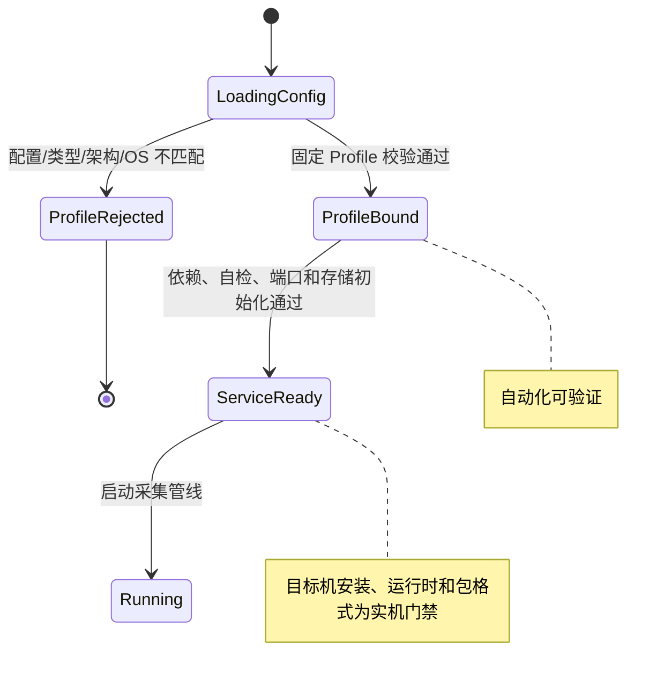
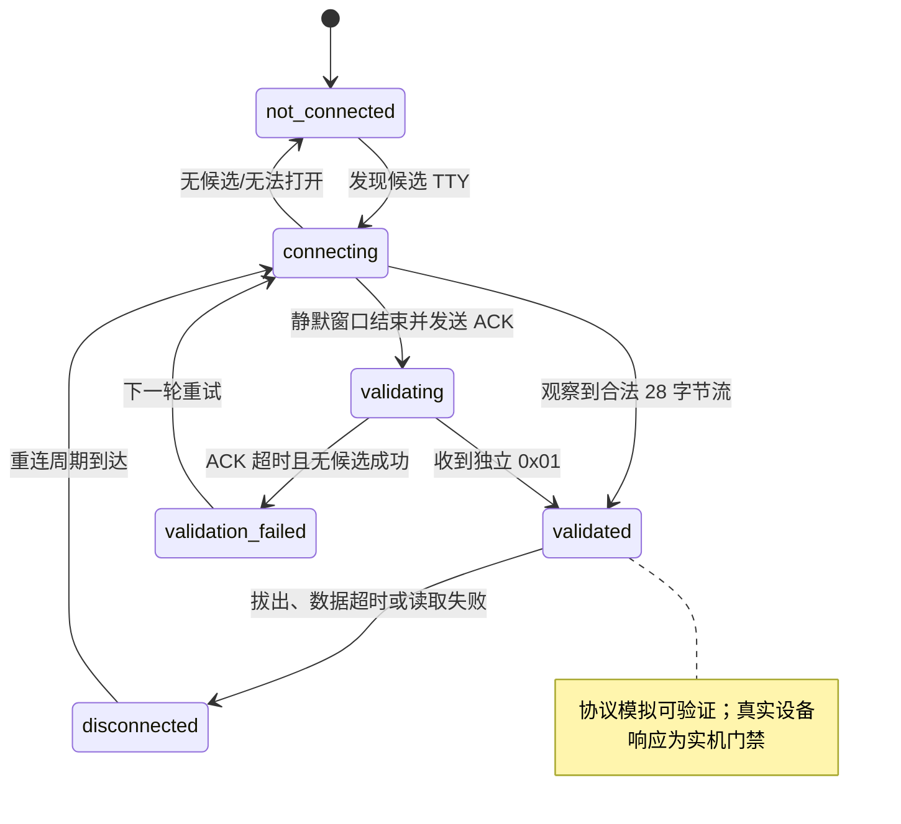
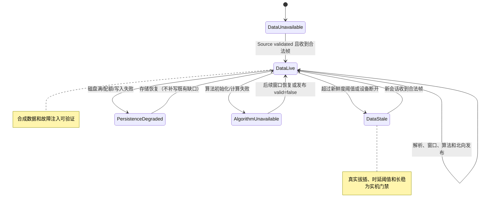
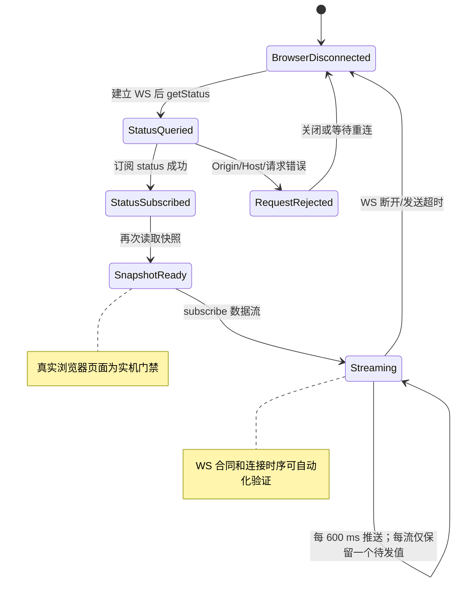
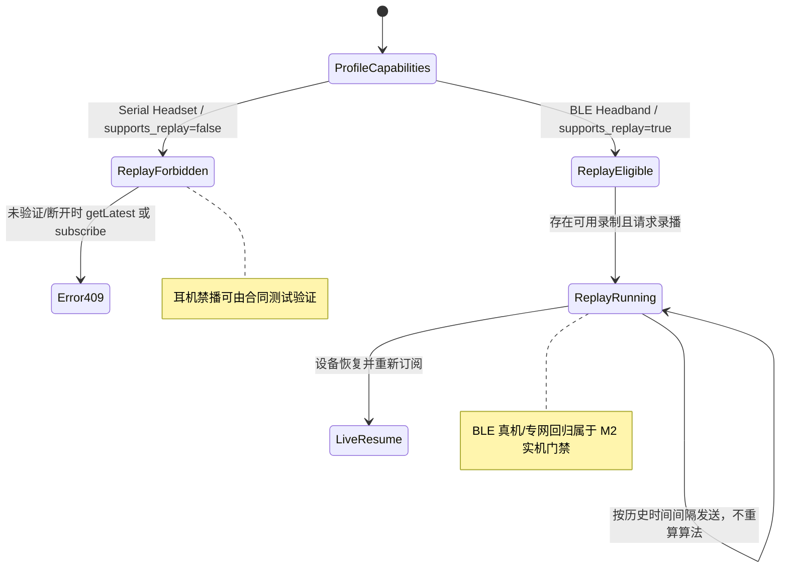

# 需求补齐与验收清单

日期：2026-09-08  
状态：内部源码核对；不是产品发布或现场验收报告。

依据：[统一架构 PRD](NeuroBridge项目结构与多系统接入_PRD.md)、[统一技术方案](NeuroBridge项目结构与多系统接入_技术方案.md)、[银河麒麟专项 PRD](../银河麒麟V10耳机USB串口接入_PRD.md)及[专项技术方案](../银河麒麟V10耳机USB串口接入_技术方案.md)。以下“已实现”仅表示本分支源码及自动化测试支持。

## 1. 统一架构：PRD → 技术方案 → 实现

| PRD 要求 | 技术方案 | 本轮结果与证据 |
|---|---|---|
| 固定 Profile、唯一 Bootstrap、稳定内核无具体 I/O 依赖 | §4、§5、§20 | 已实现；`bootstrap/container.py` 生产实例为 GatewayApplication，不再实例化旧 business.Gateway；共用一个算法引擎 |
| Source、Parser、DeviceControl 职责分离 | §6–§10 | 已实现；Application 准备会话后调用 DeviceControl，Source 只验证/读取；物理链路保留合法流扫描用于验证和超时，不再生成重复业务投影 |
| 采集不等待慢算法/磁盘、队列有界 | §17.1 | 已实现；独立算法 Worker、有界队列与 ALGORITHM_BACKLOG，持久化确认不在 RawChunk 消费任务中等待；生产入口故障测试覆盖 |
| 连接与数据双状态、数据新鲜度 | §11、§12 | 已实现；修复断线引用不存在 parser；新会话清空旧快照，超龄 getLatest 返回 valid=false，串口启动依赖失败进入 error |
| 完整帧、解析批次、算法结果分别保存并关联采集窗口 | §13 | 已实现；单套 raw/parsed/algorithm 分段写入，算法记录同时保存采集与计算时间；移除生产双写旧格式 |
| 算法超时、迟到隔离、原子最新值 | §12 | 已实现；迟到结果仅保存；积压后旧结果不能覆盖新结果；发布顺序使用进程内序号，不依赖可回拨的系统时间；SDK 请求串行化，失步桥接退出防止跨请求误配，下个设备会话重新初始化 |
| 每连接每流 1 个待发值 | §14、§17.1 | 已实现；SubscriptionFanout 接入实际发送链路，status/eeg/hr 独立槽位；覆盖计数、发送超时与关联任务取消 |
| 头环 ReplayReader 与耳机禁用 replay | §15 | 已实现；仅 supports_replay=true 注入 Reader；新分段读取按批次关联历史结果且不重新计算，使用磁盘索引/有界读取；旧文件格式保留兼容 |
| 存储过载、恢复、清理保护 | §13、§18 | 已实现；有界批量 fsync 后确认，磁盘 I/O 不持有状态锁，关闭超时保留 partial；读取/导出标记阻止自动清理；默认不清理 |
| 固定周期资源与链路观测 | §18.2 | 已实现周期 Runtime metrics，包含 CPU、RSS/峰值 RSS、任务/线程、FD/Handle、重连/离线、队列/耗时、发送/覆盖与存储水位；重启次数由 bootId 与服务日志关联 |
| 配置、服务布局、升级回滚 | §16、§22 | 类型化配置及迁移已有；本轮麒麟候选增加失败自动回滚与保留回滚快照；隔离目录验证应用、配置和 unit 恢复，未做目标机安装验收 |
| 存储新增北向字段及错误语义 | §13、§23 | 未发布：仍只有内部状态/日志，未修改已锁定或预发布协议；需明确协议更新授权及合同同步 |
| 原生离线包、运行时、签名、完整 SBOM/许可证 | §22、§23 | 部分实现：候选追加源树 dirty 标识、文件摘要、构建环境和原生依赖锁；CI 等待测试门禁且要求干净源码。目标运行时验证、完整许可证及最终签名/原生格式未完成 |
| 各阶段真实设备、算法基线和 24 小时长稳 | §20、§24 | 未验收：本轮仅开发机合成数据和故障注入测试，不能替代银河麒麟/M2/M3 实机 |

## 2. 统一架构：PRD 未单列的技术实现

| 项目 | PRD 关系 | 处理 |
|---|---|---|
| 旧 Gateway 兼容 facade | 迁移兼容手段，不是新增产品需求 | 保留旧调用 API/测试，但移出生产组合入口 |
| 分段文件转旧采集包的临时投影 | 实现“保留下载与历史兼容”所需细节 | 仅下载时生成，不增加实时双写；白名单防止内部帧外泄 |
| SQLite 临时关联索引 | 实现长录制读取的内存约束 | 索引只存临时目录，读取结束释放，不引入额外服务或生产数据库依赖 |
| Windows 源码、COM 与候选骨架 | M3 扩展，不属于 M1 当前验收 | 保留且明确未交付；本轮只收紧固定 COM 的 USB 身份过滤，不扩大麒麟验收范围 |
| 脚本更新包、诊断页和运维入口 | 工程联调工具 | 不把 Git bundle 更新包或通用 tar/zip 称为最终产品安装包 |

## 3. 银河麒麟：PRD → 技术方案 → 实现

| PRD 验收项 | 技术方案 | 当前状态 |
|---|---|---|
| AC-001 目标系统/硬件 | §1、§11 | 待最终 ISO/SHA-256 与 N100/N150 实机验收；候选安装器限定 Kylin V10 x86_64 |
| AC-002 USB 派生 TTY 安全发现 | §4 | 已有自动/固定路径过滤；继续保持禁止探测系统串口和 BLE |
| AC-003 已有流接管 | §5 | 已实现并回归；不发送 ACK/E1；算法不可用仍保存原始数据，停止尝试一次 E0 |
| AC-004 静默 ACK/独立 01/算法 ready 后 E1 | §5、§8 | 已实现；生产 Application 掌握 E1 决策，初始化异常不使能采集；验证状态不被算法错误改写 |
| AC-005 停止 | §5 | 正常关闭先调用 E0、后关闭 Source；增加 SIGTERM 清理与算法进程退出上限；硬件写失败/电气行为待实测 |
| AC-006 原始数据与读取时间 | §6、§7、§9 | 合成帧逐字节/关联测试通过；修复来源追踪累积、乱序高水位、已知缺口拼帧和 18/20 字节北向映射；真实抓取比对待完成 |
| AC-007 算法正确性 | §7、§8 | 输入投影、隔离、超时/积压有自动化；采样、分组、范围、单位和真实算法结果待确认与实测 |
| AC-008 页面与连接 | §10 | 保留回环、Origin/Host、状态查询/订阅和页面开始停止；慢订阅者不拖住采集；本轮未运行真实浏览器/耳机现场测试 |
| AC-009 拔插/重连/重启 | §5、§12 | 源码故障注入覆盖断线任务存活、会话隔离、清旧快照；真实拔插和服务场景待验收 |
| AC-010 离线禁止录播 | §9 | 继续通过合同测试；耳机不注入 Reader、不读取历史，仍返回已确认 409 |
| AC-011 运维 | §11、§12 | 自启/诊断已有；本轮补周期观测和候选回滚；目标机离线安装/升级/回滚演练未完成 |
| AC-012 长稳 | §12 | 明确对齐统一 PRD 的 24 小时，尚未执行目标机长稳；默认参数不是性能通过标准 |

## 4. 银河麒麟：PRD 未要求的兼容内容

| 内容 | 分类 | 当前策略 |
|---|---|---|
| macOS/Ubuntu BLE、专网和头环录播 | 历史兼容/M2 | 保留但与耳机 Profile 严格隔离，不纳入麒麟交付 |
| Windows COM/Service | 后续 M3 | 仅源码骨架和模拟测试；Windows 7 与 Python 3.11+ 的运行时兼容问题尚未解决 |
| 新 storage 字段、507 错误及对外运维文档 | 统一架构新增合同，专项 PRD 未授权改协议 | 保持发布门禁；本轮不向已发布报文添加字段 |
| 临时索引、队列缺口标记、回滚快照、文件白名单 | 可靠性与兼容实现细节 | 已实现，不新增设备模式、原生 USB 或浏览器直连能力 |

## 5. 参数与验证

各平台示例均新增 `[pipeline]`；必须为正整数：

| 参数 | 初始值 | 单位/含义 |
|---|---:|---|
| source_queue_size | 64 | RawChunk 个数 |
| source_enqueue_timeout_ms | 50 | Source 入队等待毫秒 |
| algorithm_queue_size | 8 | 待处理信号批次数 |
| persistence_timeout_ms | 100 | 单次确认等待毫秒 |
| shutdown_timeout_ms | 5000 | 管线排空/会话与 Writer 关闭等待毫秒；不是整个进程的总时间上限 |
| send_timeout_ms | 5000 | 单次订阅发送等待毫秒 |
| metrics_interval_seconds | 10 | 运维采样周期秒 |

在仓库根目录执行：

```bash
.venv/bin/python -m unittest discover -s tests -q
.venv/bin/python -m compileall -q neurobridge
bash -n packaging/kylin/install.sh packaging/kylin/rollback.sh
bash tools/check-external-protocol.sh
git diff --check
```

新增生产入口故障测试在 `tests/integration/test_production_resilience.py`；Parser 来源/序列测试在 `tests/unit/test_architecture_core.py`；算法桥接超时/取消/输出非法/会话替换隔离测试在 `tests/unit/test_algorithm_bridge_isolation.py`；回滚与候选元数据测试在 `tests/package/test_candidates.py`。测试只使用合成数据和临时目录，不部署到当前开发机、不外发人体数据、不生成正式发布包。

## 6. 交付前仍需关闭的门禁

1. 客户确认最终麒麟镜像、系统路径/包格式、真实耳机数据与算法预期基线；在该机完成真实设备场景与 24 小时长稳。
2. 明确授权后同步并发布存储状态北向合同、模拟服务端测试及对外运维文档；此前不能声称客户端能观察新的 storage 字段。
3. 提供并验证目标离线运行时及算法二进制，补齐完整许可证、签名、安装/修复/卸载/回滚验收和正式构建证据；当前通用候选仍不是正式安装包。
4. M2 的真实 BLE/专网/录播回归，以及 M3 的 Windows 7 运行时方案、安装器和升级回滚，按后续阶段实施。

以上事项的负责人仍为“待指定”；不以修改需求、虚构目标机结果或自行选择未确认平台基线来关闭。

## 7. 需求审查后的代码修复

2026-09-08 再次逐项审查后，确认上文“已实现”只适用于其测试范围，不能推导为完整需求通过。本节为当前实现状态的补充与纠正。

| 审查发现 | 本轮代码处理 | 验证边界 |
|---|---|---|
| 配置字符串 false 被转换为 true，数字字段接受错误类型 | 显式类型验证，拒绝非法布尔、数字、命令数组和非有限数 | 配置回归 |
| Kylin 仅识别系统名称，缺少 V10 门禁 | 实际 OS 检测带入 VERSION_ID，版本未知或非 V10 拒绝 | 模拟 os-release；最终 ISO 待锁定 |
| 窗口可设置 1000 ms，订阅仍声明 600 ms | 当前配置与 Profile 固定校验 600 ms，拒绝未发布的窗口变化 | 配置/组合根测试 |
| Capture 先订阅再查询 | 首次/重连先 getStatus 成功，再订阅状态，再补一次快照；就绪前禁用数据开始按钮 | 执行完整页面脚本的 Node 测试；实机浏览器另验 |
| 麒麟持久日志无轮转安装动作 | 默认进程内大小轮转，10 MiB、14 份，可配置；Ubuntu external 模式保留 | 临时目录真实轮转；现场保留策略待确认 |
| 存储 ENOSPC 与其他错误混为 write_error | errno 分类、失败不更新时间、路径启动失败降级而不退出 | 故障注入 |
| 清理审计不完整、partial 一次全量读取 | 选择/跳过/失败/删除审计；无法持久审计时不删；逐行恢复有效前缀 | 临时文件和失败注入；真实断电/清理另验 |
| GatewayApplication 仍拼包络并分支传输类型 | Codec 注入具体报文投影；连接状态集合由 Bootstrap 注入、录播由能力控制 | 依赖/分支检查及既有北向合同回归 |
| BLE 未使用独立 DeviceControl | 生产 Source 共享 BLE 会话与 I/O 锁；应用调用启停、旧会话再次校验、写失败仍断开 | 模拟 BLE；M2 真机未验收 |
| 批次缺少来源/版本/样本数等 | 补齐内部批次元数据并落盘，旧录制读取兼容 | 合成帧与生产管线关联测试 |
| RawChunk 可配置诊断留存未实现 | 默认关闭，单进程录制会话默认 1 MiB 原始字节预算，超限整块省略；完整帧始终按原策略保存 | 生产管线预算与完整帧共存测试 |
| 分层配置只停留在加载函数 | 包内 defaults.toml 自动加载；系统配置不可换 Profile；临时覆盖需显式开发模式；迁移保留权限和所有者 | 配置迁移与包结构回归 |
| 按流/按动作指标不完整 | 增加 requestsByAction、subscriptions、deliveryByStream 与覆盖次数 | 模拟订阅和周期日志；24 小时采样待完成 |
| 候选安装缺少完整性与空间预检 | 全文件 files.sha256、包外 release-manifest、NumCpp 许可证、磁盘余量检查、迁移后 Profile 检查 | 候选结构与 shell 检查；目标机安装另验 |

新增默认配置与运维约束：

- `logging.rotation_mode="size"`、`max_bytes=10485760`、`backup_count=14`。显式 external 模式由 logrotate 负责，同一文件只选一种轮转方式；旧 Ubuntu 部署升级时应核对该配置。
- `recording.transport_trace_enabled=false`、`transport_trace_max_bytes=1048576`。只影响额外 RawChunk 诊断留存，不影响完整帧和算法结果保存；默认不额外采集诊断字节。
- `session_retention_days=30` 仍为现有保守保留策略。清理默认关闭；启用时同时满足“已结束/未锁定/未占用”和该保留期，不擅自缩短现场数据保留时间。
- 产品配置优先级为包默认值 → 系统配置；`--development --override-config <文件>` 可增加开发覆盖。包固定 Profile 和当前 600 ms 合同仍不能通过覆盖改变。

本轮不关闭以下事项：存储新北向字段和 507 的协议同步；最终 Kylin 镜像/电气行为/真实算法基线；目标运行时、完整第三方许可证、原生包和正式签名；目标机安装/升级/修复/卸载及 24 小时验收；M2/M3 的真实平台回归与 Windows 7 运行时选择。候选包仍不得标为正式交付。

本轮最终验证：258 项 Python 自动化测试全部通过（开发机 Python 3.14）；`node tests/capture_connection_order.cjs` 通过首次连接、错误请求关联与重连时序测试；`compileall`、麒麟安装/回滚 Shell 语法、`tools/check-external-protocol.sh` 和 diff 空白检查通过。候选包测试实际校验全文件摘要，并修改载荷确认校验失败。未执行目标机部署，未构建正式签名包。

## 8. 无实机阶段的需求对应状态机

以下状态机用于把“源码/模拟测试已支持”和“必须实机验收”分开记录。没有实机时，只能关闭标注为“自动化可验证”的转换；标注为“实机门禁”的转换必须保留待验收状态。

### 8.1 启动与 Profile 绑定



### 8.2 设备连接与验证（耳机）



### 8.3 数据、算法与持久化状态



### 8.4 浏览器连接与订阅



### 8.5 录播能力分支



### 8.6 状态机需求关闭规则

| 状态机 | 无实机可关闭 | 必须保留待验收 |
|---|---|---|
| 启动/Profile | 配置校验、固定映射、错误拒绝 | 最终镜像、运行时、安装布局 |
| 设备连接 | 模拟 ACK/01/E1/E0、分帧和重连逻辑 | 真实 USB 枚举、电气行为、拔插 |
| 数据/算法 | 合成数据、超时、积压、持久化故障 | 真实算法基线、性能阈值、24 小时长稳 |
| 浏览器订阅 | WS 合同、Origin、600 ms 和重连顺序 | 目标机浏览器页面体验 |
| 录播分支 | Serial 禁播和 409 合同 | BLE 头环录播现场回归 |
