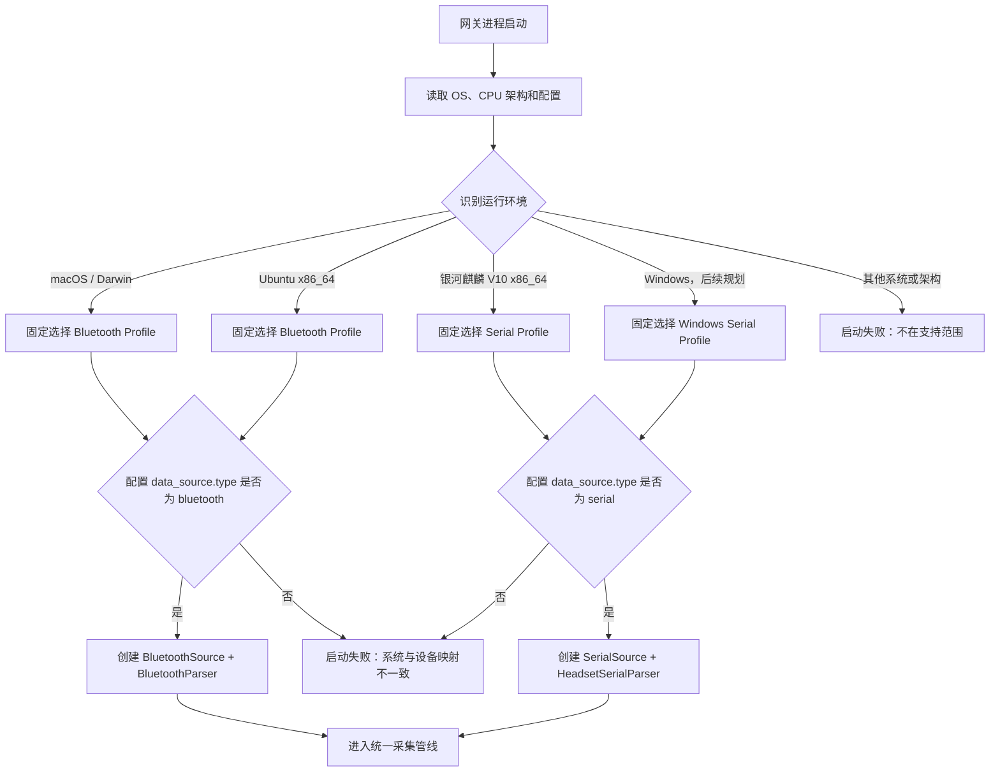
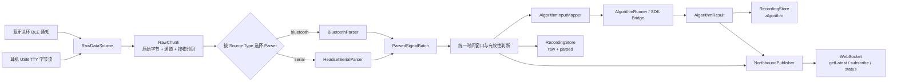
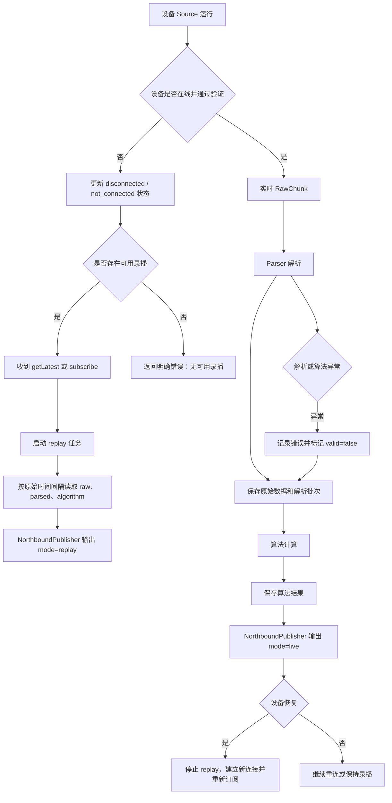

# NeuroBridge 项目结构与多系统接入 PRD

状态：内部架构需求基线（待评审）

日期：2026-09-04

适用分支：当前 NeuroBridge 分支

## 1. 文档目的

本文定义 NeuroBridge 在 macOS、Ubuntu、银河麒麟 V10 及后续 Windows 网关上的统一项目结构、设备接入边界、源数据处理链路和验收要求。

本文解决以下问题：

1. macOS、Ubuntu、银河麒麟 V10 以及后续 Windows 分别接入哪一种设备；
2. 蓝牙头环和 USB 串口耳机如何统一称为原始数据源；
3. 设备采集、源数据解析、算法输入、持久化和北向分发之间如何隔离；
4. 当前代码已经满足哪些要求，哪些地方仍不能作为目标架构验收依据。

本文是内部项目结构和实现约束，不修改已发布的北向协议，也不替代双方最终签字的报文语义。

## 2. 产品范围

### 2.1 支持矩阵

| 网关操作系统 | 设备类型 | 设备链路 | 目标状态 |
|---|---|---|---|
| macOS | 蓝牙头环 | BLE | 支持头环采集、算法处理、录制和北向分发 |
| Ubuntu | 蓝牙头环 | BLE | 支持头环采集、算法处理、录制和北向分发 |
| 银河麒麟 V10 x86_64 | 耳机 | USB 派生 TTY 串口 | 支持耳机采集、算法处理、录制和北向分发 |
| Windows | 耳机 | USB 虚拟串口（COM） | 后续规划；复用统一串口 Source/Parser 合同，不计入当前分支验收 |

系统和设备的对应关系由网关运行环境固定决定，不允许根据设备扫描结果自动切换到另一类设备传输。

### 2.2 统一术语

- **原始数据（Raw Data）**：设备接入边界收到的、尚未改变字节序和载荷语义的数据。包括 BLE 特征通知原始字节和耳机串口完整 28 字节帧。
- **源数据源（Raw Data Source）**：负责发现设备、建立连接、读取原始字节和报告连接状态的组件。
- **源数据解析器（Raw Data Parser）**：负责将某一种设备原始字节解析为网关统一的信号批次；解析器不得调用算法或北向服务。
- **统一信号批次（Parsed Signal Batch）**：与设备传输无关的 EEG、HR、状态和时间窗口模型，供算法、录制和北向层共同使用。
- **算法输入**：由统一信号批次经过算法适配器转换得到的 SDK 输入，不等同于设备原始帧。

### 2.3 不在本 PRD 范围

- 银河麒麟上的 BLE 头环接入；
- macOS 或 Ubuntu 上的耳机串口接入；
- 当前阶段的 Windows 实现与现场验收；Windows Profile 及其串口数据源属于后续扩展目标；
- 未确认设备 VID/PID、端点和传输合同的原生 USB/HID/Bulk/Interrupt 接入；
- 浏览器直接使用 Web Serial 或 WebUSB；
- 修改已发布或预发布北向协议版本、字段和错误码；
- 多耳机、多网关和多受试者并发场景。

## 3. 产品目标

### 3.1 主要目标

1. 当前三种目标操作系统均通过统一网关核心完成“设备采集 → 原始数据解析 → 算法 → 持久化 → 北向 WebSocket 分发”，并为后续 Windows 串口耳机接入保留相同扩展路径。
2. 新增或替换设备传输时，只增加对应 Source 和 Parser 实现，不修改核心业务、算法和北向协议代码。
3. 保留设备原始字节，并能将其与解析结果、算法结果、录制会话和采集窗口时间戳关联。
4. 通过运行环境配置校验保证系统与设备类型的固定映射，防止错误部署。
5. 实时模式与录播模式复用同一套统一信号模型和北向事件模型。

### 3.2 成功标准

- macOS 和 Ubuntu 能使用 BLE 头环完成连续采集；
- 银河麒麟 V10 能使用 USB 串口耳机完成握手、分帧、重连和连续采集；
- 当前三条链路以及后续 Windows 串口链路都使用相同根包络的北向消息；
- 算法层不依赖 BLE、串口或具体设备名称；
- 北向层不依赖 Bleak、pyserial 或设备帧格式；
- 设备接入失败、解析失败和算法失败不会导致主进程退出。

## 4. 目标总体架构

```text
┌─────────────────────────────────────────────────────────────┐
│                    OS Profile Resolver                      │
│ macOS → BLE Headband       Ubuntu → BLE Headband            │
│ Kylin V10 → USB Serial     Windows（规划）→ USB COM Serial  │
└──────────────────────────────┬──────────────────────────────┘
                               │ selects exactly one profile
┌──────────────────────────────▼──────────────────────────────┐
│                    Raw Data Source Layer                     │
│ BluetoothSource                  SerialSource                │
│ - scan/connect/notify             - tty discovery/open/read   │
│ - device lifecycle                - handshake/control         │
│ - emit RawChunk                   - emit RawChunk              │
└──────────────────────────────┬──────────────────────────────┘
                               │ raw bytes + receive timestamp
┌──────────────────────────────▼──────────────────────────────┐
│                    Raw Data Parser Layer                     │
│ BluetoothParser                  HeadsetSerialParser          │
│ - BLE characteristic mapping     - 28-byte frame validation   │
│ - payload validity               - resync/sequence tracking   │
│                                   - EEG/HR field extraction    │
│                 emit ParsedSignalBatch                       │
└──────────────────────────────┬──────────────────────────────┘
                               │ unified signal model
       ┌───────────────────────┼─────────────────────────┐
       ▼                       ▼                         ▼
 AlgorithmInputMapper     RecordingStore           NorthboundPublisher
       ▼                       ▼                         ▼
 AlgorithmRunner        raw + parsed + result       WS/JSON event
```

### 4.1 系统与设备策略选择流程



### 4.2 原始数据处理主流程



### 4.3 实时、断线和录播分支流程



### 4.4 分层依赖规则

| 层 | 可以依赖 | 禁止依赖 |
|---|---|---|
| OS Profile | OS 探测、配置校验、策略注册表 | 具体业务数据、北向消息 |
| Raw Data Source | 系统驱动、Bleak、pyserial、设备连接协议 | 算法、RecordingStore、北向协议 |
| Raw Data Parser | 设备帧格式、统一领域模型 | Bleak、pyserial、算法进程、WebSocket |
| Domain/Window | 统一信号模型、时间窗口和有效性 | 设备特征 UUID、串口对象、操作系统 |
| Algorithm | AlgorithmInput、SDK bridge | BLE/串口实现细节、北向连接 |
| Recording | Raw/Parsed/Algorithm 事件及会话 ID | WebSocket 连接对象 |
| Northbound | 统一领域事件、协议序列化 | Bleak、pyserial、设备帧解析 |

## 5. 核心接口需求

以下接口是架构合同，具体命名可以在实现设计阶段调整，但职责不得合并回 Gateway。

### 5.1 原始数据源接口

原始数据源负责设备生命周期和字节读取，不负责解释业务字段。

```text
RawDataSource
  start() -> async
  stop() -> async
  events() -> async iterator[RawChunk]
  status() -> SourceStatus
```

`RawChunk` 至少包含：

- `sourceType`：`bluetooth` 或 `serial`；
- `channel`：来源通道，如 BLE characteristic 或 `serial.read`；
- `bytes`：未经修改的原始字节；
- `receivedAtMs`：读取边界时间；
- `sessionId` 或可关联的连接会话标识；
- 可选的设备元数据，但不得把敏感凭据和完整人体数据写入日志。

### 5.2 源数据解析器接口

解析器接收 RawChunk，输出统一信号批次和解析状态。

```text
RawDataParser
  feed(chunk: RawChunk) -> list[ParsedSignalBatch]
  flush() -> list[ParsedSignalBatch]
  reset() -> None
```

解析器必须：

- 保留原始字节引用或原始记录关联；
- 显式返回无效原因、丢包、拆包、粘包和时间窗口信息；
- 不在解析失败时抛出导致网关退出的未处理异常；
- 不调用算法，不发送北向消息。

### 5.3 统一信号批次

统一模型至少包含：

- `sourceType`；
- `sessionId`；
- `windowStartMs`、`windowEndMs`；
- EEG 批量样本及其字节格式；
- HR 批量样本及其字节格式；
- `valid` 与 `invalidReasons`；
- 原始数据引用（录制 ID、序号或时间范围）。

统一模型不得使用 `ff31`、`ff51` 等只属于某一设备协议的名称作为公共业务字段。

### 5.4 算法适配接口

算法层只接收 `ParsedSignalBatch` 或明确的 `AlgorithmInput`，不得导入 BLE 或串口包模块。算法适配器负责：

- 保持算法要求的原始字节序和分组；
- 将统一 EEG/HR 批次转换为 SDK 输入；
- 返回算法指标、计算时间和错误原因；
- 算法不可用时保留原始数据和解析结果。

### 5.5 北向发布接口

北向发布器接收统一信号批次和算法结果，负责：

- 生成既有 `{protocolVersion, code, data, message}` 根包络；
- 按 `live` / `replay` 生成事件；
- 过滤订阅流；
- 处理 `getStatus`、`getLatest`、`subscribe`、`unsubscribe`。

设备源、解析器和算法适配器不得直接持有 WebSocket 连接对象。

## 6. 系统固定映射与 Windows 扩展需求

### 6.1 映射规则

```text
Darwin/macOS       → bluetooth + BluetoothParser
Ubuntu             → bluetooth + BluetoothParser
Galaxy Kylin V10   → serial    + HeadsetSerialParser
Windows（后续规划） → serial    + HeadsetSerialParser
```

### 6.2 校验规则

1. 启动时读取系统标识、架构和配置；
2. 解析 OS Profile；
3. 配置中的 `data_source.type` 必须与 OS Profile 一致；
4. 不一致时启动失败并给出明确错误，不自动降级到另一传输；
5. Kylin 必须校验 x86_64 和串口参数；
6. Ubuntu BLE 运行时不得要求或依赖 ttyACM/ttyUSB 权限；
7. macOS 和 Ubuntu 的 BLE 配置必须包含设备匹配条件和 BLE 权限检查；
8. 只有经过显式开发/回归开关授权，才允许在非目标系统运行其他传输策略。
9. Windows Profile 必须识别 USB 虚拟串口 COM 设备，不依赖 Linux 的 `/dev/ttyACM*`、`/dev/ttyUSB*` 或 sysfs；
10. Windows 与银河麒麟复用同一耳机帧语义、Parser、统一信号模型和北向链路，只允许串口发现、端口打开、权限和服务运行方式存在平台差异。

### 6.3 入口要求

- macOS：统一入口应使用共享网关核心和 BluetoothSource，不再维护一套绕过策略注册表的 POC 控制器；
- Ubuntu：部署脚本默认生成 BLE 配置，安装 BlueZ/Bleak 运行依赖，不以串口作为默认设备；
- 银河麒麟：项目入口固定生成 serial 配置，并执行串口权限、算法 bridge 和本机运行环境检查；
- Windows（后续）：提供 Windows 服务或受控进程入口，固定生成 serial 配置，通过 COM 端口发现实现接入，不复制 Gateway、Parser、算法和北向业务代码。

## 7. 设备接入要求

### 7.1 蓝牙头环

BluetoothSource 负责：

- 扫描并按已确认的设备名称/服务 UUID 筛选；
- 连接、订阅 EEG/HR/状态通知；
- 断线状态和重连；
- 记录通知到达时间；
- 输出未经修改的 BLE 原始通知。

BluetoothParser 负责：

- 按已确认的 BLE characteristic 解释通道；
- 校验 EEG、HR 数据长度和有效性；
- 按统一时间窗口形成信号批次。

### 7.2 USB 串口耳机

SerialSource 负责：

- 遍历 USB 派生 TTY 候选；
- 打开 115200 8-N-1 串口；
- 执行已有流观察、ACK、独立 `0x01` 验证和重连；
- 报告连接、验证和超时状态；
- 输出读取边界的原始字节块。

HeadsetSerialParser 负责：

- 识别固定 28 字节帧；
- 校验包头、长度、包尾；
- 处理拆包、粘包、噪声和缓冲上限；
- 解析序列号、EEG 和 HR 字段；
- 输出完整帧与统一 EEG/HR 批次之间的关联；
- 记录丢包、重复、乱序和迟到信息。

完整串口帧必须原样持久化；对算法的 EEG/HR 投影不得替代完整原始帧。

## 8. 数据、算法与北向链路

### 8.1 实时链路

```text
RawDataSource
  → RawDataParser
  → ParsedSignalBatch
  → AlgorithmInputMapper / AlgorithmRunner
  → RecordingStore（raw、parsed、algorithm 分开保存）
  → NorthboundPublisher
  → WebSocket 客户端
```

算法异常只影响算法结果的有效性，不得阻止原始数据和解析批次保存，也不得让采集主循环退出。

### 8.2 录播链路

录播直接读取已保存的原始数据、解析数据和算法结果，按原始时间间隔发送，不重新调用算法。录播输出必须显式带 `mode = "replay"`。

### 8.3 时间戳要求

- 原始数据使用设备读取/通知到达边界时间；
- Parser 不得使用页面发送时间替代采集时间；
- 同一原始帧派生出的多个信号应共享可关联的时间范围；
- 算法结果同时保存采集窗口时间和计算完成时间。

## 9. 当前分支评估

### 9.1 已有能力

| 领域 | 当前代码表现 | 判断 |
|---|---|---|
| 设备策略 | `DeviceAdapter` Protocol 和 `create_device_adapter()` 支持 bluetooth/serial | 有接口雏形 |
| 统一事件 | `DevicePacket` 携带 transport、channel、bytes、receivedAtMs | 部分符合 |
| Kylin 串口 | 已有发现、握手、28 字节分帧、重连、E1/E0、序列统计 | 基本符合当前串口基线 |
| 原始持久化 | 串口完整帧写入受保护目录，EEG/HR 与算法结果分开保存 | 基本符合 |
| 北向链路 | Gateway 生成统一 envelope，WebSocket 层负责传输 | 基本符合 |
| 录播 | 独立读取保存的 raw/algorithm 数据并输出 replay | 基本符合 |

### 9.2 与本 PRD 的差距

1. **没有 OS Profile Resolver。** 当前根据 `data_source.type` 选择适配器，没有强制 macOS/Ubuntu/Kylin 与设备类型的固定映射。
2. **Ubuntu 默认关系错误。** `config/gateway.toml.example` 默认是 `type = "serial"`，Ubuntu 安装脚本还会授予 tty 设备组权限；这不符合 Ubuntu BLE 头环目标。
3. **macOS 配置不完整。** `mac/gateway.capture.toml.example` 没有 `[data_source]`，而当前 `config.load()` 要求该字段显式存在。按当前模板加载会报 `data_source.type must be explicitly configured`。
4. **macOS 入口绕过统一策略。** `mac/poc_server.py` 直接实例化 `FlowtimeAdapter`，没有使用统一的 `create_device_adapter()`。
5. **Source 与 Parser 职责混合。** `SerialAdapter` 同时承担串口发现、控制握手、分帧、字段切片和输出通道投影；BLE 适配器也同时承担扫描、订阅和通道映射。
6. **公共模型被 BLE 命名污染。** `DataWindow`、`RawPacket` 位于 `neurobridge/ble/packets.py`，算法层和 Gateway 都依赖该模块；串口数据被转换为 `ff31`/`ff51` 兼容通道后才进入公共处理。
7. **没有明确的算法输入模型。** `AlgorithmRunner` 直接拼接窗口字节并发送 `eegRawBase64`/`hrRawBase64`，尚未形成独立的设备无关 `AlgorithmInput`。
8. **北向协议业务仍集中在 Gateway。** WebSocket 传输已分离，但请求解析、事件映射和协议过滤仍与设备业务同处 Gateway，后续可继续抽出 NorthboundPublisher。
9. **缺少系统 Profile 集成验收测试。** 现有测试覆盖较多串口和 BLE 单元行为，但没有验证 macOS BLE、Ubuntu BLE、Kylin 串口的系统映射和错误组合拒绝，也没有 Windows 串口扩展测试基线。
10. **当前串口发现实现仅适用于 Linux。** 现有实现依赖 `/dev/serial/by-id`、`ttyACM`、`ttyUSB` 和 sysfs；后续 Windows 需要独立的 COM 发现后端，但应复用相同 Source 接口及 `HeadsetSerialParser`。

因此，当前分支的结论是：**具备多传输适配器和共享下游链路，但尚未满足本 PRD 的完整项目结构要求。**

## 10. 非功能要求

### 10.1 稳定性

- 设备断线、串口异常、BLE 异常、解析异常和算法异常均转换为可观测状态；
- 适配器自动重连，主进程不因单次设备错误退出；
- 缓冲上限、重连间隔、窗口大小和录播速度均配置化。

### 10.2 安全与隐私

- 默认本机浏览器和 WebSocket 仅监听 `127.0.0.1`；
- 日志不得记录令牌、密码、私钥或完整人体原始数据；
- 完整串口帧和 BLE 原始数据只能写入受保护的录制目录；
- 北向层不得暴露设备扫描、UUID、串口路径和内部帧格式。

### 10.3 可维护性

- 设备传输实现不得被算法和北向层导入；
- 公共领域模型不得位于 `ble/` 或 `serial/` 私有目录；
- 新设备接入应通过新增 Source、Parser 和 Profile 完成，核心 Gateway 不得增加设备类型分支；
- 配置错误应在启动前失败，错误信息需指出系统、期望传输和实际传输。

## 11. 验收标准

### 11.1 系统映射

- macOS 启动后只能选择 BLE 头环 Profile；
- Ubuntu 24.04 启动后默认选择 BLE 头环 Profile；
- 银河麒麟 V10 x86_64 启动后只能选择 USB 串口耳机 Profile；
- Windows 扩展完成后只能选择 USB 虚拟串口耳机 Profile；当前阶段只验收其接口扩展点，不宣称 Windows 已实现；
- 在任一系统配置另一类传输时，启动前明确拒绝；
- 不允许通过设备扫描结果自动切换 Profile。

### 11.2 源数据接口与解析

- BLE 和串口均通过同一 `RawDataSource` 事件边界输出原始字节；
- BLE 和串口均有独立 Parser，Parser 输出同一 `ParsedSignalBatch`；
- Parser 单元测试覆盖正常包、拆包、粘包、非法包、时间戳和无效原因；
- 串口完整 28 字节帧可从持久化记录恢复；
- 新增模拟 Source 不需要修改 Gateway、AlgorithmRunner 或 NorthboundPublisher。

### 11.3 算法和北向

- 算法输入只依赖统一模型，不导入 `ble` 或 `serial` 实现模块；
- 算法失败时 raw/parsed 数据仍保存，北向事件正确标记 `valid=false` 或算法不可用原因；
- 实时和录播均输出统一根包络；
- `subscribe`、`getLatest`、`getStatus`、`unsubscribe` 在当前三种目标 Profile 下行为一致；Windows 实现后必须满足同一行为。

### 11.4 场景验收

- macOS BLE 头环持续采集、断线重连、浏览器重连；
- Ubuntu BLE 头环持续采集、BlueZ 权限、断线重连、服务重启；
- 银河麒麟串口耳机已有流接管、ACK/`0x01` 验证、E1/E0、拔插重连；
- 当前三种系统分别完成原始数据、解析数据、算法结果和录播回放验证；
- Windows 后续实现需增加 COM 发现、插拔恢复、服务重启及同一耳机帧录播兼容性验证；
- 目标环境结果区分“源码支持”“POC 已验证”和“现场验收通过”。

## 12. 交付物

1. OS Profile 与固定映射实现；
2. `RawDataSource`、`RawDataParser` 和统一领域模型；
3. macOS/Ubuntu BLE 与银河麒麟串口的 Source/Parser 实现，以及 Windows COM 串口 Source 扩展设计；
4. 算法输入适配器和独立的 NorthboundPublisher；
5. 当前三系统配置模板和启动入口，以及后续 Windows 配置与服务入口规范；
6. 单元测试、集成测试和目标系统验收记录；
7. 更新后的 README、内部技术方案和部署说明；
8. 不改变已发布北向协议语义的变更记录。
