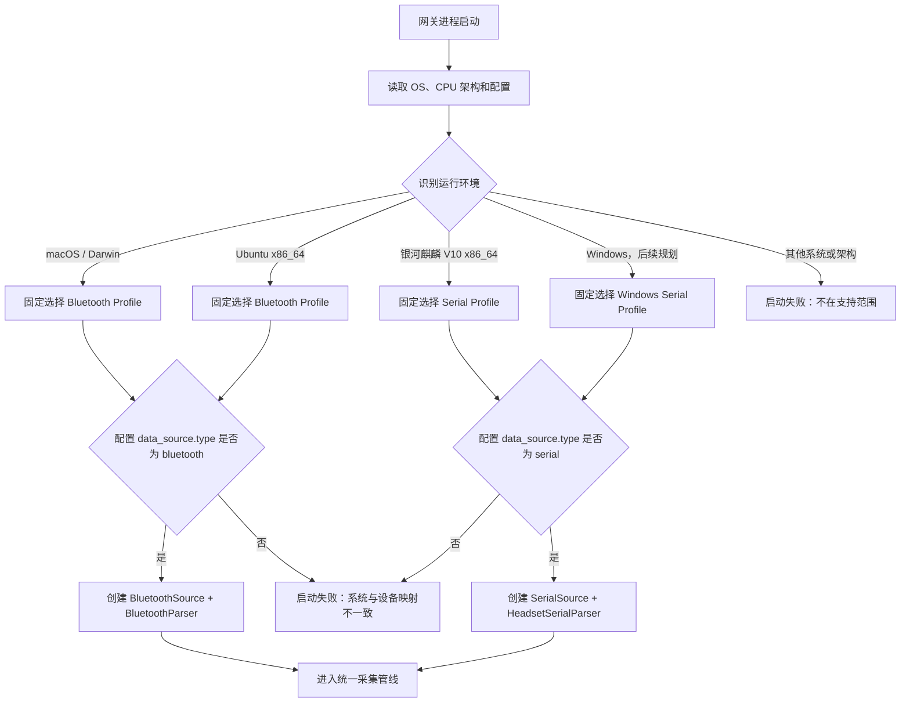
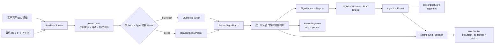
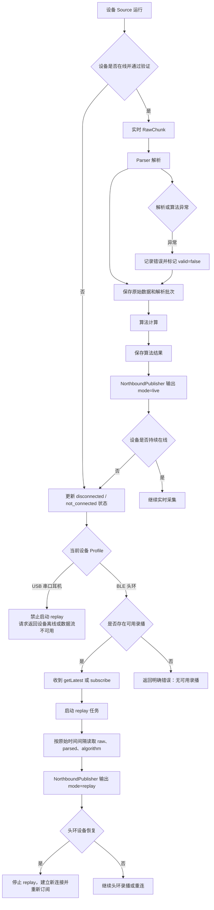
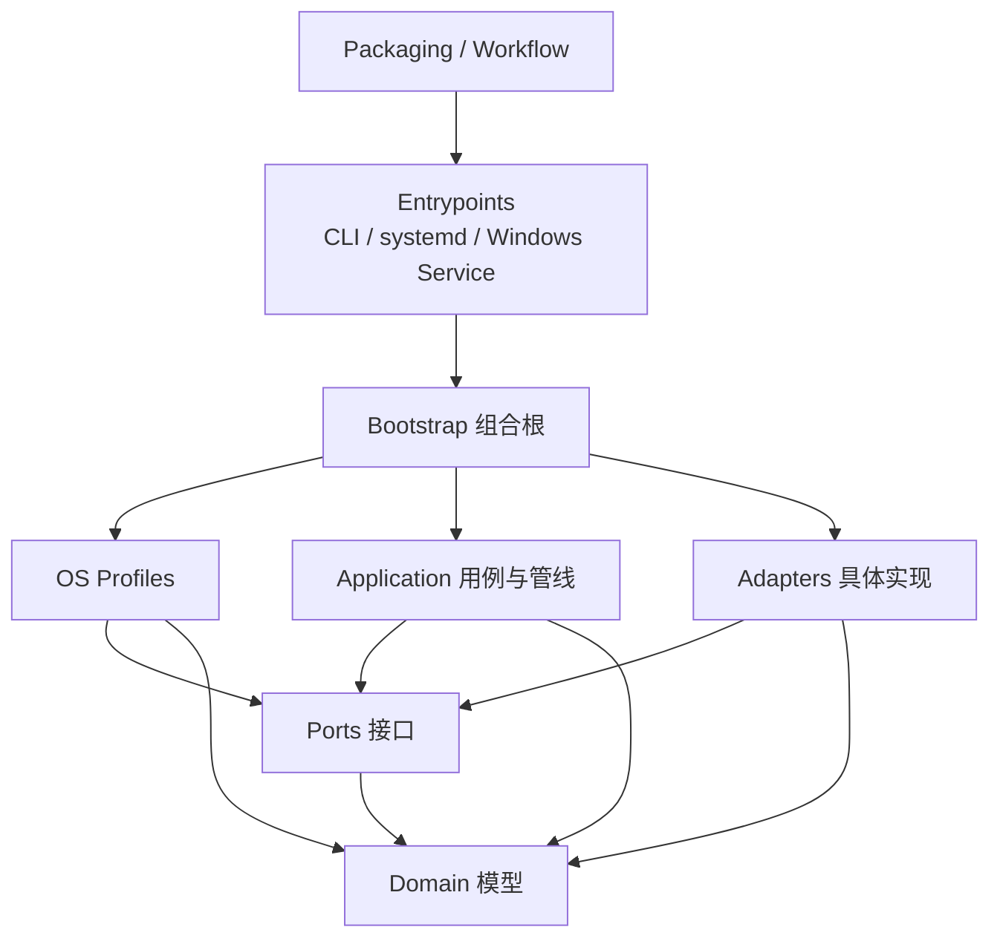
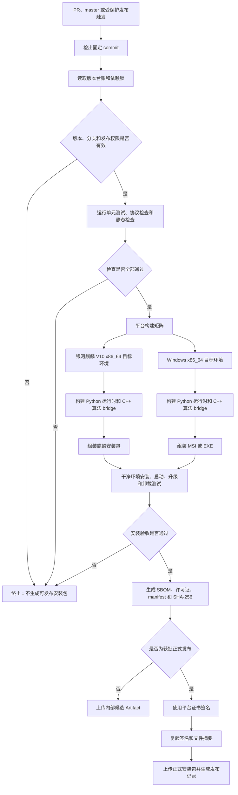

# NeuroBridge 项目结构与多系统接入 PRD

状态：内部架构需求基线（待评审）

日期：2026-09-07

适用分支：当前 NeuroBridge 分支

## 1. 文档目的

本文定义 NeuroBridge 在 macOS、Ubuntu、银河麒麟 V10 及后续 Windows 网关上的统一项目结构、设备接入边界、源数据处理链路和验收要求。

本文解决以下问题：

1. macOS、Ubuntu、银河麒麟 V10 以及后续 Windows 分别接入哪一种设备；
2. 蓝牙头环和 USB 串口耳机如何统一称为原始数据源；
3. 设备采集、源数据解析、算法输入、持久化和北向分发之间如何隔离；
4. 当前代码已经满足哪些要求，哪些地方仍不能作为目标架构验收依据。

本文是内部项目结构和实现约束，不修改已发布的北向协议，也不替代双方最终签字的报文语义。

## 2. 产品范围

### 2.1 支持矩阵

| 网关操作系统 | 设备类型 | 设备链路 | 目标状态 |
|---|---|---|---|
| macOS | 蓝牙头环 | BLE | 支持头环实时采集、录播、算法处理、录制和北向分发 |
| Ubuntu | 蓝牙头环 | BLE | 支持头环实时采集、录播、算法处理、录制和北向分发 |
| 银河麒麟 V10 x86_64 | 耳机 | USB 派生 TTY 串口 | 最终产品平台；仅支持实时数据，不支持录播；以可安装、升级、卸载的离线安装包交付 |
| Windows x86_64 | 耳机 | USB 虚拟串口（COM） | 后续最终产品平台；仅支持实时数据，不支持录播；以可安装、升级、卸载的安装包交付 |

系统和设备的对应关系由网关运行环境固定决定，不允许根据设备扫描结果自动切换到另一类设备传输。

macOS 和 Ubuntu 用于 BLE 头环兼容、开发、验证或特定部署；面向最终客户的标准产品交付形态为银河麒麟 V10 安装包或 Windows 安装包。不得要求最终用户获取 Git 仓库、执行源码脚本或自行准备 Python/C++ 构建环境。

### 2.2 统一术语

- **原始数据（Raw Data）**：设备接入边界收到的、尚未改变字节序和载荷语义的数据。包括 BLE 特征通知原始字节和耳机串口完整 28 字节帧。
- **源数据源（Raw Data Source）**：负责发现设备、建立连接、读取原始字节和报告连接状态的组件。
- **源数据解析器（Raw Data Parser）**：负责将某一种设备原始字节解析为网关统一的信号批次；解析器不得调用算法或北向服务。
- **统一信号批次（Parsed Signal Batch）**：与设备传输无关的 EEG、HR、状态和时间窗口模型，供算法、录制和北向层共同使用。
- **算法输入**：由统一信号批次经过算法适配器转换得到的 SDK 输入，不等同于设备原始帧。
- **录制（Recording）**：为追溯、诊断或合规目的持久化设备原始数据、解析数据和算法结果。录制不代表数据允许录播。
- **录播（Replay）**：将已保存数据按历史采集时间间隔重新通过北向协议发送。录播仅适用于蓝牙头环；USB 串口耳机数据不支持录播。

### 2.3 不在本 PRD 范围

- 银河麒麟上的 BLE 头环接入；
- macOS 或 Ubuntu 上的耳机串口接入；
- 当前阶段的 Windows 实现与现场验收；Windows Profile 及其串口数据源属于后续扩展目标；
- 未确认设备 VID/PID、端点和传输合同的原生 USB/HID/Bulk/Interrupt 接入；
- 浏览器直接使用 Web Serial 或 WebUSB；
- USB 串口耳机历史数据的北向录播；
- 修改已发布或预发布北向协议版本、字段和错误码；
- 多耳机、多网关和多受试者并发场景。

## 3. 产品目标

### 3.1 主要目标

1. 当前三种目标操作系统均通过统一网关核心完成“设备采集 → 原始数据解析 → 算法 → 持久化 → 北向 WebSocket 分发”，并为后续 Windows 串口耳机接入保留相同扩展路径。
2. 按 Domain、Ports、Application、Adapters、Profiles 和 Entrypoints 重新组织项目结构；新增或替换设备传输时，只增加对应 Source、Parser 和 Profile 实现，不修改核心业务、算法和北向协议代码。
3. 保留设备原始字节，并能将其与解析结果、算法结果、录制会话和采集窗口时间戳关联。
4. 通过运行环境配置校验保证系统与设备类型的固定映射，防止错误部署。
5. 蓝牙头环的实时与录播模式复用同一套统一信号模型和北向事件模型；USB 串口耳机只允许实时模式。
6. 银河麒麟 V10 和 Windows 的最终交付物由受控 Workflow 从已审核源码生成可追溯安装包，不以源码目录或 Git bundle 代替产品安装包。

### 3.2 成功标准

- macOS 和 Ubuntu 能使用 BLE 头环完成连续采集；
- 银河麒麟 V10 能使用 USB 串口耳机完成握手、分帧、重连和连续采集；
- 当前三条链路以及后续 Windows 串口链路都使用相同根包络的北向消息；
- 算法层不依赖 BLE、串口或具体设备名称；
- 北向层不依赖 Bleak、pyserial 或设备帧格式；
- 公共领域模型和接口层不反向依赖具体设备、操作系统、WebSocket、文件系统或算法 SDK；
- 设备接入失败、解析失败和算法失败不会导致主进程退出；
- 银河麒麟和 Windows 耳机离线时不自动选择任何录播数据，耳机北向事件不得出现 `mode="replay"`；
- 银河麒麟与 Windows 安装包可在干净目标系统上完成安装、启动、升级、修复和卸载，并能通过版本、摘要和构建清单追溯到唯一源码提交。

## 4. 目标总体架构

```text
┌─────────────────────────────────────────────────────────────┐
│                    OS Profile Resolver                      │
│ macOS → BLE Headband       Ubuntu → BLE Headband            │
│ Kylin V10 → USB Serial     Windows（规划）→ USB COM Serial  │
└──────────────────────────────┬──────────────────────────────┘
                               │ selects exactly one profile
┌──────────────────────────────▼──────────────────────────────┐
│                    Raw Data Source Layer                     │
│ BluetoothSource                  SerialSource                │
│ - scan/connect/notify             - tty discovery/open/read   │
│ - device lifecycle                - handshake/control         │
│ - emit RawChunk                   - emit RawChunk              │
└──────────────────────────────┬──────────────────────────────┘
                               │ raw bytes + receive timestamp
┌──────────────────────────────▼──────────────────────────────┐
│                    Raw Data Parser Layer                     │
│ BluetoothParser                  HeadsetSerialParser          │
│ - BLE characteristic mapping     - 28-byte frame validation   │
│ - payload validity               - resync/sequence tracking   │
│                                   - EEG/HR field extraction    │
│                 emit ParsedSignalBatch                       │
└──────────────────────────────┬──────────────────────────────┘
                               │ unified signal model
       ┌───────────────────────┼─────────────────────────┐
       ▼                       ▼                         ▼
 AlgorithmInputMapper     RecordingStore           NorthboundPublisher
       ▼                       ▼                         ▼
 AlgorithmRunner        raw + parsed + result       WS/JSON event
```

### 4.1 系统与设备策略选择流程



### 4.2 原始数据处理主流程



### 4.3 实时、断线与头环录播分支流程



### 4.4 目标项目结构重设计

当前目录按功能逐步演进，已经出现公共模型位于 `ble/`、串口 Source 与 Parser 混合、平台入口绕过统一组合逻辑等问题。目标结构采用“领域模型 + 接口端口 + 应用编排 + 外部适配器 + 系统 Profile + 组合根”，建议目录如下。文件名可在技术设计阶段微调，但职责边界和依赖方向属于本 PRD 的强制要求。

```text
NeuroBridge/
├── neurobridge/
│   ├── domain/                         # 纯领域模型，不依赖外部框架
│   │   ├── raw.py                      # RawChunk、SourceStatus、连接会话
│   │   ├── signal.py                   # ParsedSignalBatch、时间窗口、有效性
│   │   ├── algorithm.py                # AlgorithmInput、AlgorithmResult
│   │   └── capabilities.py             # ProfileCapabilities，如 supportsReplay
│   ├── ports/                          # 面向接口编程的抽象边界
│   │   ├── raw_source.py               # RawDataSource
│   │   ├── raw_parser.py               # RawDataParser
│   │   ├── algorithm.py                # AlgorithmEngine
│   │   ├── recording.py                # RecordingRepository
│   │   ├── replay.py                   # ReplayRepository / ReplayReader
│   │   └── northbound.py               # NorthboundSink / 会话输出接口
│   ├── application/                    # 用例与管线编排，只依赖 domain + ports
│   │   ├── acquisition.py              # Source → Parser → Window 主流程
│   │   ├── processing.py               # 算法输入映射与执行编排
│   │   ├── subscriptions.py            # getLatest/subscribe/unsubscribe 用例
│   │   ├── replay.py                   # 仅在 Profile 允许时启动头环录播
│   │   └── status.py                   # 统一运行状态和错误转换
│   ├── adapters/                       # ports 的具体实现
│   │   ├── sources/
│   │   │   ├── bluetooth_bleak.py      # macOS/Ubuntu BLE 连接与原始通知
│   │   │   ├── serial_posix.py         # 银河麒麟 TTY 发现、打开、读取
│   │   │   └── serial_windows.py       # Windows COM 发现、打开、读取（规划）
│   │   ├── parsers/
│   │   │   ├── headband_ble.py         # 头环 BLE 通知语义解析
│   │   │   └── headset_rev181.py       # 耳机 28 字节帧解析，麒麟/Windows 共用
│   │   ├── algorithms/
│   │   │   └── affective_sdk.py        # C++ SDK bridge 适配
│   │   ├── storage/
│   │   │   └── filesystem.py           # raw/parsed/algorithm 分层持久化
│   │   └── northbound/
│   │       ├── protocol.py              # 根包络、字段映射、错误映射
│   │       ├── websocket.py             # WS 连接与 UTF-8 JSON 传输
│   │       └── local_ui.py              # 本机 HTTP 页面
│   ├── profiles/                        # OS 与设备组合及能力声明
│   │   ├── resolver.py                  # OS/架构/配置校验
│   │   ├── macos_headband.py            # BLE + 头环 Parser + replay=true
│   │   ├── ubuntu_headband.py           # BLE + 头环 Parser + replay=true
│   │   ├── kylin_headset.py             # POSIX Serial + 耳机 Parser + replay=false
│   │   └── windows_headset.py           # Windows Serial + 耳机 Parser + replay=false
│   ├── bootstrap/                       # 唯一组合根，实例化并注入具体实现
│   │   ├── container.py
│   │   └── app.py
│   ├── entrypoints/                     # CLI、systemd/Windows Service 进程入口
│   │   ├── cli.py
│   │   └── service.py
│   └── configuration/                   # 配置模型、加载、迁移和校验
├── config/                              # 各 Profile 默认配置模板
├── web/                                 # 本机浏览器静态资源
├── packaging/
│   ├── kylin/                           # 原生包/.run、systemd、权限和升级脚本
│   └── windows/                         # MSI/EXE、Windows Service 和签名配置
├── tests/
│   ├── unit/                            # domain、Parser、应用用例
│   ├── contract/                        # Source/Parser/算法/北向接口合同测试
│   ├── integration/                     # Profile 完整管线与录播策略
│   ├── platform/                        # macOS/Ubuntu/Kylin/Windows 平台测试
│   └── package/                         # 安装、升级、卸载测试
└── .github/workflows/                   # 校验、候选包与受保护发布 Workflow
```

结构设计规则：

1. `domain/` 和 `ports/` 是稳定内核，不得导入 `adapters/`、`profiles/`、系统 API 或第三方 I/O 库；
2. `application/` 通过 ports 调用设备、算法、持久化和北向输出，不实例化 Bleak、pyserial、WebSocket 或文件存储实现；
3. `adapters/sources/` 只处理传输和设备生命周期，`adapters/parsers/` 只解释设备数据语义，两者必须能独立做合同测试；
4. POSIX TTY 与 Windows COM 是两个 Source 实现，但共用 `headset_rev181` Parser，禁止复制耳机帧解析逻辑；
5. `profiles/` 只声明 Source、Parser、配置约束和能力，不承载采集、算法、录制或北向业务代码；
6. `bootstrap/` 是唯一允许同时认识 ports 和具体 adapters 的组合根，所有 CLI、systemd 与 Windows Service 入口必须经该组合根启动；
7. 录制能力与录播能力分开建模：RecordingRepository 可保存所有设备数据，ReplayReader 只能由 `supportsReplay=true` 的头环 Profile 使用；
8. `packaging/` 与平台安装脚本不得被 `neurobridge/domain`、`ports` 或 `application` 导入；
9. 迁移可以分阶段进行，并可短期保留兼容导出层，但不得长期同时维护两套 Gateway、领域模型或耳机 Parser。

### 4.5 目标依赖方向



图中箭头表示“可以依赖”。`Domain` 不依赖其他业务层；具体设备和平台实现通过 `Bootstrap` 注入应用层，禁止从 `Application` 反向导入 `Adapters`。

### 4.6 分层依赖规则

| 层 | 可以依赖 | 禁止依赖 |
|---|---|---|
| OS Profile | OS 探测、配置校验、策略注册表 | 具体业务数据、北向消息 |
| Raw Data Source | 系统驱动、Bleak、pyserial、设备连接协议 | 算法、RecordingStore、北向协议 |
| Raw Data Parser | 设备帧格式、统一领域模型 | Bleak、pyserial、算法进程、WebSocket |
| Domain/Window | 统一信号模型、时间窗口和有效性 | 设备特征 UUID、串口对象、操作系统 |
| Algorithm | AlgorithmInput、SDK bridge | BLE/串口实现细节、北向连接 |
| Recording | Raw/Parsed/Algorithm 事件及会话 ID | WebSocket 连接对象 |
| Northbound | 统一领域事件、协议序列化 | Bleak、pyserial、设备帧解析 |

## 5. 核心接口需求

以下接口是架构合同，具体命名可以在实现设计阶段调整，但职责不得合并回 Gateway。

### 5.1 原始数据源接口

原始数据源负责设备生命周期和字节读取，不负责解释业务字段。

```text
RawDataSource
  start() -> async
  stop() -> async
  events() -> async iterator[RawChunk]
  status() -> SourceStatus
```

`RawChunk` 至少包含：

- `sourceType`：`bluetooth` 或 `serial`；
- `channel`：来源通道，如 BLE characteristic 或 `serial.read`；
- `bytes`：未经修改的原始字节；
- `receivedAtMs`：读取边界时间；
- `sessionId` 或可关联的连接会话标识；
- 可选的设备元数据，但不得把敏感凭据和完整人体数据写入日志。

### 5.2 源数据解析器接口

解析器接收 RawChunk，输出统一信号批次和解析状态。

```text
RawDataParser
  feed(chunk: RawChunk) -> list[ParsedSignalBatch]
  flush() -> list[ParsedSignalBatch]
  reset() -> None
```

解析器必须：

- 保留原始字节引用或原始记录关联；
- 显式返回无效原因、丢包、拆包、粘包和时间窗口信息；
- 不在解析失败时抛出导致网关退出的未处理异常；
- 不调用算法，不发送北向消息。

### 5.3 统一信号批次

统一模型至少包含：

- `sourceType`；
- `sessionId`；
- `windowStartMs`、`windowEndMs`；
- EEG 批量样本及其字节格式；
- HR 批量样本及其字节格式；
- `valid` 与 `invalidReasons`；
- 原始数据引用（录制 ID、序号或时间范围）。

统一模型不得使用 `ff31`、`ff51` 等只属于某一设备协议的名称作为公共业务字段。

### 5.4 算法适配接口

算法层只接收 `ParsedSignalBatch` 或明确的 `AlgorithmInput`，不得导入 BLE 或串口包模块。算法适配器负责：

- 保持算法要求的原始字节序和分组；
- 将统一 EEG/HR 批次转换为 SDK 输入；
- 返回算法指标、计算时间和错误原因；
- 算法不可用时保留原始数据和解析结果。

### 5.5 北向发布接口

北向发布器接收统一信号批次和算法结果，负责：

- 生成既有 `{protocolVersion, code, data, message}` 根包络；
- 按设备 Profile 生成事件：蓝牙头环允许 `live` / `replay`，USB 串口耳机只允许 `live`；
- 过滤订阅流；
- 处理 `getStatus`、`getLatest`、`subscribe`、`unsubscribe`。

设备源、解析器和算法适配器不得直接持有 WebSocket 连接对象。

对于 USB 串口耳机，北向发布器还必须保证：

- 不从历史录制推导 `availableStreams`；
- 不创建 replay task，不输出 `mode="replay"`；
- 耳机离线后的 `getLatest`、`subscribe` 和状态查询不以历史数据伪装为当前可用数据。

## 6. 系统固定映射与 Windows 扩展需求

### 6.1 映射规则

```text
Darwin/macOS       → bluetooth + BluetoothParser
Ubuntu             → bluetooth + BluetoothParser
Galaxy Kylin V10   → serial    + HeadsetSerialParser
Windows（后续规划） → serial    + HeadsetSerialParser
```

### 6.2 校验规则

1. 启动时读取系统标识、架构和配置；
2. 解析 OS Profile；
3. 配置中的 `data_source.type` 必须与 OS Profile 一致；
4. 不一致时启动失败并给出明确错误，不自动降级到另一传输；
5. Kylin 必须校验 x86_64 和串口参数；
6. Ubuntu BLE 运行时不得要求或依赖 ttyACM/ttyUSB 权限；
7. macOS 和 Ubuntu 的 BLE 配置必须包含设备匹配条件和 BLE 权限检查；
8. 只有经过显式开发/回归开关授权，才允许在非目标系统运行其他传输策略；
9. Windows Profile 必须识别 USB 虚拟串口 COM 设备，不依赖 Linux 的 `/dev/ttyACM*`、`/dev/ttyUSB*` 或 sysfs；
10. Windows 与银河麒麟复用同一耳机帧语义、Parser、统一信号模型和北向链路，只允许串口发现、端口打开、权限和服务运行方式存在平台差异。

### 6.3 入口要求

- macOS：统一入口应使用共享网关核心和 BluetoothSource，不再维护一套绕过策略注册表的 POC 控制器；
- Ubuntu：部署脚本默认生成 BLE 配置，安装 BlueZ/Bleak 运行依赖，不以串口作为默认设备；
- 银河麒麟：项目入口固定生成 serial 配置，并执行串口权限、算法 bridge 和本机运行环境检查；
- Windows（后续）：提供 Windows 服务或受控进程入口，固定生成 serial 配置，通过 COM 端口发现实现接入，不复制 Gateway、Parser、算法和北向业务代码。

## 7. 设备接入要求

### 7.1 蓝牙头环

BluetoothSource 负责：

- 扫描并按已确认的设备名称/服务 UUID 筛选；
- 连接、订阅 EEG/HR/状态通知；
- 断线状态和重连；
- 记录通知到达时间；
- 输出未经修改的 BLE 原始通知。

BluetoothParser 负责：

- 按已确认的 BLE characteristic 解释通道；
- 校验 EEG、HR 数据长度和有效性；
- 按统一时间窗口形成信号批次。

### 7.2 USB 串口耳机

SerialSource 负责：

- 遍历 USB 派生 TTY 候选；
- 打开 115200 8-N-1 串口；
- 执行已有流观察、ACK、独立 `0x01` 验证和重连；
- 报告连接、验证和超时状态；
- 输出读取边界的原始字节块。

HeadsetSerialParser 负责：

- 识别固定 28 字节帧；
- 校验包头、长度、包尾；
- 处理拆包、粘包、噪声和缓冲上限；
- 解析序列号、EEG 和 HR 字段；
- 输出完整帧与统一 EEG/HR 批次之间的关联；
- 记录丢包、重复、乱序和迟到信息。

完整串口帧必须原样持久化；对算法的 EEG/HR 投影不得替代完整原始帧。

耳机数据只允许走实时处理和北向分发链路。保存完整帧、解析数据和算法结果仅用于追溯、诊断、导出或后续离线分析，不得由网关重新读取并作为 `mode="replay"` 的北向事件发送。

## 8. 数据、算法与北向链路

### 8.1 实时链路

```text
RawDataSource
  → RawDataParser
  → ParsedSignalBatch
  → AlgorithmInputMapper / AlgorithmRunner
  → RecordingStore（raw、parsed、algorithm 分开保存）
  → NorthboundPublisher
  → WebSocket 客户端
```

算法异常只影响算法结果的有效性，不得阻止原始数据和解析批次保存，也不得让采集主循环退出。

### 8.2 录播链路

录播只适用于蓝牙头环。头环录播直接读取已保存的原始数据、解析数据和算法结果，按原始时间间隔发送，不重新调用算法；录播输出必须显式带 `mode = "replay"`。

USB 串口耳机不支持录播，必须遵守以下规则：

1. 耳机在线时只输出 `mode = "live"`；
2. 耳机离线时，`subscribe` 或 `getLatest` 不得触发历史数据回放；
3. 即使录制目录存在耳机历史数据，也不得将其识别为耳机可用录播源；
4. 耳机离线请求应返回北向协议已定义的设备离线或数据流不可用错误；具体错误码和字段以最终签字协议为准；
5. 网关重启、耳机拔出或串口异常后，只执行设备重连，不从历史时间点补播；
6. 耳机数据持久化、导出和离线分析能力不因禁止录播而取消；
7. 已发布北向协议若只有 `live` / `replay` 两种 `mode`，耳机离线状态的 `mode` 表达及具体错误响应必须在实现前完成合同评审；在确认前不得用 `replay` 代表“离线”。

### 8.3 时间戳要求

- 原始数据使用设备读取/通知到达边界时间；
- Parser 不得使用页面发送时间替代采集时间；
- 同一原始帧派生出的多个信号应共享可关联的时间范围；
- 算法结果同时保存采集窗口时间和计算完成时间。

## 9. 最终产品安装包与 Workflow 打包需求

### 9.1 最终交付形态

最终客户交付物必须是与目标系统匹配的安装包，而不是源码仓库、Git bundle、Python 虚拟环境或要求用户手工执行的一组脚本。

| 产品平台 | 首选安装包 | 兼容备选 | 安装结果 |
|---|---|---|---|
| 银河麒麟 V10 x86_64 | 与最终目标镜像包管理器匹配的原生系统包 | 经批准的自包含离线 `.run` 安装包 | 安装网关程序、算法 bridge、本机网页、配置、systemd 服务和运维工具 |
| Windows x86_64 | 已签名 MSI | 已签名 EXE 安装器 | 安装网关程序、算法 bridge、本机网页、配置和 Windows Service |

银河麒麟使用 RPM、DEB 或其他原生包格式，必须以最终验收镜像实际提供的包管理器为准，在实施前锁定。未经目标镜像确认，不得只根据“银河麒麟 V10”名称假设固定包格式。

当前 `tools/build-kylin-offline-update.sh` 生成的是面向已有 Git 工作区的源码更新文件，仍要求目标机存在仓库和 Git，因此不属于本 PRD 定义的最终产品安装包。

### 9.2 安装包内容

安装包必须包含运行所需的完整、已锁定内容：

- NeuroBridge 网关程序；
- 与目标系统和架构匹配的 Python 运行时及锁定依赖，或等价的独立可执行运行时；
- 目标平台构建的本地 C++ 算法 bridge 及其运行依赖；
- 本机浏览器页面静态资源；
- 平台对应的默认配置、配置校验和升级迁移逻辑；
- 银河麒麟 systemd 服务定义，或 Windows Service 注册组件；
- 日志、录制、缓存和配置目录的创建及最小权限设置；
- 安装、升级、修复、卸载和版本查询能力；
- 第三方许可证、软件物料清单（SBOM）、构建清单和文件摘要。

安装包不得包含：

- `.git`、开发分支信息和本地工作区缓存；
- 录制的人体原始数据、录播数据和现场日志；
- 现场设备地址、COM/TTY 固定路径和个人配置；
- 密码、令牌、私钥、代码签名证书或其他凭据；
- 未锁定的在线安装依赖和构建过程临时文件。

### 9.3 安装、升级与卸载语义

#### 银河麒麟 V10

- 支持完全离线安装，不在安装阶段访问 GitHub、PyPI、APT、YUM 或其他外部网络；
- 安装程序校验系统版本、x86_64 架构、磁盘空间、串口运行权限和包完整性；
- 安装后注册并启用受管 systemd 服务；是否立即启动由发布策略明确，不得在配置未校验时盲目连接设备；
- 升级前验证当前版本与目标版本，执行配置迁移并保留现场配置、录制数据和日志；
- 升级失败时不得留下半安装状态，应保留原版本或提供可验证的回滚路径；
- 卸载默认删除程序与服务，但保留现场配置和录制数据；只有用户显式选择清除数据时才删除数据目录。

#### Windows

- 安装程序校验 Windows 版本、x86_64 架构、管理员权限、可用空间和包签名；
- 安装后注册 Windows Service，并以最小权限账户运行；
- 使用 Windows COM 端口发现后端接入耳机，不依赖 Linux TTY/sysfs；
- 默认仅绑定 `127.0.0.1` 提供本机 HTTP/WS，不因安装自动开放公网防火墙规则；
- 升级保留配置、录制数据和日志，并能停止旧服务、原子替换程序后恢复服务；
- 卸载默认保留业务数据，清除数据必须单独确认。

### 9.4 安装包版本与命名

安装包版本必须读取 `neurobridge/version_registry.toml` 中的应用版本，禁止在 Workflow、打包脚本或安装器工程中维护第二份版本号。

候选包命名规则：

```text
neurobridge-kylin-v<applicationVersion>-x86_64.<package-extension>
neurobridge-windows-v<applicationVersion>-x86_64.msi
```

每个平台安装包必须同时生成：

- `<package>.sha256`；
- `release-manifest.json`；
- SBOM；
- 第三方许可证清单；
- 自动化测试报告和安装验证摘要。

`release-manifest.json` 至少记录应用版本、北向报文版本、目标系统、CPU 架构、源码 commit、构建时间、构建环境标识、算法 SDK/依赖版本、安装包文件名、大小和 SHA-256。构建清单不得包含密码、令牌、签名私钥路径或人体数据。

### 9.5 Workflow 触发与职责

安装包 Workflow 分为验证和发布两类：

| 触发方式 | 目的 | 允许产物 |
|---|---|---|
| Pull Request | 验证源码、接口边界和打包可重复性 | 未签名候选包、测试报告；不得发布正式版本 |
| `master` 合入 | 生成主分支候选安装包并执行安装回归 | 内部候选 Artifact；不得自动成为正式客户交付 |
| 受保护的发布标签或人工发布 | 构建、签名并发布指定应用版本 | 正式安装包、摘要、SBOM、构建清单和发布记录 |

正式发布必须使用受保护环境和人工审批。代码签名凭据仅在签名阶段注入，不得提供给普通 PR Workflow，也不得写入安装包、日志或 Artifact。

### 9.6 Workflow 打包主流程



### 9.7 平台构建环境

- 银河麒麟安装包和算法 bridge 必须在与正式银河麒麟 V10 x86_64 ABI 兼容的受控 runner、构建机或已验证容器中生成；Ubuntu runner 的构建结果不能替代银河麒麟目标包验证；
- Windows 安装包和算法 bridge 必须在受控 Windows x86_64 runner 上生成；
- 两个平台分别锁定编译器、CMake、Python、Eigen、NumCpp、算法 SDK 和安装器工具版本；
- Workflow 禁止在目标包构建过程中临时拉取未锁定源码；外部依赖必须来自锁文件、经摘要校验的缓存或批准制品库；
- 同一 commit 和同一构建输入应尽可能产生可复现产物；无法做到字节级复现的签名时间戳等差异必须在构建清单中说明。

### 9.8 安装包自动化验收

每个平台的候选安装包至少覆盖：

1. 在干净目标环境完成离线安装；
2. 查询版本与版本台账一致；
3. 后台服务正确注册、启动、停止和重启；
4. 默认 HTTP/WS 只监听 `127.0.0.1`；
5. 使用模拟设备或已批准测试夹具完成 Source → Parser → Algorithm → Northbound 冒烟测试；
6. 从上一受支持版本升级，配置和录制数据保持完整；
7. 重复安装或修复安装不会创建重复服务和冲突端口；
8. 卸载后服务和程序文件被移除，默认保留配置与业务数据；
9. 安装包签名、SHA-256、SBOM 和 manifest 校验通过；
10. 安装、升级或卸载失败时输出可诊断错误，且不记录敏感原始数据；
11. 银河麒麟和 Windows 包验证耳机离线、服务重启及存在历史录制时均不会启动 replay 或输出 `mode="replay"`。

### 9.9 当前实现差距

当前仓库只有通用 CI、银河麒麟源码启动/配置脚本和面向已有 Git 工作区的离线源码更新 `.run`，没有满足本节要求的银河麒麟产品安装包、Windows MSI/EXE、双平台构建矩阵、代码签名、SBOM、安装升级回归和正式安装包发布门禁。

本节只定义后续产品与 Workflow 要求，不代表当前分支已经具备安装包交付能力。

## 10. 当前分支评估

### 10.1 已有能力

| 领域 | 当前代码表现 | 判断 |
|---|---|---|
| 设备策略 | `DeviceAdapter` Protocol 和 `create_device_adapter()` 支持 bluetooth/serial | 有接口雏形 |
| 统一事件 | `DevicePacket` 携带 transport、channel、bytes、receivedAtMs | 部分符合 |
| Kylin 串口 | 已有发现、握手、28 字节分帧、重连、E1/E0、序列统计 | 基本符合当前串口基线 |
| 原始持久化 | 串口完整帧写入受保护目录，EEG/HR 与算法结果分开保存 | 基本符合 |
| 北向链路 | Gateway 生成统一 envelope，WebSocket 层负责传输 | 基本符合 |
| 录播 | 当前实现会在实时设备不可用时通用读取 raw/algorithm 数据并输出 replay，未区分头环和耳机 | 不符合耳机禁用录播规则 |

### 10.2 与本 PRD 的差距

1. **没有 OS Profile Resolver。** 当前根据 `data_source.type` 选择适配器，没有强制 macOS/Ubuntu/Kylin 与设备类型的固定映射。
2. **Ubuntu 默认关系错误。** `config/gateway.toml.example` 默认是 `type = "serial"`，Ubuntu 安装脚本还会授予 tty 设备组权限；这不符合 Ubuntu BLE 头环目标。
3. **macOS 配置不完整。** `mac/gateway.capture.toml.example` 没有 `[data_source]`，而当前 `config.load()` 要求该字段显式存在。按当前模板加载会报 `data_source.type must be explicitly configured`。
4. **macOS 入口绕过统一策略。** `mac/poc_server.py` 直接实例化 `FlowtimeAdapter`，没有使用统一的 `create_device_adapter()`。
5. **Source 与 Parser 职责混合。** `SerialAdapter` 同时承担串口发现、控制握手、分帧、字段切片和输出通道投影；BLE 适配器也同时承担扫描、订阅和通道映射。
6. **公共模型被 BLE 命名污染。** `DataWindow`、`RawPacket` 位于 `neurobridge/ble/packets.py`，算法层和 Gateway 都依赖该模块；串口数据被转换为 `ff31`/`ff51` 兼容通道后才进入公共处理。
7. **没有明确的算法输入模型。** `AlgorithmRunner` 直接拼接窗口字节并发送 `eegRawBase64`/`hrRawBase64`，尚未形成独立的设备无关 `AlgorithmInput`。
8. **北向协议业务仍集中在 Gateway。** WebSocket 传输已分离，但请求解析、事件映射和协议过滤仍与设备业务同处 Gateway，后续可继续抽出 NorthboundPublisher。
9. **缺少系统 Profile 集成验收测试。** 现有测试覆盖较多串口和 BLE 单元行为，但没有验证 macOS BLE、Ubuntu BLE、Kylin 串口的系统映射和错误组合拒绝，也没有 Windows 串口扩展测试基线。
10. **当前串口发现实现仅适用于 Linux。** 现有实现依赖 `/dev/serial/by-id`、`ttyACM`、`ttyUSB` 和 sysfs；后续 Windows 需要独立的 COM 发现后端，但应复用相同 Source 接口及 `HeadsetSerialParser`。
11. **没有最终产品安装包 Workflow。** 当前 CI 主要运行测试和生成对外文档包；现有银河麒麟 `.run` 是源码更新器，不能替代可独立安装、升级和卸载的产品包，Windows 安装器尚不存在。
12. **当前录播没有按设备类型隔离。** Gateway 依据实时连接状态和录制目录统一判断录播可用性，串口耳机离线时仍可能选择历史录制并输出 `mode="replay"`，与本 PRD 的耳机禁用录播规则冲突。
13. **当前目录不是目标项目结构。** `business/gateway.py` 同时承担应用编排和协议业务，`ble/packets.py` 承载公共窗口模型，`serial/adapter.py` 混合 Source 与 Parser，`mac/` 入口可绕过统一工厂；目前也没有独立的 `domain`、`ports`、`profiles` 和唯一组合根。

因此，当前分支的结论是：**具备多传输适配器和共享下游链路，但尚未满足本 PRD 的完整项目结构要求。**

### 10.3 项目结构迁移要求

| 当前模块或目录 | 目标归属 | 迁移要求 |
|---|---|---|
| `neurobridge/device/packet.py` | `domain/raw.py` | 保留原始字节和接收时间语义，去除对具体适配器的认识 |
| `neurobridge/ble/packets.py` | `domain/signal.py` + `adapters/parsers/headband_ble.py` | 将公共窗口模型与 BLE 特征解析拆开，公共模型不得保留 FFxx 命名 |
| `neurobridge/ble/flowtime.py` | `adapters/sources/bluetooth_bleak.py` + `adapters/parsers/headband_ble.py` | 扫描/连接/通知与载荷解析分离 |
| `neurobridge/serial/adapter.py` | `adapters/sources/serial_posix.py` + `adapters/parsers/headset_rev181.py` | 串口发现、握手和读取留在 Source；28 字节分帧及字段解析移到 Parser |
| `neurobridge/device/strategy.py` | `profiles/` + `bootstrap/container.py` | 从按配置字符串选择适配器，改为先解析 OS Profile，再由组合根注入实现 |
| `neurobridge/business/gateway.py` | `application/` 用例 + `adapters/northbound/protocol.py` | 拆分采集、订阅、状态、录播和报文映射，不形成新的万能 Gateway |
| `neurobridge/business/recording.py` | `ports/recording.py` + `adapters/storage/filesystem.py` | 接口与文件系统实现分离，并独立表达 Recording 与 Replay |
| `neurobridge/algorithm/runner.py` | `ports/algorithm.py` + `adapters/algorithms/affective_sdk.py` | 应用层只依赖 AlgorithmEngine 与统一 AlgorithmInput |
| `neurobridge/northbound/` | `adapters/northbound/` | 协议映射、WebSocket 传输和本机页面分开，均不得解析设备帧 |
| `mac/`、`linux/`、`windows/` | `packaging/` + `entrypoints/` + `profiles/` | 平台安装/服务脚本与运行期 Profile 分开；所有正式入口统一经过 Bootstrap |
| `tests/` | `unit/contract/integration/platform/package` | 先建立接口合同测试，再迁移实现，避免目录调整改变既有行为 |

迁移顺序应遵循“先抽取模型和接口，再建立组合根与 Profile，然后逐个迁移 Source/Parser，最后拆分 Gateway 和平台入口”。每个阶段必须保持可运行和可回归；目录移动本身不得被表述为功能已验收。

## 11. 非功能要求

### 11.1 稳定性

- 设备断线、串口异常、BLE 异常、解析异常和算法异常均转换为可观测状态；
- 适配器自动重连，主进程不因单次设备错误退出；
- 缓冲上限、重连间隔和窗口大小均配置化；录播速度配置只对蓝牙头环 Profile 生效。

### 11.2 安全与隐私

- 默认本机浏览器和 WebSocket 仅监听 `127.0.0.1`；
- 日志不得记录令牌、密码、私钥或完整人体原始数据；
- 完整串口帧和 BLE 原始数据只能写入受保护的录制目录；
- 北向层不得暴露设备扫描、UUID、串口路径和内部帧格式。

### 11.3 可维护性

- 设备传输实现不得被算法和北向层导入；
- 公共领域模型不得位于 `ble/` 或 `serial/` 私有目录；
- 新设备接入应通过新增 Source、Parser 和 Profile 完成，核心 Gateway 不得增加设备类型分支；
- 配置错误应在启动前失败，错误信息需指出系统、期望传输和实际传输；
- 平台安装、服务注册、串口发现和签名逻辑保留在平台目录；公共网关核心不得依赖 RPM/DEB、MSI 或 Windows Service API；
- 录播能力必须由设备 Profile 显式声明；不得仅凭录制目录中存在历史数据就推断当前设备支持录播。

### 11.4 可交付性

- 最终产品必须能在无源码、无 Git、无编译器的干净目标机安装；
- 安装包必须离线可用并携带完整运行依赖；
- 每个正式安装包必须可验证签名或摘要，并可追溯到唯一版本台账和源码 commit；
- 客户部署不得依赖开发人员现场修改源码或手工创建 Python 环境。

## 12. 验收标准

### 12.1 系统映射

- macOS 启动后只能选择 BLE 头环 Profile；
- Ubuntu 24.04 启动后默认选择 BLE 头环 Profile；
- 银河麒麟 V10 x86_64 启动后只能选择 USB 串口耳机 Profile；
- Windows 扩展完成后只能选择 USB 虚拟串口耳机 Profile；当前阶段只验收其接口扩展点，不宣称 Windows 已实现；
- 在任一系统配置另一类传输时，启动前明确拒绝；
- 不允许通过设备扫描结果自动切换 Profile；
- Bluetooth Profile 声明支持录播，Kylin/Windows Serial Headset Profile 声明不支持录播。

### 12.2 源数据接口与解析

- BLE 和串口均通过同一 `RawDataSource` 事件边界输出原始字节；
- BLE 和串口均有独立 Parser，Parser 输出同一 `ParsedSignalBatch`；
- `domain/`、`ports/` 和 `application/` 的依赖检查不得发现对 Bleak、pyserial、具体设备 Parser、WebSocket 服务端或平台安装 API 的反向导入；
- 所有正式入口均通过唯一 Bootstrap 组合根创建 Source、Parser、算法、存储和北向实现，不得由平台脚本直接实例化具体设备适配器；
- 银河麒麟 TTY Source 与 Windows COM Source 通过同一 Source 合同测试，并复用同一个耳机协议 Parser 测试集；
- Parser 单元测试覆盖正常包、拆包、粘包、非法包、时间戳和无效原因；
- 串口完整 28 字节帧可从持久化记录恢复；
- 新增模拟 Source 不需要修改 Gateway、AlgorithmRunner 或 NorthboundPublisher。

### 12.3 算法和北向

- 算法输入只依赖统一模型，不导入 `ble` 或 `serial` 实现模块；
- 算法失败时 raw/parsed 数据仍保存，北向事件正确标记 `valid=false` 或算法不可用原因；
- 蓝牙头环实时和录播均输出统一根包络；USB 串口耳机只输出 `mode="live"`；
- `subscribe`、`getLatest`、`getStatus`、`unsubscribe` 在各 Profile 下使用相同请求和响应包络，但结果必须遵守 Profile 能力：头环允许录播，耳机离线时不得录播；Windows 实现后遵守同一耳机规则。

### 12.4 场景验收

- macOS BLE 头环持续采集、断线重连、浏览器重连；
- Ubuntu BLE 头环持续采集、BlueZ 权限、断线重连、服务重启；
- 银河麒麟串口耳机已有流接管、ACK/`0x01` 验证、E1/E0、拔插重连；
- macOS、Ubuntu 分别完成头环原始数据、解析数据、算法结果和录播回放验证；
- 银河麒麟完成耳机原始数据、解析数据、算法结果和持久化验证，并验证离线请求不会启动录播；
- Windows 后续实现需增加 COM 发现、插拔恢复、服务重启、耳机数据持久化及禁用录播验证；
- 目标环境结果区分“源码支持”“POC 已验证”和“现场验收通过”。

### 12.5 安装包与 Workflow

- 银河麒麟候选包在最终 V10 x86_64 镜像完成离线安装、启动、升级和卸载验收；
- Windows 功能交付时，MSI/EXE 在受支持的干净 Windows x86_64 环境完成相同验收；
- PR 和普通 `master` 构建不能访问正式签名凭据或直接发布正式安装包；
- 正式发布需经过测试、安装验证、人工审批、签名和摘要复验；
- Artifact 同时包含安装包、SHA-256、SBOM、许可证、manifest 和测试摘要；
- 安装后的应用版本、北向报文版本、算法依赖和源码 commit 与 manifest 一致；
- 安装包内不含 `.git`、人体数据、现场日志、凭据或未锁定依赖；
- 银河麒麟和 Windows 安装验收必须覆盖“历史录制存在但耳机离线”的场景，并确认不会输出 replay 数据。

## 13. 交付物

1. 按第 4.4 节落地的目标项目目录、依赖门禁和唯一 Bootstrap 组合根；
2. OS Profile 与固定映射实现；
3. `RawDataSource`、`RawDataParser` 和统一领域模型；
4. macOS/Ubuntu BLE 与银河麒麟串口的 Source/Parser 实现，以及 Windows COM 串口 Source 扩展设计；
5. 算法输入适配器和独立的 NorthboundPublisher；
6. 当前三系统配置模板和启动入口，以及后续 Windows 配置与服务入口规范；
7. 按 unit、contract、integration、platform 和 package 分层的测试，以及目标系统验收记录；
8. 更新后的 README、内部技术方案和部署说明；
9. 不改变已发布北向协议语义的变更记录；
10. 银河麒麟 V10 x86_64 产品安装包及其安装、升级、卸载逻辑；
11. Windows x86_64 产品安装包及 Windows Service/COM 串口集成；
12. 双平台安装包 Workflow、签名门禁、SBOM、构建清单、摘要和安装回归报告。
