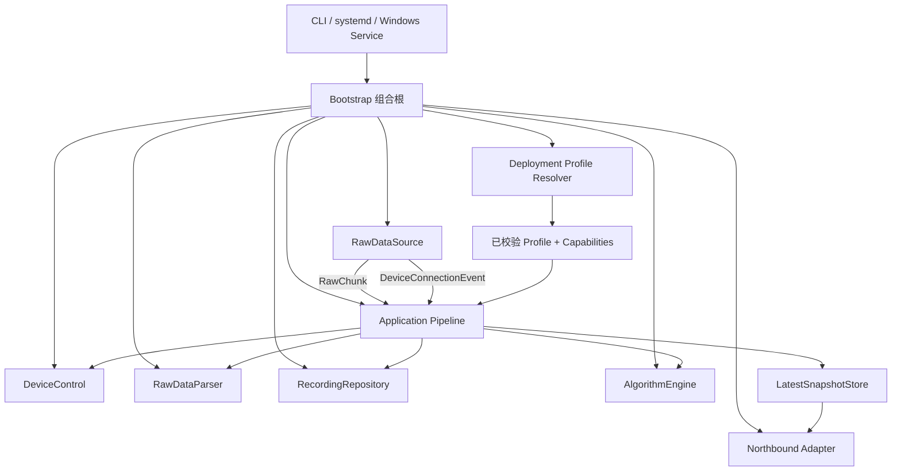
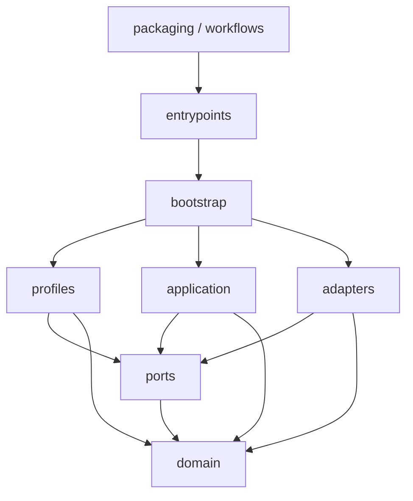
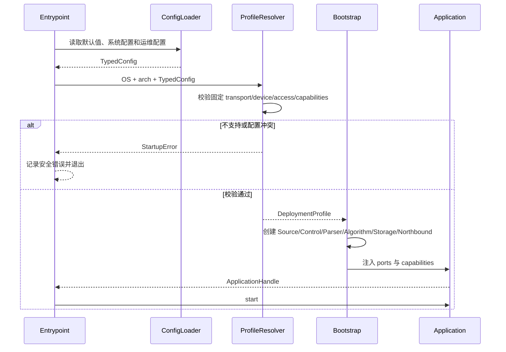
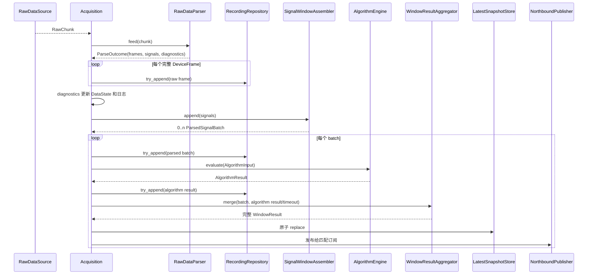
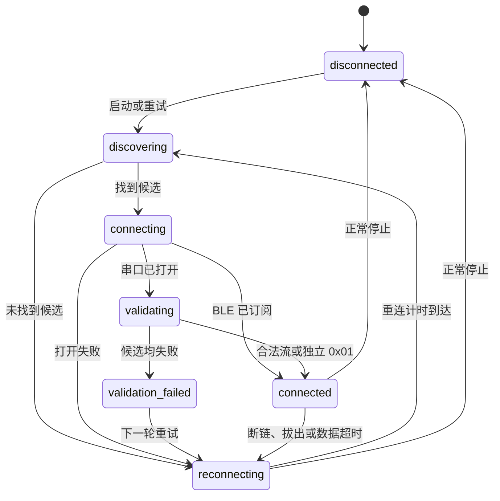
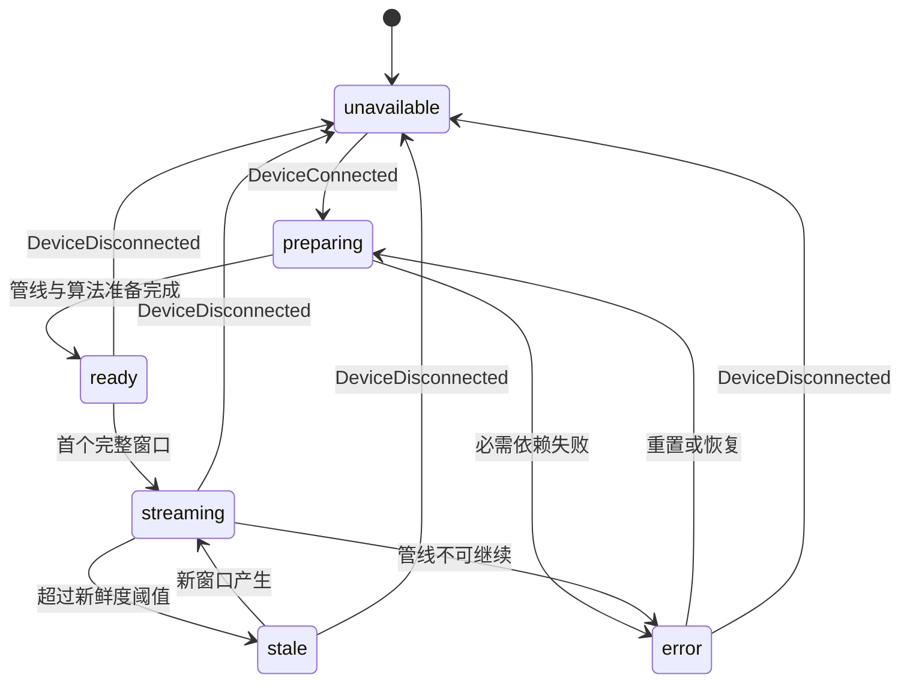
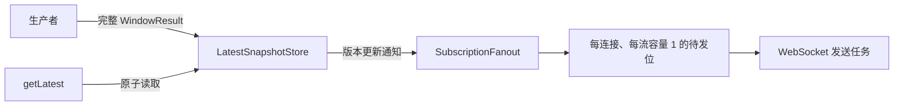
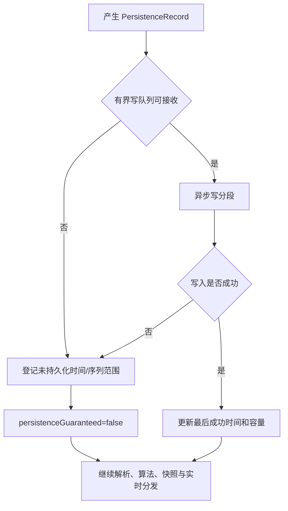
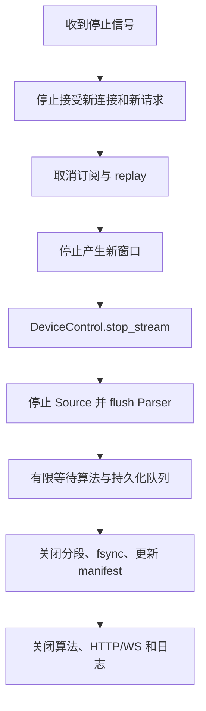
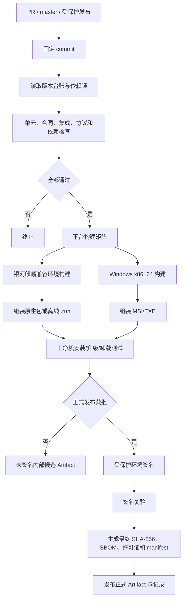

# NeuroBridge 项目结构与多系统接入技术方案

状态：内部目标技术方案（M1 架构实现已落地，目标机验收待完成）

日期：2026-09-07

需求来源：[NeuroBridge 项目结构与多系统接入 PRD](NeuroBridge项目结构与多系统接入_PRD.md)

专项参考：[银河麒麟 V10 耳机 USB 串口接入技术方案](银河麒麟V10耳机USB串口接入_技术方案.md)

## 1. 文档定位

本文把多系统接入 PRD 转换为可实施的软件架构、接口合同、运行时流程、目录迁移和测试方案。本文描述的是目标设计，不代表当前分支已经完成对应能力。

本文与现有文档的关系如下：

- 多系统接入 PRD 定义产品范围、行为和验收目标，本文说明如何实现；
- 银河麒麟专项 PRD 与专项技术方案继续描述 M1 的设备协议和交付细节，本文复用其中已确认事实；
- 历史头环方案用于 macOS/Ubuntu 兼容链路的行为依据；
- 北向报文的正式字段、错误码和兼容性仍以完成发布流程的北向协议为准；本文中的新增北向字段仅是待协议同步的内部设计；
- 各文档对同一事实必须保持一致，不存在由某一份文档单方面替代其他文档的关系。

初稿阶段只新增内部技术方案。2026-09-07 的实施已落地稳定内核、M1 Profile/组合根、耳机 Parser、分段持久化与自动化测试，并按版本门禁只记录变更；已发布和预发布北向协议正文仍未修改。

## 2. 范围与交付阶段

### 2.1 系统固定映射

| Deployment Profile | 目标系统 | 设备 | 传输 | 接入方式 | 录制 | 录播 | 阶段 |
|---|---|---|---|---|---|---|---|
| `macos_headband_wired` | macOS | 蓝牙头环 | BLE | 旧 B 端隔离专网 | 支持 | 支持 | M2 兼容回归 |
| `ubuntu_headband_wired` | Ubuntu x86_64 | 蓝牙头环 | BLE | 旧 B 端隔离专网 | 支持 | 支持 | M2 兼容回归 |
| `kylin_headset_local` | 银河麒麟桌面操作系统 V10 x86_64 | USB 串口耳机 | POSIX TTY | `127.0.0.1` 本机页面 | 支持 | **不支持** | M1 当前交付 |
| `windows_headset_local` | Windows 7 x86_64 及以上 | USB 串口耳机 | Windows COM | `127.0.0.1` 本机页面 | 支持 | **不支持** | M3 后续扩展 |

系统与数据源的关系由安装包和 Deployment Profile 固定。设备扫描结果只用于寻找当前 Profile 允许的设备，不能触发 Profile、传输或接入方式切换。

### 2.2 本文不解决的事项

- 不确认尚未取得的采样率、每 600 ms 样本数、算法触发分组、结果单位或性能阈值；
- 不把 Windows 规划写成当前已实现能力；
- 不新增或直接发布北向协议字段；
- 不定义耳机录播、离线补播或历史补传；
- 不把当前源码更新 `.run` 文件视为最终客户产品安装包。

## 3. 当前实现基线

当前分支已具备以下可复用能力：

- `neurobridge/device/strategy.py` 可按 `data_source.type` 创建 BLE 或串口适配器；
- `neurobridge/serial/adapter.py` 已实现银河麒麟 TTY 发现、验证、28 字节分帧、E1/E0 和重连；
- `neurobridge/ble/flowtime.py` 已实现头环扫描、连接、通知和重连；
- `neurobridge/business/gateway.py` 已串联窗口、算法、录制、最新值、请求和订阅；
- `neurobridge/algorithm/runner.py` 已把 C++ 算法 SDK 隔离在线分隔 JSON 子进程之后；
- `neurobridge/northbound/` 已提供 WebSocket、本机页面和接入策略；
- 银河麒麟已有 systemd、离线运行时准备、诊断和源码更新脚本；
- 串口数据源当前已禁止自动选择录播。

当前实现与目标设计的主要差距：

1. `Gateway` 同时承担状态、窗口、算法、持久化、录播、订阅和协议处理，职责过宽；
2. 串口 Source 内仍包含分帧、字段投影和设备控制，尚未拆成 Source、Parser、DeviceControl；
3. BLE 连接与载荷解析仍在同一适配器附近，公共窗口模型位于 `ble/`；
4. `DevicePacket` 只有墙钟接收时间，缺少单调时间、连接会话和追踪关联；
5. 当前按配置字符串选择适配器，尚无系统、架构、设备协议和能力一体化的 Deployment Profile；
6. 设备连接状态与数据状态仍共享一个可变状态对象；
7. 最新值未抽象为按 `batchId` 原子更新的独立存储；
8. 录制缺少容量状态、有界队列、分段 manifest、崩溃恢复和 quarantine；
9. 当前平台入口没有全部经过同一个组合根；
10. 还没有 Windows COM Source、Windows Service 和正式双平台安装包流水线。

因此迁移采用渐进方式：先建立领域模型和接口合同，再迁移实现，最后拆分 Gateway 和平台入口。每一步均保持当前行为可回归。

## 4. 架构设计

### 4.1 总体组件



核心原则：

- Domain 只表达业务事实，不依赖操作系统、I/O 库或网络框架；
- Ports 定义 Application 需要的能力，Adapters 实现这些能力；
- Application 负责编排，不创建 pyserial、Bleak、WebSocket 或文件对象；
- Bootstrap 是唯一同时认识接口和具体实现的组合根；
- Profile 在启动阶段一次性绑定 Source、Parser、DeviceControl 和能力，运行期不再按 `sourceType` 选择 Parser；
- Northbound 只做协议适配，不能决定录播能力、设备状态或算法流程。

### 4.2 依赖方向



箭头表示允许依赖。以下依赖应由静态测试禁止：

- `domain` 导入 `ports`、`application`、`adapters` 或第三方 I/O 库；
- `ports` 导入具体 Adapter；
- `application` 导入 `bleak`、`serial`、`websockets` 或平台服务 API；
- Parser 导入 Source、算法或北向实现；
- Source 直接调用算法、录制或 WebSocket；
- 平台安装代码被运行时核心反向导入。

## 5. 目标项目结构

```text
NeuroBridge/
├── neurobridge/
│   ├── domain/
│   │   ├── raw.py
│   │   ├── signal.py
│   │   ├── algorithm.py
│   │   ├── result.py
│   │   ├── status.py
│   │   └── capabilities.py
│   ├── ports/
│   │   ├── raw_source.py
│   │   ├── raw_parser.py
│   │   ├── device_control.py
│   │   ├── algorithm.py
│   │   ├── recording.py
│   │   ├── replay.py
│   │   └── northbound.py
│   ├── application/
│   │   ├── acquisition.py
│   │   ├── windowing.py
│   │   ├── processing.py
│   │   ├── aggregation.py
│   │   ├── snapshots.py
│   │   ├── subscriptions.py
│   │   ├── replay.py
│   │   └── status.py
│   ├── adapters/
│   │   ├── sources/
│   │   │   ├── bluetooth_bleak.py
│   │   │   ├── serial_posix.py
│   │   │   └── serial_windows.py
│   │   ├── parsers/
│   │   │   ├── headband_ble.py
│   │   │   └── headset_rev181.py
│   │   ├── algorithms/affective_sdk.py
│   │   ├── storage/filesystem.py
│   │   └── northbound/
│   │       ├── controller.py
│   │       ├── protocol.py
│   │       ├── publisher.py
│   │       ├── websocket.py
│   │       └── local_ui.py
│   ├── profiles/
│   │   ├── resolver.py
│   │   ├── macos_headband_wired.py
│   │   ├── ubuntu_headband_wired.py
│   │   ├── kylin_headset_local.py
│   │   └── windows_headset_local.py
│   ├── bootstrap/
│   │   ├── container.py
│   │   └── app.py
│   ├── configuration/
│   │   ├── model.py
│   │   ├── loader.py
│   │   └── migration.py
│   └── entrypoints/
│       ├── cli.py
│       └── service.py
├── config/
├── web/
├── packaging/
│   ├── kylin/
│   └── windows/
├── tests/
│   ├── unit/
│   ├── contract/
│   ├── integration/
│   ├── platform/
│   └── package/
└── .github/workflows/
```

`domain`、`ports` 和 `application` 构成稳定内核。新设备接入的正常改动范围应是新增 Source、Parser、Profile 和合同测试，不应修改统一算法、快照、订阅或北向传输核心。

## 6. 领域模型

领域模型使用不可变对象；字段命名以下划线表示内部 Python 形式，由协议适配层转换为外部 camelCase。

### 6.1 原始数据模型

| 模型 | 关键字段 | 说明 |
|---|---|---|
| `RawChunk` | `source_type`、`channel`、`data`、`received_at_ms`、`received_at_monotonic_ns`、`connection_session_id`、`trace_id` | 一次 BLE 通知或一次串口 read 边界的未修改字节 |
| `DeviceFrame` | `device_protocol`、`raw_bytes`、`frame_id`、`sequence`、`received_at_ms`、`source_chunk_ids` | Parser 识别出的完整设备帧；原始字节必须保留 |
| `ParseDiagnostic` | `kind`、`severity`、`byte_count`、`sequence_range`、`occurred_at_ms`、`details` | 拆包、噪声、非法帧、缺口、重复、乱序等诊断 |
| `ParseOutcome` | `frames`、`signals`、`diagnostics`、`buffered_bytes`、`discarded_bytes` | 一次 `feed` 或 `flush` 的完整返回值 |

`RawChunk.data` 和 `DeviceFrame.raw_bytes` 必须是 `bytes`，不得在 Source 或 Parser 边界转为 Base64。Base64 只允许出现在 JSON 持久化或北向序列化边界。

### 6.2 信号与窗口模型

| 模型 | 关键字段 | 说明 |
|---|---|---|
| `ParsedSignal` | `signal_type`、`samples`、`sample_format`、`unit`、`window_hint`、`frame_refs`、`valid`、`invalid_reasons` | 与传输无关的信号片段 |
| `ParsedSignalBatch` | `batch_id`、`device_protocol`、`connection_session_id`、`recording_session_id`、`window_start_ms`、`window_end_ms`、`signals`、`frame_refs`、`valid`、`invalid_reasons` | 交给算法和聚合器的统一窗口 |
| `AlgorithmInput` | `batch_id`、`payload`、`mapping_version` | SDK 专用输入投影 |
| `AlgorithmResult` | `batch_id`、`algorithm_version`、`started_at_ms`、`completed_at_ms`、`metrics`、`valid`、`invalid_reasons` | 算法运行结果或明确失败结果 |
| `WindowResult` | `batch`、`algorithm_result`、`mode`、`completed_at_ms`、`persistence_guaranteed` | 对最新快照和北向发布的原子单位 |

公共信号模型不得出现 `ff31`、`ff51`、TTY 或 COM 等设备私有名称。修订号 181 耳机帧的公共语义为：

- `frame[4:6]`：无符号大端序列号；
- `frame[6:24]`：18 字节 EEG 原始值；
- `frame[24:25]`：1 字节 HR；
- 算法兼容投影可读取 `frame[4:24]` 的 20 字节，但该投影只存在于 `AlgorithmInputMapper`，不得把序列号误写为 EEG 样本。

采样率、单位、缩放规则和窗口内包数在真实数据合同确认前为显式配置或未知元数据，不写死在公共模型。

### 6.3 标识与时间

- `gateway_boot_id`：进程每次启动生成，关联一次进程生命周期；
- `connection_session_id`：每次设备底层连接成功后生成，断线即失效；
- `recording_session_id`：一次连续采集会话；
- `frame_id`：单个完整设备帧；
- `batch_id`：窗口、算法、快照和持久化的主关联键；
- `subscription_id`：只在当前 WebSocket 连接内有效，重连后不可复用。

采集时间和对外时间统一使用 Unix Epoch 毫秒；超时、耗时和进程内排序使用单调时钟。系统时钟回拨不得导致负耗时或错误触发超时。

## 7. Ports 接口设计

以下代码是目标接口草图，不表示当前路径已经存在。

### 7.1 RawDataSource

```python
class RawDataSource(Protocol):
    async def start(self) -> None: ...
    async def stop(self) -> None: ...
    def chunks(self) -> AsyncIterator[RawChunk]: ...
    def connection_events(self) -> AsyncIterator[DeviceConnectionEvent]: ...
    def status(self) -> SourceStatus: ...
```

职责：设备发现、底层连接、验证、原始字节读取、读取边界打时戳、断线检测和重连。禁止解析业务字段、组成算法窗口或发送北向消息。

每个 Source 实例是底层 BLE Client 或串口对象的唯一所有者。`chunks()` 与 `connection_events()` 均为单消费者流，由 `AcquisitionSupervisor` 消费；需要多方观察时由 Application 转换为领域事件后扇出，不能让多个模块直接争抢 Source 迭代器。

### 7.2 DeviceControl

```python
class DeviceControl(Protocol):
    async def start_stream(self, connection_session_id: str) -> ControlResult: ...
    async def stop_stream(self, connection_session_id: str) -> ControlResult: ...
```

Source Adapter 同时提供 Source 视图和 Control 视图，两者通过 Adapter 内部的会话注册器共享同一个底层连接。DeviceControl 不持有原生串口对象，不得重新打开端口。

控制规则：

- 每个请求必须匹配当前 `connection_session_id`，旧会话返回 `staleSession`；
- 读、写、关闭通过同一会话锁或串行执行器协调；
- 串口已有合法流时 `start_stream` 返回 `alreadyStreaming`，不得发送 E1；
- 静默串口完成 ACK 和独立 `0x01` 验证、且算法 ready 后，`start_stream` 最多无响应发送一次 E1；
- 正常停止最多无响应发送一次 E0；写失败不阻止关闭端口和任务；
- BLE 启停命令只由 BLE Control Adapter 解释，Application 不认识具体字节。

### 7.3 RawDataParser

```python
class RawDataParser(Protocol):
    def feed(self, chunk: RawChunk) -> ParseOutcome: ...
    def flush(self, reason: FlushReason) -> ParseOutcome: ...
    def reset(self) -> None: ...
```

Parser 是同步、有状态但无 I/O 的对象，每个连接会话创建一个实例。它只能缓存完成分帧所需的有限字节；断线或停止时必须 `flush`，把残留半帧转为诊断，随后销毁或 `reset`。

Parser 不抛出可使采集主循环退出的设备数据异常。不可解析输入通过 `ParseDiagnostic` 返回；程序错误仍应被边界捕获、记录并让当前管线进入可恢复错误状态。

### 7.4 AlgorithmEngine

```python
class AlgorithmEngine(Protocol):
    async def initialize(self, session: AlgorithmSession) -> AlgorithmState: ...
    async def evaluate(self, value: AlgorithmInput) -> AlgorithmResult: ...
    async def close(self) -> None: ...
```

`AlgorithmInputMapper` 是 Application 内的纯转换器。Algorithm Adapter 封装 C++17 SDK bridge、Eigen3 和 NumCpp 依赖，只返回领域结果，不暴露子进程 stdin/stdout。

算法失败不停止 Source、Parser 或持久化。每次调用必须有配置化超时，超时返回带 `batch_id` 的无效结果；迟到结果只允许持久化和计数，不允许覆盖已发布快照。

### 7.5 Recording 与 Replay

```python
class RecordingRepository(Protocol):
    def try_append(self, record: PersistenceRecord) -> PersistenceReceipt: ...
    async def close_session(self, recording_session_id: str) -> None: ...
    def storage_status(self) -> StorageStatus: ...

class ReplayReader(Protocol):
    async def events(self, recording_session_id: str) -> AsyncIterator[ReplayEvent]: ...
```

`RecordingRepository` 与 `ReplayReader` 必须是两个接口：能保存数据不代表允许北向录播。只有 `supports_replay=true` 的头环 Profile 才注入并调用 ReplayReader；麒麟和 Windows 耳机 Profile 不创建 replay task。

`try_append` 不能阻塞实时链路。它只把记录加入有界持久化队列并返回当前记录是否获得持久化保障；队列满或存储不可写时返回失败收据、更新 StorageStatus 并记录缺口范围。

### 7.6 最新快照与北向输出

```python
class LatestSnapshotStore(Protocol):
    def replace(self, result: WindowResult) -> SnapshotVersion: ...
    def get(self, streams: frozenset[str]) -> SnapshotRead: ...

class NorthboundSink(Protocol):
    async def publish(self, event: ApplicationEvent) -> None: ...
```

`replace` 以一个完整 `WindowResult` 为事务单位，并在同一锁或单线程执行器内更新所有相关流。`getLatest` 只能调用 `get`，不得扫描 RecordingRepository、等待下一窗口或启动 ReplayReader。

## 8. Deployment Profile 与组合根

### 8.1 Profile 数据结构

```python
@dataclass(frozen=True)
class DeploymentProfile:
    profile_id: str
    os_family: str
    architecture: str
    transport: str
    device_protocol: str
    access_mode: str
    capabilities: ProfileCapabilities
```

`ProfileCapabilities` 至少包含：

- `supports_recording`；
- `supports_replay`；
- `supports_local_ui`；
- `supports_wired_b_side`；
- `max_device_count`，当前为 1；
- `allowed_streams`。

### 8.2 启动与绑定时序



ProfileResolver 必须在连接设备前拒绝：未知字段、缺少强制字段、错误类型、系统/架构不支持、Profile 与 transport/device/access 不一致。生产运行不允许使用命令行把麒麟包切换为 BLE，或把 macOS/Ubuntu 切换为本机页面。

## 9. 设备连接和控制生命周期

### 9.1 串口耳机时序

```mermaid
sequenceDiagram
    participant APP as AcquisitionSupervisor
    participant SRC as SerialSource
    participant DEV as USB 串口耳机
    participant ALG as AlgorithmEngine
    participant CTL as DeviceControl
    participant PAR as HeadsetRev181Parser

    APP->>SRC: start()
    SRC->>DEV: 打开候选 115200 8-N-1
    SRC->>DEV: 被动观察合法 28 字节流
    alt 已有合法流
        DEV-->>SRC: 28 字节帧
        SRC-->>APP: DeviceConnected(existing_stream=true)
        APP->>ALG: initialize()
        Note over APP,CTL: 不发送 ACK，不发送 E1
    else 候选静默
        SRC->>DEV: 固定 ACK
        DEV-->>SRC: 独立 0x01
        SRC-->>APP: DeviceConnected(existing_stream=false)
        APP->>ALG: initialize()
        alt 算法 ready
            APP->>CTL: start_stream(session_id)
            CTL->>DEV: 0xE1（无响应）
        else 算法失败
            APP-->>APP: DataState=error，不发送 E1
        end
    end
    DEV-->>SRC: read() 原始字节
    SRC-->>APP: RawChunk
    APP->>PAR: feed(RawChunk)
    PAR-->>APP: ParseOutcome
```

协议修订号 181 的固定事实为 115200 8-N-1、28 字节帧、静默时 ACK、独立 `0x01` 验证、算法 ready 后 E1、停止时 E0。Source 负责发现、打开、观察、ACK、验证和读取；Parser 负责 28 字节分帧；DeviceControl 负责 E1/E0。

### 9.2 BLE 头环

BluetoothSource 负责扫描、筛选、连接、订阅、通知接收、断线和重连；HeadbandBleParser 负责 characteristic 对应的数据语义和长度校验。BLE UUID、扫描条件和控制命令只存在于 BLE Adapter/Parser 配置，不进入公共 Domain。

## 10. 原始数据处理主流程



处理规则：

1. 一个 RawChunk 可以产生零到多个 DeviceFrame 和 ParsedSignal；
2. 完整 DeviceFrame 一经识别立即尝试持久化，不等待窗口或算法；
3. Diagnostics 更新数据状态和结构化计数，不作为北向人体数据；
4. WindowAssembler 只按已配置且已确认的规则形成批次；
5. 算法、存储和北向发送互相解耦，任一异常不能造成 Source 无界等待；
6. `valid` 表示数据/算法语义有效性，`persistence_guaranteed` 表示持久化保障，两者正交；
7. 无完整 WindowResult 时不生成空数据事件。

持久化保障按 `batch_id` 聚合：与该批次关联的完整 DeviceFrame、ParsedSignalBatch 和 AlgorithmResult 中，只要任一必需记录未被持久化队列接受或最终写入失败，该批次以及受影响时间段的 `persistence_guaranteed` 就为 `false`。后续存储恢复只影响新批次，不回写已经发布的 WindowResult。

## 11. 双状态模块

### 11.1 设备连接状态



连接状态模块只拥有设备发现、连接、验证和重连状态。每次迁移产生不可变 `DeviceConnectionEvent`，数据状态模块订阅该事件，但不能直接读取或修改连接模块内部对象。

内部 `discovering`、`validating`、`validation_failed` 等详细状态不自动成为北向枚举；Northbound Protocol Mapper 只按已发布合同映射。

### 11.2 数据状态



数据状态快照至少包含：

- `data_state`、`algorithm_state`、`storage_state`；
- `last_produced_at_ms`、`last_published_at_ms`；
- `persistence_guaranteed`、`affected_from_ms`；
- 最近错误和错误发生阶段；
- 生产窗口、无效窗口、快照覆盖、发送失败和存储缺口计数。

存储异常或算法异常不必然让设备连接状态改变。设备在线且原始/解析数据仍可产生时，应继续处理允许的流。

## 12. 窗口、算法与结果聚合

`SignalWindowAssembler` 每个连接会话独立创建；断线时 flush 并结束当前窗口，不跨连接拼接数据。窗口策略由设备协议配置提供，不能依靠 `source_type` 临时判断。

`WindowResultAggregator` 以 `batch_id` 维护有限生命周期的聚合槽：

1. ParsedSignalBatch 到达后创建槽并启动算法超时计时；
2. AlgorithmResult 在超时前到达时合成 WindowResult；
3. 算法不可用或失败时立即合成带原因的结果；
4. 超时到达时合成 `valid=false`、原因明确的结果并关闭槽；
5. 槽关闭后到达的同 `batch_id` 结果标记为 late，只尝试持久化并计数；
6. late 结果不重新发布，也不回写 LatestSnapshotStore；
7. 聚合槽数量必须有上限，断线和停止时全部完成或取消，不能泄漏任务。

算法超时值属于类型化配置。首轮 24 小时观测前必须填写明确候选值，不能在实现中使用不可见常量。

## 13. 生产者与消费者

生产者为 Source → Parser → Window → Algorithm → Aggregator。无论是否有客户端，生产者都继续采集、算法和持久化；每当形成完整 WindowResult，先原子更新快照，再通知订阅者。

消费者分两类：

- `getLatest`：读取请求流的当前最新快照并立即返回；没有可用快照时返回明确不可用结果；
- `subscribe`：登记流集合，由生产者有新数据时主动推送；`unsubscribe` 释放该订阅。



背压规则：

- 每个 WebSocket 连接、每个流只保留一个待发最新值；
- 旧值尚未发送时，新值覆盖旧值并增加 `snapshot_overwrite_count`；
- 慢消费者不会阻塞 Source、Parser、算法或其他连接；
- 发送任务设置配置化超时，失败后释放连接订阅；
- 连续波形按批量窗口发送，禁止逐采样点 JSON；
- WebSocket 不发送应用层 Ping/Pong 或 JSON 心跳；
- 连接断开后订阅全部失效，重连必须先 `getStatus` 再重新订阅。

## 14. 录制、录播与存储

### 14.1 录制和录播分离

所有 Profile 都可以将原始帧、解析批次和算法结果持久化。只有头环 Profile 可把已保存数据作为北向 replay：

| 场景 | 行为 |
|---|---|
| 头环在线 | `mode=live`，正常生产与录制 |
| 头环离线且有允许的录播 | 按原时间间隔读取已保存 raw/parsed/algorithm，不重新计算算法，输出 `mode=replay` |
| 耳机在线 | 只输出 `mode=live`，正常生产与录制 |
| 耳机离线 | 不创建 ReplayReader，不扫描历史会话；银河麒麟数据请求返回已确认的 409 不可用错误 |
| 耳机目录存在历史数据 | 仅用于追溯、导出和离线分析，不能推导 `availableStreams` 或 replay 能力 |

### 14.2 文件布局

```text
<recording-root>/
├── sessions/<recordingSessionId>/
│   ├── manifest.json
│   ├── raw/
│   │   ├── 000001.jsonl
│   │   └── 000002.jsonl.partial
│   ├── parsed/
│   └── algorithm/
└── quarantine/
```

每条 JSONL 记录至少包含 `schemaVersion`、会话标识、关联键、采集时间、记录类型和载荷。完整人体原始数据只写受保护录制目录，不能写运行日志。

默认每 10 分钟或 256 MiB 轮转，以先到者为准。轮转流程为：flush → fsync → 计算条数/时间范围/字节数/SHA-256 → 原子重命名 → 原子更新 manifest。时长、大小和 fsync 频率配置化。

启动时处理 `.partial`：

- 截断到最后一条完整且可解析的 JSONL；
- 重建条数、时间范围和摘要；
- 关闭为 `recovered` 分段并更新 manifest；
- 无法安全恢复时移入 quarantine，设置存储错误并记录审计日志；
- 不静默删除，不把损坏分段当作完整录制。

### 14.3 存储状态和实时降级



存储状态为 `ok`、`warning`、`full`、`error`。默认空间阈值：warning 5 GiB，critical 1 GiB；恢复阈值在进入阈值上增加 1 GiB，连续 3 次健康检查且至少一次实际写入成功后恢复，避免抖动。

存储异常时：

- 能实时发送就继续发送；
- 允许 `valid=true` 且 `persistenceGuaranteed=false`；
- 持久化队列满时不无界积压，也不默认在恢复后补写已丢记录；
- 通过时间和序列范围记录持久化缺口；
- 不把设备离线错误改写为存储错误；
- 只有请求目标本身要求成功持久化时，才使用待发布合同中的 507 语义。

计划中的 `data.storage`、`persistenceGuaranteed` 和 507 映射尚未进入当前正式北向合同。实现、对外文档、模拟服务端和兼容测试完成同步发布前，不得宣称已对外支持。

### 14.4 自动清理

`storage.auto_cleanup_enabled` 默认 `false`。关闭时绝不自动删除录制数据。开启时只选择已结束、非活动、未保留且未被导出/诊断占用的会话，按结束时间从旧到新整会话清理；raw、parsed、algorithm 和 manifest 必须一起处理。

清理到高于恢复阈值后停止；没有合格会话时保持 `full/error`。每次选择、删除、跳过和失败均写审计日志。正式启用前必须在运维文档中说明开关、风险、保留标记和删除顺序。

## 15. 北向适配

NorthboundController 的处理顺序：

1. 验证 WebSocket 文本 JSON、根对象、action、请求 ID 和字段类型；
2. 转换为 Application Command；
3. 调用 `getStatus`、`getLatest`、`subscribe` 或 `unsubscribe` 用例；
4. 把领域结果和错误映射为协议包络；
5. NorthboundPublisher 序列化并发送响应或连续事件。

根对象继续保持：

```json
{
  "protocolVersion": "1.0",
  "code": 200,
  "data": {},
  "message": "OK"
}
```

适配边界要求：

- Domain 不包含 `protocolVersion` 或对外错误码；
- 内部状态通过显式 Mapper 转为正式协议允许的状态；
- Kylin/Windows HTTP 和 WebSocket 仅监听 `127.0.0.1` 并校验固定 Origin；
- macOS/Ubuntu 只监听确认的旧 B 端隔离专网地址；
- 不暴露 BLE UUID、串口路径、设备扫描策略、原始帧格式或算法实现；
- 二进制帧方案只有完成协议评审后才能启用；当前文本 JSON 必须批量传输波形；
- 对外字段变化必须同步字段说明、时序、示例、模拟服务端和录播兼容测试。

## 16. 配置设计

配置采用单一类型化 Schema，并带 `config_schema_version`。建议顶层结构：

```toml
config_schema_version = 1
profile = "kylin_headset_local"

[serial]
device = "auto"
baud_rate = 115200

[algorithm]
enabled = true
request_timeout_ms = 2000

[storage]
warning_threshold_bytes = 5368709120
critical_threshold_bytes = 1073741824
segment_duration_seconds = 600
segment_max_bytes = 268435456
auto_cleanup_enabled = false

[access]
mode = "local_browser"
```

示例只展示已确认字段和候选值，不代表算法超时或所有路径已最终锁定。

加载顺序：安装包默认值 → 系统级配置 → 显式运维配置。命令行覆盖只允许开发/回归模式。未知字段、类型错误和 Profile 冲突在连接设备前失败；设备传输、设备协议和接入方式变更必须重启，不支持热切换。

升级时先备份配置，再按 `config_schema_version` 执行确定性迁移。迁移失败保持旧版本可运行或回滚，不得带着部分迁移配置启动。

## 17. 并发、取消和关闭

Application 使用结构化并发管理以下长期任务：

- Source 连接/重连任务；
- RawChunk 消费任务；
- DeviceConnectionEvent 消费任务；
- 持久化 Writer；
- 算法请求和聚合超时任务；
- 每连接的订阅发送任务；
- WebSocket、HTTP 和可选头环 replay 任务；
- 周期存储健康与运行指标采样任务。

禁止脱离 Application 生命周期创建不可追踪的后台任务。

### 17.1 队列边界与过载策略

所有跨 I/O 或跨进程边界的队列都有配置化上限和水位指标，不允许使用无界 `asyncio.Queue`：

| 边界 | 所有者 | 满载处理 | 数据状态影响 |
|---|---|---|---|
| 驱动回调/read → RawChunk 消费 | Source Adapter | 短暂有界等待；达到超时后丢弃整个 RawChunk 并登记字节/时间缺口 | `stale` 或 `error`，按新鲜度和连续缺口判断 |
| ParsedSignalBatch → 算法 Worker | Processing Application | 不阻塞采集；为该批次生成 `ALGORITHM_BACKLOG` 无效结果 | 原始/解析数据继续保存，结果 `valid=false` |
| PersistenceRecord → 文件 Writer | Recording Adapter | `try_append` 立即失败并登记持久化缺口 | `persistence_guaranteed=false`，业务 `valid` 不变 |
| WindowResult → 每连接每流发送位 | SubscriptionFanout | 新值覆盖尚未发送的旧值 | 业务数据不失效，增加覆盖计数 |

RawChunk 只能整块接受或整块丢弃，不能在不了解帧边界时截断。Source 队列满不是正常流控方式：达到水位必须记录消费者耗时、队列深度和连续缺口，并触发运维可见状态。具体容量和等待超时由首轮压力测试及 24 小时观测确定。

Parser 在 RawChunk 消费任务内同步执行，避免为快速纯计算再增加乱序队列。算法使用独立 Worker；单设备初始保持同一 `connection_session_id` 内按 `batch_id` 顺序提交。未来增加并行算法 Worker 时，Aggregator 仍按 `batch_id` 关联，不能依赖返回顺序。

正常关闭顺序：



所有等待都有配置化上限。E0 或 fsync 失败必须记录，但不能让资源关闭链中断。异常退出依靠 `.partial` 恢复，不通过无限延长关机来保证零丢失。

## 18. 错误模型与可观察性

### 18.1 内部错误分类

| 类别 | 示例 | 处理 |
|---|---|---|
| `configuration` | Profile 冲突、字段缺失 | 启动前失败 |
| `connection` | 未发现、打开失败、验证失败、断线 | 更新连接状态并重连 |
| `control` | stale session、E1/E0 写失败 | 结构化 ControlResult；按阶段恢复或关闭 |
| `parse` | 非法长度、包尾错误、噪声、序列缺口 | 诊断、有限丢弃、继续处理 |
| `algorithm` | 未就绪、超时、输出非法、进程退出 | 无效算法结果；采集继续 |
| `storage` | 空间不足、只读、权限、I/O、队列满 | 保障状态降级；实时链路继续 |
| `northbound` | 请求非法、慢消费者、发送失败 | 隔离到当前连接 |
| `internal` | 未预期程序错误 | 捕获在任务边界，记录关联 ID，按模块重建或受控退出 |

错误对象至少包含稳定内部 reason、发生阶段、是否可重试、关联 ID 和安全消息。未经协议发布，不把内部异常文本直接暴露为新对外错误。

### 18.2 24 小时观测基线

固定周期结构化日志至少记录：

- 连接状态迁移、阶段耗时、验证、重连和连续离线时间；
- RawChunk 字节、完整/非法帧、缓存/丢弃字节、序列缺口、重复、乱序和迟到；
- 各流窗口数、算法耗时、聚合耗时、端到端耗时；
- `getLatest`、订阅、发送成功/失败、发送耗时、待发覆盖和队列水位；
- 写入成功/失败、可用空间、StorageState 和持久化缺口；
- CPU、内存、任务/线程、文件描述符或 Handle、服务重启次数。

日志携带应用版本、Profile、`gateway_boot_id`、`connection_session_id`、`recording_session_id` 和必要 `batch_id`，但不记录完整原始帧、Base64 生理数据、令牌、密码或私钥。

M1、M2、M3 在各自目标平台完成时分别运行 24 小时。首轮用于收集数据和确定延迟、CPU、内存、队列、发送超时及丢弃率阈值；未确认阈值不得被实现者自行写成验收承诺。

## 19. 安全设计

- 本机页面的 HTTP/WS 只绑定回环地址，不自动增加公网防火墙规则；
- 旧 B 端链路只允许确认的 RFC1918 隔离专网地址；
- 配置、日志、录制和可执行文件使用最小权限，后台服务使用受控非 root 账户；
- 完整人体数据只进入录制目录，诊断包默认不包含；
- 固定 TTY 必须验证为 USB 派生字符设备；Windows COM 必须验证设备身份，不盲选任意端口；
- 安装包不包含凭据、签名私钥、现场配置、录制数据或 Git 元数据；
- 发布凭据只在受保护签名阶段注入。

## 20. 测试方案

### 20.1 单元测试

- HeadsetRev181Parser：正常、拆包、粘包、噪声、非法长度、错误包尾、缓存上限；
- 序列号回绕、间隙、重复、乱序和迟到；
- HeadbandBleParser 各 characteristic 长度与语义；
- WindowAssembler 的窗口边界、flush 和无效原因；
- AlgorithmInputMapper 的字节序与 `frame[4:24]` 专用投影；
- 双状态机的全部合法/非法迁移；
- Aggregator 超时、迟到结果和槽上限；
- LatestSnapshotStore 原子替换；
- StorageState 阈值、防抖和清理候选选择。

### 20.2 合同测试

同一合同测试套件必须覆盖：

- BLE、POSIX TTY、Windows COM 和 Fake Source；
- Headband 与 Headset Parser；
- AlgorithmEngine 正常、超时、异常和关闭；
- RecordingRepository 队列满、ENOSPC、权限、崩溃恢复；
- NorthboundController 的请求/响应和错误映射；
- 每 Profile 的能力门禁，尤其耳机禁用 replay。

### 20.3 集成与平台测试

- Profile → Bootstrap → Source → Parser → Algorithm → Snapshot → WebSocket 完整链路；
- 麒麟已有流接管、ACK/0x01、E1/E0、拔插、服务重启和历史录制不触发 replay；
- macOS/Ubuntu BLE 连接、订阅、断线重连、隔离专网和头环 replay；
- Windows COM 发现、插拔、Windows Service 和回环访问；
- 浏览器断开/恢复、重新查询状态和重新订阅；
- 存储 warning/full/error 时实时数据继续发送；
- `.partial` 恢复、quarantine 和自动清理开关；
- 各目标平台 24 小时长稳与资源趋势报告。

测试结论必须区分“源码支持”“POC 已验证”和“现场验收通过”。模拟设备测试不能代替真实目标机和真实设备验收。

## 21. 迁移实施方案

迁移以小提交进行，不采用一次性目录重写。

### 阶段 A：建立稳定内核

1. 新增 Domain 模型和兼容转换器；
2. 新增 Ports 及 Fake 合同测试；
3. 把现有 `DevicePacket` 映射为 `RawChunk`，保持 Gateway 行为不变；
4. 建立依赖方向静态检查。

退出条件：现有测试通过，新接口合同可由 Fake 实现独立运行。

### 阶段 B：拆分设备边界

1. 从串口 Adapter 提取 HeadsetRev181Parser；
2. 将 E1/E0 提取为 DeviceControl，绑定连接会话；
3. 从 BLE Adapter 提取 HeadbandBleParser；
4. POSIX 与规划中的 Windows Source 共用耳机 Parser 合同测试。

退出条件：Source 只输出 RawChunk/连接事件，Parser 无 I/O，控制请求不能越过旧会话。

### 阶段 C：拆分应用管线

1. 抽取 WindowAssembler、AlgorithmInputMapper 和 Aggregator；
2. 建立双状态模块和领域事件；
3. 抽取 LatestSnapshotStore 和 SubscriptionFanout；
4. 把录制与 replay 能力分离；
5. 拆分 NorthboundController 与 Publisher。

退出条件：Application 不导入具体 Adapter；耳机离线在任何历史数据条件下都不启动 replay。

### 阶段 D：Profile 与统一入口

1. 实现 ProfileResolver 和类型化配置；
2. 建立唯一 Bootstrap 组合根；
3. 使 CLI、systemd、macOS 入口和后续 Windows Service 全部经过组合根；
4. 删除或收敛旧策略注册和兼容导出层。

退出条件：系统/设备/接入固定映射在启动前校验，运行期没有 Source-Type Parser 分支。

### 阶段 E：存储与产品化

1. 实现有界 Writer、StorageStatus、分段、manifest、恢复和清理开关；
2. 完成存储北向合同的发布流程和兼容测试；
3. 建立麒麟产品安装布局、候选包和干净机验收；
4. M3 增加 Windows COM、Windows Service 和安装包；
5. 完成各阶段目标平台 24 小时长稳。

退出条件：安装无需源码、Git 或编译器；产物与版本、commit、依赖和测试记录可追溯。

## 22. 安装布局与 Workflow

### 22.1 产品安装布局

具体系统路径由最终镜像和安装器确认，但职责必须分开：

- 只读程序和内置运行时；
- 系统级类型化配置；
- 可写录制、缓存和状态目录；
- 可轮转日志目录；
- systemd unit 或 Windows Service 注册；
- 版本查询、诊断、修复和卸载工具。

银河麒麟首选与最终桌面系统镜像包管理器匹配的原生包，兼容备选为批准的自包含离线 `.run`。Windows 首选签名 MSI，备选签名 EXE。最终格式必须通过目标机确认，不能从“银河麒麟 V10”名称推断 RPM 或 DEB。

### 22.2 打包流水线



正式产物命名读取版本台账中的应用版本，不在 Workflow 维护第二份版本：

```text
neurobridge-kylin-v<applicationVersion>-x86_64.<ext>
neurobridge-windows-v<applicationVersion>-x86_64.msi
```

每个产物同时生成最终文件 SHA-256、SBOM、许可证、`release-manifest.json` 和测试摘要。正式 SHA-256 必须在签名后生成；PR 和普通主分支构建不能访问正式签名凭据。

干净机测试覆盖离线安装、启动/停止/重启、回环监听、模拟设备冒烟、升级保留配置和数据、重复安装、卸载默认保留业务数据、签名/摘要验证，以及耳机离线和存在历史录制时仍不 replay。

## 23. 实施前门禁与未决项

以下事项不阻塞 Domain、Ports、Parser、状态机、Fake Adapter 和 Application 骨架编码，但会阻塞对应阶段的真实算法、部署或发布验收：

| 项目 | 不阻塞的工作 | 阻塞点 |
|---|---|---|
| 麒麟正式验收镜像 ISO/SHA-256、包管理器和系统路径 | 核心架构、Parser、Source 合同 | 最终服务布局和候选安装包 |
| Windows 7 SP/补丁、浏览器、签名和安装器 | 公共串口合同与 Parser | M3 目标构建、安装和签名 |
| 采样率、窗口包数、算法触发和单位 | 原始帧解析与关联模型 | 真实 AlgorithmInput 和结果验收 |
| 脱敏真实串口数据与预期结果 | Fake/合成合同测试 | 真实数据回归和算法正确性 |
| 性能阈值 | 指标埋点和 24 小时采样 | 最终性能通过判定 |
| 运维可调字段、日志采样/保留周期 | 类型化配置框架 | 生产配置冻结 |
| 存储新增北向字段发布 | 内部 StorageStatus 和映射准备 | 对外宣称、合同验收和正式交付 |

所有待确认项在达到对应门禁前必须补充负责人、日期、依据和受影响测试。若有效文档间出现同一事实冲突，相关实现、发布和验收标记为 `blocked_by_document_conflict`，先统一事实并同步文档，不能由开发人员自行选择一份执行。

当前已知的一致性问题是：仓库级规则中仍存在“耳机串口实时路径不可用时自动使用录播”的旧描述，而本 PRD、银河麒麟专项 PRD、当前代码和用户已确认规则均为“耳机不支持录播”。目标设计按耳机禁用 replay 建模，但在相关规则完成同步前，文档一致性门禁不能判定通过。Windows 耳机离线是否复用银河麒麟的 409 错误合同，也需要在 M3 北向评审前确认。

## 24. 完成定义

本技术方案完成实施需同时满足：

1. 目标目录和依赖门禁落地，所有正式入口经过唯一 Bootstrap；
2. BLE、POSIX TTY 和 Windows COM 使用相同 RawDataSource 合同，耳机 Parser 在麒麟/Windows 复用；
3. Source、Parser、DeviceControl、算法、存储和北向可独立合同测试；
4. 设备连接状态与数据状态独立，仅以领域事件通信；
5. WindowResult 按 `batch_id` 原子更新快照，慢消费者不能阻塞生产者；
6. 耳机 Profile 在任何离线和历史数据条件下都不产生 replay；
7. 存储异常时实时链路继续，`valid` 与持久化保障分别表达；
8. 目标平台自动化、真实设备场景和 24 小时长稳验收通过；
9. 麒麟及后续 Windows 安装包可在无源码、无 Git、无编译器的干净目标机离线安装；
10. 对外可观察行为均已完成对应协议发布、文档同步和合同测试；
11. 验收报告明确区分源码支持、POC 验证和现场通过。

## 25. 2026-09-07 实施状态

本轮已达到“源码支持”的范围：

- 新增 `domain`、`ports`、`application`、`adapters`、`profiles`、`bootstrap`、`configuration` 和 `entrypoints` 分层；静态合同测试禁止稳定内核反向导入具体 I/O；
- M1 启动入口通过唯一 Bootstrap 校验 `kylin_headset_local`，固定 POSIX TTY、`headset_rev181`、`local_browser` 和 `supports_replay=false`；
- M1 串口帧经 Source 边界进入纯 Parser，Parser 覆盖拆包、粘包、噪声、非法尾、缓存、序列诊断，并将 2 字节序列号、18 字节 EEG 和 1 字节 HR 分开；算法专用 Mapper 才使用 `frame[4:24]`；
- 已实现连接/数据双状态机、公共窗口、算法超时与迟到结果隔离、原子 LatestSnapshotStore、每连接每流容量 1 的最新值扇出；
- 已实现有界持久化 Writer、raw/parsed/algorithm 分段、`.partial`、fsync、原子关闭、SHA-256、manifest、启动恢复和 quarantine；兼容录制/导出文件继续保留；
- 配置增加 `config_schema_version`、`profile`、算法超时和存储阈值/分段/队列/清理开关，示例固定为 M1 Profile；
- 自动化测试已覆盖上述领域合同，并保持原有网关、WebSocket、串口、部署和文档测试通过。

以下内容仍只能标记为“待验收/待后续阶段”，不能由源码测试替代：

- 银河麒麟目标机真实耳机、算法真实数据、拔插/恢复、systemd 候选安装布局和 24 小时长稳；
- 存储状态新北向字段及 507 语义的对外版本发布；本轮未获得更新对外文档授权，因此只保留内部状态和日志，不改变 v0.2 包络；
- M2 的 macOS/Ubuntu BLE 全量迁移与专网/录播回归；
- M3 的 Windows COM、Windows Service、安装包、签名和目标机验收；
- 自动清理的正式启用仍受运维文档、现场保留策略与破坏性场景验收门禁约束，默认保持关闭。
