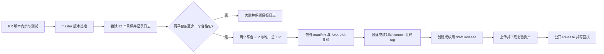

# NeuroBridge 发布工作流技术方案

- **依据**：[发布工作流 PRD](../product/发布工作流%20PRD.md)、`release/release_matrix.toml`
- **状态**：实施方案；本地构建与 CI 证据、真机验收分别记录

## 1. 版本与触发

`neurobridge/version_registry.toml` 的 `[application].version` 是产品版本唯一来源。PR 对 `master` 的业务、部署、依赖或打包变更必须按影响级别提升版本，并在台账 `application_release_changes` 写明旧版、新版、级别、兼容性边界和依据。纯文档/测试变更可不升版。合入后的 `push master` 运行同一门禁；版本未递增则记录跳过，不占用已有 tag。报文版本和对外协议发布独立。

## 2. 构建输入与矩阵

矩阵来自 `release/release_matrix.toml`：Windows 7/10/11 × x86/x86_64 × EXE/MSI 共 12 个目标；麒麟 V10 服务器/桌面 × 五架构 × DEB/RPM 共 20 个目标。每个目标有稳定 ID、独立构建目录、离线运行时、工具链/目标 sysroot 校验和日志。runner 只负责调度；跨架构产物必须检查二进制架构、依赖及目标机结果。Windows 7 独立使用 Python 3.8.10，现有源码要求 Python ≥3.11，在移植与实机验证完成前保持 `blocked`。

产物构建不得从现有 `build-product-candidate.py` 的源码 ZIP/TAR 伪装安装包。DEB/RPM 应以真实包管理器元数据和脚本构建；MSI/EXE 应由 WiX MSI/Burn 分别生成。离线输入需包含目标架构 Python、全部 wheel 和算法桥接程序，并记录 SHA-256、来源和 ABI。批准的输入运行 ID 由仓库变量 `NEUROBRIDGE_RELEASE_INPUT_RUN_ID` 指定，目标 Artifact 名为 `neurobridge-input-<targetId>`，其中真实安装包、非空验证日志和符合 [`release-target-verification.schema.json`](../../schemas/release-target-verification.schema.json) 的 `verification.json` 须绑定当前源码 commit。未提供经校验的输入、缺少打包器或目标机验证时，逐目标记录 `blocked`/`failed`，不纳入平台 ZIP。

## 3. 发布状态机

`release-manifest.json` 是发布前不可变候选清单；它记录全部目标的结果，只为合格包填写文件名和哈希。两个平台 ZIP 仅含合格包与验证日志；总 ZIP 含两个平台 ZIP、内部构建清单和 32 个目标的 `release-logs.jsonl`。ZIP 时间戳与文件名日期取经验证输入的构建时间，同一 commit 和相同输入重跑应得到相同 ZIP 字节；每次运行的实际检查时间留在 Actions 目标结果中。总 ZIP 自身的哈希在包外清单；公开状态由独立 `release-receipt.json` 记录。后续真机日志作为带版本、目标、时间的新增附件，不覆盖既有资产。所有缺口写入 Release 说明，不将源码构建、结构检查或模拟测试表述为真机通过。

## 4. 幂等与权限

PR 只用 `contents: read`；发布 job 才用 `contents: write`，同一版本串行。创建 tag 前核对本地包、摘要、清单和日志；已有 tag 必须解引用至同一 commit，否则失败，永不移动或删除。已存在 draft 时只补缺失资产，同名资产需下载比对 SHA-256；已公开且完全相同则视为重跑成功，不同则要求新版本。网络或上传错误保留 draft，禁止将仅有 tag/draft 记为 `published`。

## 5. 日志与验收

每个目标写 UTF-8 结构化结果，至少包含 `targetId`、状态、阶段、时间、runner、工具链、输入摘要、包文件/摘要、自动验证与未验证原因；文本日志保留命令的退出码和错误摘要。不得输出令牌、密码、私钥、完整人体原始数据。发布前验证 32 个目标各有结果、包字节与清单一致、两个平台各至少一个合格包、ZIP 可解压且内层摘要一致。Windows 7、麒麟五架构与服务器/桌面真机安装、升级、卸载、串口及离线无 replay 证据仍分别验收。

## 6. 当前仓库可执行边界

仓库已有 x64 Windows 算法构建与源码候选包脚本，但没有五架构麒麟 sysroot/运行时、Windows x86/7 兼容运行时、WiX 离线工具链，也没有已验证的正式 DEB/RPM/MSI/EXE 生成入口。本次新增的是版本门禁、32 目标规划、目标证据检查、归档与发布状态机；正式安装包生产仍依赖经批准的目标构建输入运行。这些输入缺失时发布必须失败并提供可诊断日志。补齐输入与目标机验证前，不能宣称 32 个安装包已交付或让 `master` 自动发布源码候选包。
