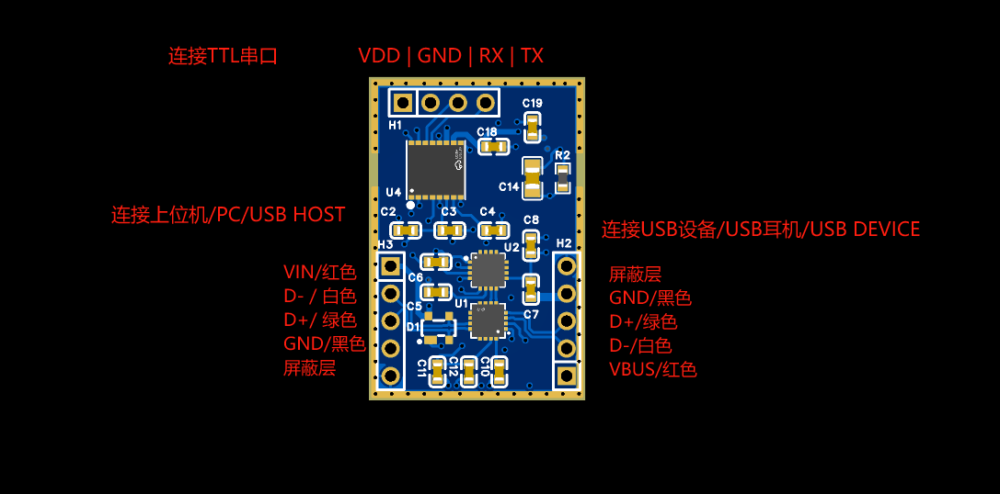

# 银河麒麟 V10 耳机 USB 串口接入 PRD

状态：内部需求基线  
日期：2026-09-04  
适用对象：银河麒麟 V10 x86_64 网关、USB 串口耳机、本机可视化页面

## 1. 背景与目标

本需求只解决一件事：耳机通过 USB 连接 N100/N150 电脑，在银河麒麟 V10 中枚举为串口设备，NeuroBridge 网关从该串口接收脑电与心率数据，完成算法、持久化和本机浏览器展示。

正式链路固定为：

```text
耳机
  → USB 线缆与转换板
  → 银河麒麟 V10 内核 USB/串口驱动
  → /dev/ttyACM* 或 /dev/ttyUSB*
  → NeuroBridge PosixSerialSource → HeadsetRev181Parser
  → ApplicationService / GatewayApplication → 算法、录制
  → 127.0.0.1 WebSocket → 同机浏览器
```

设备协议依据：[军工耳机脑电串口协议](https://entertech.feishu.cn/docx/UwtYdp2RzoZQA4xTx8ccXwwQnOc?from=from_copylink)，读取修订号 181，读取日期 2026-09-02。

## 2. 范围

### 2.1 本期范围

- 目标系统仅为银河麒麟 V10 x86_64，目标硬件为 N100/N150。
- 耳机通过 USB 物理连接，操作系统必须将数据接口呈现为 TTY。
- 网关负责串口发现、设备验证、启停、分帧、重连、时间戳、算法、录制和诊断。
- 同机浏览器通过回环 HTTP/WebSocket 查看数据，不直接访问串口。
- 服务默认由 systemd 开机自启；操作员显式配置为非自启后，才使用前台联调运行。
- 已发布北向报文结构和 `protocolVersion="1.0"` 保持不变。

### 2.2 非目标

- 不开发或验收 macOS 程序。
- 不新增 BLE/蓝牙接入需求，也不把既有 BLE POC 纳入本次验收。
- 不开发 HID、Bulk、Interrupt 等非 TTY 原生 USB 接口。
- 不实现运行时数据源选择、跨传输切换或故障降级。
- 不新增独立 B 端专网、DHCP 或有线网络部署需求。
- 不修改已发布或预发布的 B 端协议正文。
- 不根据未确认信息推断采样率、算法触发数量、电气电平、USB 芯片型号或补传规则。

仓库中既有 BLE、Ubuntu 和旧 B 端兼容代码可以保留，但它们不是本需求的交付能力，也不得替代银河麒麟实机验收。

## 3. 接线和系统识别



转换板图中存在 USB HOST、USB DEVICE/耳机和 TTL 串口三组接口。现场必须确认银河麒麟电脑连接后实际产生可读写 TTY；不得仅凭线色或图片推断 D+/D−、RX/TX、电压和供电方向。

满足以下条件才允许启动网关采集：

- `uname -m` 为 `x86_64`；
- 系统版本为批准的银河麒麟 V10 镜像；
- 设备节点可追溯到 USB 父设备；
- 当前运行用户对该 TTY 具有读写权限；
- 未被其他进程占用；
- 串口参数固定为 115200、8 数据位、无校验、1 停止位、无流控。

## 4. 串口发现与设备验证

### 4.1 候选范围

自动模式只检查：

- `/dev/serial/by-id/*`；
- `/dev/ttyACM*`；
- `/dev/ttyUSB*`。

同一真实设备去重后稳定排序，优先保留 `/dev/serial/by-id/`。主板控制台、`ttyS*`、蓝牙 RFCOMM、普通文件以及无法追溯到 USB 的字符设备不得进入候选集合。

固定路径模式也必须验证目标是 USB 派生的真实 TTY，不能因为路径由操作员填写就跳过安全检查。

### 4.2 验证时序

2026-09-10 用户向设备端确认：耳机首次上电、未握手时也可直接发送 `0xE1` 输出脑电；握手成功后重复 ACK 不回复 `0x01`。据此，Windows 与银河麒麟统一移除 ACK 发送、应答等待及停止提示文件，不再以握手状态决定启动顺序。

```text
启动本轮连接
  ├─ 发现并逐个打开 USB 派生串口，观察已有合法流
  └─ 并行准备本地算法（尚不创建录制会话）
       ↓
  ├─ 已有合法 28 字节帧 → validated → 接管，跳过 E1
  └─ 无合法流 → 等待串口打开且算法 ready
       → 无响应发送 E1 → 等待首个完整合法 28 字节帧
          ├─ 收到 → validated → 创建采集会话并复用已准备算法
          └─ 超时 → 尽力 E0 → 关闭候选；无候选成功则 validation_failed
```

- 只有完整合法帧能完成设备验证。COM/TTY 存在、端口打开、E1 写成功、独立 `0x01` 或任意非空字节都不能替代合法帧。
- 算法准备和设备发现必须并行；算法不可用时静默候选不得发 E1。已有合法流可继续接管原始数据并报告算法不可用。
- 观察及首帧验证期间保留有界缓冲与读取时间，不清空串口输入；验证后原样保存完整帧，并按读取边界交给正常处理链路。
- `0xE1` 只使能采集，`0xE0` 只停止出数，均不等待命令应答。正式会话接管已启动流，不重复 E1；正常停止最多尝试一次 E0。
- 探测中已尝试 E1 而失败或取消时，尽力 E0 并关闭串口；算法任务和未接管的算法进程必须清理，端口打开或读写线程结束后再释放句柄。
- 首个验证成功候选停止遍历。本期仍是单耳机；未验证时不创建录制会话、不输出有效数据、不回放历史录制。
- 首帧超时且无候选成功时保持 `validation_failed` 至下一轮重试；算法准备失败、串口打开或写入失败分别记录实际阶段，不伪装为首帧超时。已验证后数据超时按断线处理。
- 保留旧配置键以兼容已部署文件：`handshake_timeout_ms` 仅用于打开后的已有流观察，`command_response_timeout_ms` 仅用于串口写超时；E1 后首帧等待复用 `data_timeout_seconds`。这些键不再启动 ACK 或等待 `0x01`。

验收覆盖首次上电无 ACK、E0 后服务/整机重启、已有流接管、两项准备先后完成、无合法帧/算法异常/取消探测、多候选切换及首帧持久化。设备端确认和源码测试不替代 Windows、银河麒麟各自的实机专项验收。

## 5. 数据帧和时间戳

设备数据帧固定为 28 字节：

| 偏移 | 长度 | 含义 |
|---:|---:|---|
| 0～2 | 3 | 固定包头 |
| 3 | 1 | 包长，固定 28 |
| 4～5 | 2 | 无符号大端序列号 |
| 6～23 | 18 | 六个 24 位 EEG 原始值 |
| 24 | 1 | 心率原始字节 |
| 25～27 | 3 | 固定包尾 |

网关必须：

- 在串口读取边界生成 Unix Epoch 毫秒接收时间；不能等算法初始化或业务队列处理后补时间。
- 为同一 28 字节帧派生的完整帧、EEG 和 HR 使用同一个接收时间。
- 原样保存完整 28 字节帧，不得只保存解析结果。
- 将偏移 4～23 的 20 字节作为现有 EEG 算法原始输入，将偏移 24 的 1 字节作为 HR 算法原始输入。
- 不自行重采样、缩放、改变字节序或把 24 位值转换成新的对外协议。
- 支持任意读边界下的粘包、拆包、非法长度、错误包尾和重新同步。

序列号按无符号 16 位大端值递增，并支持 `0xFFFF → 0x0000` 回绕。丢包统计必须区分正常、间隙、重复、乱序和迟到补包。

## 6. 算法、录制和北向状态

- 每次设备验证成功后创建新的算法会话。
- 算法初始化成功必须广播 `algorithmState="ready"`；失败广播 `error` 或 `unavailable`。
- 静默候选只有算法 ready 且串口已打开后才能发送 `0xE1`。
- 原始设备帧和算法结果分别持久化，并通过录制会话和采集窗口时间关联。
- 当前耳机 USB 串口交付不支持录播；串口未验证或断开时不得读取已保存数据冒充实时数据。
- 串口内部状态仅用于控制和日志；北向仍映射为 `connected`、`connecting`、`disconnected`。
- 北向消息不得新增 `transport`、`deviceId`、`gatewayId` 或串口内部状态字段。

## 7. 本机页面与服务

- HTTP 页面、WebSocket 和可选下载只监听 `127.0.0.1`。
- 页面由网关 HTTP 服务加载并取得实际 WebSocket 地址。
- WebSocket 只接受配置对应的固定 HTTP Origin，拒绝缺失或其他 Origin。
- 页面“开始/停止”只对应 `subscribe`/`unsubscribe`，不得打开串口或停止网关采集。
- 页面状态说明必须与实际验证时序一致。
- systemd 服务以批准的普通用户运行，默认开机自启、异常退出后重试，并避免与前台实例同时占用串口和端口；显式非自启偏好必须持久保存，后续日常启动不得自动覆盖。

## 8. 错误和可观察性

以下异常不得使北向服务或主进程退出：

- 没有候选串口；
- 串口权限不足或被占用；
- E1 后首个合法帧校验超时；
- 非法帧或持续无有效帧；
- 算法初始化、计算或进程异常；
- 浏览器断开；
- 耳机拔出或重新枚举。

日志应包含阶段、候选数量、脱敏设备身份、状态变化、控制写入结果、数据时间范围、帧数和丢包统计；不得记录完整原始帧、Base64 生理数据、令牌、密码或私钥。

## 9. 验收标准

| 编号 | 验收项 | 通过标准 |
|---|---|---|
| AC-001 | 目标环境 | 批准的银河麒麟 V10 x86_64 镜像和 N100/N150 实机验证通过 |
| AC-002 | 串口识别 | USB 接入后稳定找到正确 TTY，不探测系统和蓝牙串口 |
| AC-003 | 已有流恢复 | 合法 28 字节流直接 validated，接管缓冲且不发送 ACK/E1 |
| AC-004 | 静默设备验证 | 串口发现与算法准备并行；两项就绪后直接 E1，只以完整合法帧验证 |
| AC-005 | 停止 | 正常停止无响应发送一次 E0；写失败仍关闭资源 |
| AC-006 | 原始数据 | 保存的 28 字节帧与设备侧抓取逐字节一致，时间来自读取边界 |
| AC-007 | 算法 | 真实耳机数据验证输入分组、字节序、性能和结果；源码切片不等于 POC 通过 |
| AC-008 | 页面 | 本机页面可加载、连接、查询状态、订阅和取消订阅，状态文案正确 |
| AC-009 | 重连 | 拔插、数据超时、服务重启后只重试 USB 串口路径并恢复实时数据 |
| AC-010 | 串口离线 | 耳机串口未验证或断开时不得启动录播；`subscribe`/`getLatest` 返回 `409 STREAM_NOT_AVAILABLE_REASON`，恢复串口后才继续实时采集 |
| AC-011 | 运维 | systemd 自启、日志轮转、诊断导出、离线更新和回滚完成现场演练 |
| AC-012 | 长稳 | 达到双方确认的连续运行时长，无句柄泄漏、无界内存增长或主进程退出 |

## 10. 上线前待确认

- 银河麒麟 V10 最终镜像文件名和 SHA-256；
- 转换板芯片、VID/PID、USB 接口角色和最终 TTY 节点；
- TTL 电平、供电方向和 DTR/RTS/HUP 对实机的影响；
- 采样率、每 600 ms 样本数及算法触发条件；
- 真实数据算法结果的范围、单位、延迟和有效性；
- 连续运行验收按统一架构 PRD 已确认的 24 小时执行；资源与延迟阈值、缓存上限及补传是否启用仍需确认。

这些项目必须配置化或由双方确认，不得由源码和示例自行假定。

2026-09-08 的源码补齐、自动化证据和未完成发布/现场门禁见[需求补齐与验收清单](NeuroBridge项目结构与多系统接入/需求补齐与验收清单.md)。该清单不替代本 PRD 的实机验收要求。
